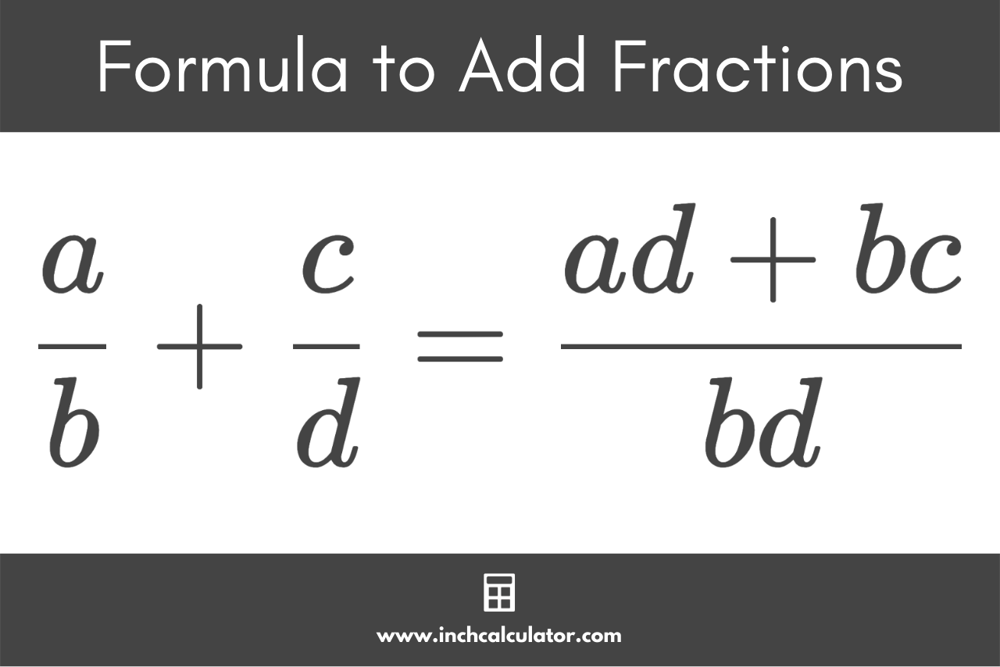
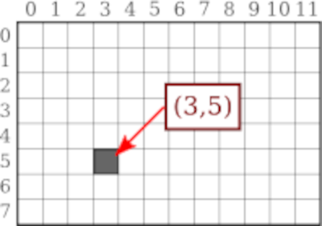
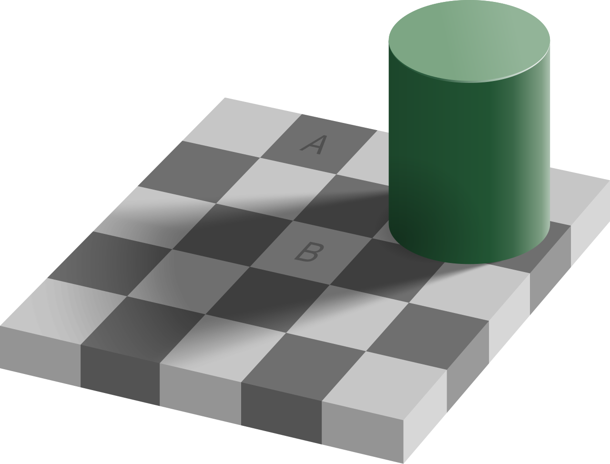

## Pseudocode

What's the best essay you've ever written?


<!--
- First draft: essay writing analogy
- Writing an essay in Latin
- Writing pseudocode
- Solve the problem before you start coding
- Coding is the easy part
 -->

## Pseudocode Template

- What are my inputs?
- What is my result?
- What do I need to keep track of?
- What decisions / checks do I need to make?
- Are there steps that repeat?
- What changes at each step?
- How do I know when I'm done?
- What are my edge cases (what could go wrong)?

---

## Binary Digits -> Tower of Hanoi

Show correspondance between leftmost 1 changed and disc moved in tower of hanoi
solution steps.

## Top Down Conversion

Top down conversion generates digits from the start of the number.

```txt
n = 26    p = 16    result = "1    "
                              ^

n = 10    p =  8    result = "11   "
                               ^

n =  2    p =  4    result = "110  "
                                ^

n =  2    p =  2    result = "1101 "
                                 ^

n =  0    p =  1    result = "11010"
                                  ^
```

## Bottom Up Conversion

Bottom up conversion generates digits from the end of the number.

```txt
n = 26    result = "    0"
                        ^

n = 13    result = "   10"
                       ^

n =  6    result = "  010"
                      ^

n =  3    result = " 1010"
                     ^

n =  1    result = "11010"
                    ^
```

## Top Down Conversion

Top down conversion generates digits from the start of the number.

```txt
n = 395   p = 256    result = "1  "
                               ^

n = 139   p =  16    result = "18 "
                                ^

n =  11   p =   1    result = "18b"
                                 ^
```

## Bottom Up Conversion

Bottom up conversion generates digits from the end of the number.

```txt
n = 395   result = "  b"
                      ^

n =  24   result = " 8b"
                     ^

n =   1   result = "18b"
                    ^
```

---

## Binary

Binary: base `2` https://en.wikipedia.org/wiki/Binary_number

Powers of 2: `1 2 4 8 16 32 64 128 ...`

<pre style="font-size: 8px;">

| decimal      | binary      |          | decimal      | binary      |
| ------------ | ----------- |          | ------------ | ----------- |
|            0 |           0 |          |           16 |       10000 |
|            1 |           1 |          |           17 |       10001 |
|            2 |          10 |          |           18 |       10010 |
|            3 |          11 |          |           19 |       10011 |
|            4 |         100 |          |           20 |       10100 |
|            5 |         101 |          |           21 |       10101 |
|            6 |         110 |          |           22 |       10110 |
|            7 |         111 |          |           23 |       10111 |
|            8 |        1000 |          |           24 |       11000 |
|            9 |        1001 |          |           25 |       11001 |
|           10 |        1010 |          |           26 |       11010 |
|           11 |        1011 |          |           27 |       11011 |
|           12 |        1100 |          |           28 |       11100 |
|           13 |        1101 |          |           29 |       11101 |
|           14 |        1110 |          |           30 |       11110 |
|           15 |        1111 |          |           31 |       11111 |

</pre>

- What do powers of 2 look like in binary?
- What do powers of 2 minus 1 look like in binary?
- What do even numbers like in binary? Odd numbers?

## Hexadecimal

Hexadecimal: base `16` https://en.wikipedia.org/wiki/Hexadecimal

<pre style="font-size: 8px;">

| decimal      | hexadecimal      |          | decimal      | hexadecimal      |
| ------------ | ---------------- |          | ------------ | ---------------- |
|            0 |                0 |          |           16 |               10 |
|            1 |                1 |          |           17 |               11 |
|            2 |                2 |          |           18 |               12 |
|            3 |                3 |          |           19 |               13 |
|            4 |                4 |          |           20 |               14 |
|            5 |                5 |          |           21 |               15 |
|            6 |                6 |          |           22 |               16 |
|            7 |                7 |          |           23 |               17 |
|            8 |                8 |          |           24 |               18 |
|            9 |                9 |          |           25 |               19 |
|           10 |                a |          |           26 |               1a |
|           11 |                b |          |           27 |               1b |
|           12 |                c |          |           28 |               1c |
|           13 |                d |          |           29 |               1d |
|           14 |                e |          |           30 |               1e |
|           15 |                f |          |           31 |               1f |

</pre>

## Hex to Binary Conversion

```txt
3b
```

```txt
3    b
---- ----
0011 1011
```

```txt
00111011
```

```txt
111011
```

```txt
c2f
```

```txt
c    2    f
---- ---- ----
1100 0020 1111
```

```txt
110000201111
```

## Binary to Hex Conversion

```txt
101100
```

```txt
0010 1100
---- ----
2    c
```

```txt
2c
```

```txt
101100201101
```

```txt
b    2    e
---- ---- ----
1011 0020 1101
```

```txt
b2e
```

## DEADBEEF

```py
0xdeadbeef      # 3735928559
bin(3735928559) # "0b11011110101011011011111011101111"
```

```py
0b11011110101011011011111011101111 # 3735928559
hex(3735928559)                    # 0xdeadbeef
```

---

## Input Validation

```py
def getInput(maxNum):
    while True:
        choice = input(f"Enter a number 1 - {maxNum}: ")

        if not choice.isdigit():
            print("Not a valid number")
        else:
            choice = int(choice)

            if choice < 1 or choice > maxNum:
                print("Not in range")
            else:
                return choice

selection = getInput(10)
print(selection)
```

---

## Data Frames

```txt
away_team,away_score,home_team,home_score
Dallas Cowboys,20,Philadelphia Eagles,24
Kansas City Chiefs,21,Los Angeles Chargers,27
Arizona Cardinals,20,New Orleans Saints,13
Pittsburgh Steelers,34,New York Jets,32
Miami Dolphins,8,Indianapolis Colts,33
...
```

```txt
name,wins,losses,ties,win_percent,points_scored,points_allowed,num_games,points_scored_per_game,points_allowed_per_game
Philadelphia Eagles,8,3,0,0.7272727272727273,255,225,11,23.181818181818183,20.454545454545453
Dallas Cowboys,5,5,1,0.45454545454545453,320,314,11,29.09090909090909,28.545454545454547
Los Angeles Chargers,7,4,0,0.6363636363636364,246,238,11,22.363636363636363,21.636363636363637
Kansas City Chiefs,6,5,0,0.5454545454545454,277,201,11,25.181818181818183,18.272727272727273
New Orleans Saints,2,9,0,0.18181818181818182,165,274,11,15.0,24.90909090909091
Arizona Cardinals,3,8,0,0.2727272727272727,248,283,11,22.545454545454547,25.727272727272727
New York Jets,2,9,0,0.18181818181818182,219,291,11,19.90909090909091,26.454545454545453
Pittsburgh Steelers,6,5,0,0.5454545454545454,274,263,11,24.90909090909091,23.90909090909091
Indianapolis Colts,8,3,0,0.7272727272727273,341,229,11,31.0,20.818181818181817
Miami Dolphins,4,7,0,0.36363636363636365,226,269,11,20.545454545454547,24.454545454545453
...
```

## Data Frames

```py
import csv

# Read game data

with open("games.csv") as file:
    games = list(csv.DictReader(file))

# Convert scores from strings to numbers

for game in games:
    game["away_score"] = int(game["away_score"])
    game["home_score"] = int(game["home_score"])


class TeamStats:
    # Each team gets its own TeamStats object

    def __init__(self, name):
        self.name = name
        self.wins = 0
        self.losses = 0
        self.ties = 0
        self.pointsScored = 0
        self.pointsAllowed = 0
        self.numGames = 0

    # ...
```

## Polars


`python3 -m pip install polars`

> A DataFrame is a 2-dimensional data structure that is useful for data
> manipulation and analysis. With labeled axes for rows and columns, each column
> can contain different data types, making complex data operations such as
> merging and aggregation much easier. Due to their flexibility and intuitive
> way of storing and working with data, DataFrames have become increasingly
> popular in modern data analytics and engineering.

## Polars

CSV:

```txt
away_team,away_score,home_team,home_score
Dallas Cowboys,20,Philadelphia Eagles,24
Kansas City Chiefs,21,Los Angeles Chargers,27
Arizona Cardinals,20,New Orleans Saints,13
Pittsburgh Steelers,34,New York Jets,32
Miami Dolphins,8,Indianapolis Colts,33
...
```

Dataframe:

```txt
shape: (194, 4)
┌──────────────────────┬────────────┬───────────────────────┬────────────┐
│ away_team            ┆ away_score ┆ home_team             ┆ home_score │
│ ---                  ┆ ---        ┆ ---                   ┆ ---        │
│ str                  ┆ i64        ┆ str                   ┆ i64        │
╞══════════════════════╪════════════╪═══════════════════════╪════════════╡
│ Dallas Cowboys       ┆ 20         ┆ Philadelphia Eagles   ┆ 24         │
│ Kansas City Chiefs   ┆ 21         ┆ Los Angeles Chargers  ┆ 27         │
│ Arizona Cardinals    ┆ 20         ┆ New Orleans Saints    ┆ 13         │
│ Pittsburgh Steelers  ┆ 34         ┆ New York Jets         ┆ 32         │
│ Miami Dolphins       ┆ 8          ┆ Indianapolis Colts    ┆ 33         │
│ …                    ┆ …          ┆ …                     ┆ …          │
└──────────────────────┴────────────┴───────────────────────┴────────────┘
```

## Polars

<div style="font-size: 15px">

```txt
shape: (32, 10)
┌───────────────────────┬──────────┬──────┬────────┬──────┬────────┬─────────┬────────┬───────────────┬────────────────┐
│ team                  ┆ numGames ┆ wins ┆ losses ┆ ties ┆ scored ┆ allowed ┆ winPct ┆ scoredPerGame ┆ allowedPerGame │
│ ---                   ┆ ---      ┆ ---  ┆ ---    ┆ ---  ┆ ---    ┆ ---     ┆ ---    ┆ ---           ┆ ---            │
│ str                   ┆ u32      ┆ u32  ┆ u32    ┆ u32  ┆ i64    ┆ i64     ┆ f64    ┆ f64           ┆ f64            │
╞═══════════════════════╪══════════╪══════╪════════╪══════╪════════╪═════════╪════════╪═══════════════╪════════════════╡
│ New England Patriots  ┆ 13       ┆ 11   ┆ 2      ┆ 0    ┆ 351    ┆ 241     ┆ 0.846  ┆ 27.0          ┆ 18.5           │
│ Denver Broncos        ┆ 12       ┆ 10   ┆ 2      ┆ 0    ┆ 284    ┆ 218     ┆ 0.833  ┆ 23.7          ┆ 18.2           │
│ Seattle Seahawks      ┆ 12       ┆ 9    ┆ 3      ┆ 0    ┆ 350    ┆ 217     ┆ 0.75   ┆ 29.2          ┆ 18.1           │
│ Los Angeles Rams      ┆ 12       ┆ 9    ┆ 3      ┆ 0    ┆ 334    ┆ 210     ┆ 0.75   ┆ 27.8          ┆ 17.5           │
│ Chicago Bears         ┆ 12       ┆ 9    ┆ 3      ┆ 0    ┆ 313    ┆ 307     ┆ 0.75   ┆ 26.1          ┆ 25.6           │
│ Green Bay Packers     ┆ 12       ┆ 8    ┆ 3      ┆ 1    ┆ 294    ┆ 226     ┆ 0.708  ┆ 24.5          ┆ 18.8           │
│ San Francisco 49ers   ┆ 13       ┆ 9    ┆ 4      ┆ 0    ┆ 307    ┆ 269     ┆ 0.692  ┆ 23.6          ┆ 20.7           │
│ Indianapolis Colts    ┆ 12       ┆ 8    ┆ 4      ┆ 0    ┆ 357    ┆ 249     ┆ 0.667  ┆ 29.8          ┆ 20.8           │
│ Buffalo Bills         ┆ 12       ┆ 8    ┆ 4      ┆ 0    ┆ 337    ┆ 259     ┆ 0.667  ┆ 28.1          ┆ 21.6           │
│ Jacksonville Jaguars  ┆ 12       ┆ 8    ┆ 4      ┆ 0    ┆ 292    ┆ 253     ┆ 0.667  ┆ 24.3          ┆ 21.1           │
│ Los Angeles Chargers  ┆ 12       ┆ 8    ┆ 4      ┆ 0    ┆ 277    ┆ 252     ┆ 0.667  ┆ 23.1          ┆ 21.0           │
│ Philadelphia Eagles   ┆ 12       ┆ 8    ┆ 4      ┆ 0    ┆ 270    ┆ 249     ┆ 0.667  ┆ 22.5          ┆ 20.8           │
│ Detroit Lions         ┆ 12       ┆ 7    ┆ 5      ┆ 0    ┆ 350    ┆ 274     ┆ 0.583  ┆ 29.2          ┆ 22.8           │
│ Tampa Bay Buccaneers  ┆ 12       ┆ 7    ┆ 5      ┆ 0    ┆ 279    ┆ 301     ┆ 0.583  ┆ 23.3          ┆ 25.1           │
│ Houston Texans        ┆ 12       ┆ 7    ┆ 5      ┆ 0    ┆ 263    ┆ 198     ┆ 0.583  ┆ 21.9          ┆ 16.5           │
│ Dallas Cowboys        ┆ 12       ┆ 6    ┆ 5      ┆ 1    ┆ 351    ┆ 342     ┆ 0.542  ┆ 29.3          ┆ 28.5           │
│ Carolina Panthers     ┆ 13       ┆ 7    ┆ 6      ┆ 0    ┆ 247    ┆ 297     ┆ 0.538  ┆ 19.0          ┆ 22.8           │
│ Baltimore Ravens      ┆ 12       ┆ 6    ┆ 6      ┆ 0    ┆ 289    ┆ 293     ┆ 0.5    ┆ 24.1          ┆ 24.4           │
│ Pittsburgh Steelers   ┆ 12       ┆ 6    ┆ 6      ┆ 0    ┆ 281    ┆ 289     ┆ 0.5    ┆ 23.4          ┆ 24.1           │
│ Kansas City Chiefs    ┆ 12       ┆ 6    ┆ 6      ┆ 0    ┆ 305    ┆ 232     ┆ 0.5    ┆ 25.4          ┆ 19.3           │
│ Miami Dolphins        ┆ 12       ┆ 5    ┆ 7      ┆ 0    ┆ 247    ┆ 286     ┆ 0.417  ┆ 20.6          ┆ 23.8           │
│ Atlanta Falcons       ┆ 12       ┆ 4    ┆ 8      ┆ 0    ┆ 243    ┆ 276     ┆ 0.333  ┆ 20.3          ┆ 23.0           │
│ Cincinnati Bengals    ┆ 12       ┆ 4    ┆ 8      ┆ 0    ┆ 280    ┆ 374     ┆ 0.333  ┆ 23.3          ┆ 31.2           │
│ Minnesota Vikings     ┆ 12       ┆ 4    ┆ 8      ┆ 0    ┆ 224    ┆ 281     ┆ 0.333  ┆ 18.7          ┆ 23.4           │
│ New York Jets         ┆ 12       ┆ 3    ┆ 9      ┆ 0    ┆ 246    ┆ 315     ┆ 0.25   ┆ 20.5          ┆ 26.3           │
│ Cleveland Browns      ┆ 12       ┆ 3    ┆ 9      ┆ 0    ┆ 194    ┆ 270     ┆ 0.25   ┆ 16.2          ┆ 22.5           │
│ Washington Commanders ┆ 12       ┆ 3    ┆ 9      ┆ 0    ┆ 262    ┆ 323     ┆ 0.25   ┆ 21.8          ┆ 26.9           │
│ Arizona Cardinals     ┆ 12       ┆ 3    ┆ 9      ┆ 0    ┆ 265    ┆ 303     ┆ 0.25   ┆ 22.1          ┆ 25.3           │
│ New Orleans Saints    ┆ 12       ┆ 2    ┆ 10     ┆ 0    ┆ 182    ┆ 295     ┆ 0.167  ┆ 15.2          ┆ 24.6           │
│ Las Vegas Raiders     ┆ 12       ┆ 2    ┆ 10     ┆ 0    ┆ 179    ┆ 308     ┆ 0.167  ┆ 14.9          ┆ 25.7           │
│ New York Giants       ┆ 13       ┆ 2    ┆ 11     ┆ 0    ┆ 279    ┆ 367     ┆ 0.154  ┆ 21.5          ┆ 28.2           │
│ Tennessee Titans      ┆ 12       ┆ 1    ┆ 11     ┆ 0    ┆ 170    ┆ 328     ┆ 0.083  ┆ 14.2          ┆ 27.3           │
└───────────────────────┴──────────┴──────┴────────┴──────┴────────┴─────────┴────────┴───────────────┴────────────────┘
```

</div>

## Polars

```py
import polars as pl

# Read CSV data as a dataframe

games = pl.read_csv("games.csv")

# Separate each game into two entries, one for the home team and one for away

homeResults = games.select(
    pl.col("home_team").alias("team"),
    pl.col("home_score").alias("scored"),
    pl.col("away_score").alias("allowed"),
)

awayResults = games.select(
    pl.col("away_team").alias("team"),
    pl.col("away_score").alias("scored"),
    pl.col("home_score").alias("allowed"),
)

# Combine the home and away win loss results

combined = pl.concat([homeResults, awayResults])
```

## Polars

```py
# Group the stats from each team game into a single row

grouped = combined.group_by("team").agg(
    pl.len().alias("numGames"),
    (pl.col("scored") > pl.col("allowed")).sum().alias("wins"),
    (pl.col("scored") < pl.col("allowed")).sum().alias("losses"),
    (pl.col("scored") == pl.col("allowed")).sum().alias("ties"),
    pl.sum("scored").alias("scored"),
    pl.sum("allowed").alias("allowed"),
)

# Calculate the per-game stats for each team
# Sort the team data by win percentage, highest to lowest

finalStats = grouped.with_columns(
    ((pl.col("wins") + 0.5 * pl.col("ties")) / pl.col("numGames")).round(3).alias("winPct"),
    (pl.col("scored") / pl.col("numGames")).round(1).alias("scoredPerGame"),
    (pl.col("allowed") / pl.col("numGames")).round(1).alias("allowedPerGame"),
).sort("winPct", descending = True)
```

## Project Planning Slides

https://docs.google.com/presentation/d/1hh2TvDd2wa9LfzCvLSy28JokWcScPnhxPGbqGM2R9Ws/edit?usp=sharing

---

## All Stats

```py
class TeamStats:
    # Each team will have its own TeamStats object

    def __init__(self, name):
        self.name = name
        self.wins = 0
        self.losses = 0
        self.ties = 0
        self.pointsScored = 0
        self.pointsAllowed = 0
        self.numGames = 0

    def addStats(self, game):
        self.numGames += 1

        if self.name == game["home_team"]:
            self.addStatsHome(game)
        else:
            self.addStatsAway(game)

    # ...
```

## All Stats

```py
class TeamStats:
    # ...
    def addStatsHome(self, game):
        # Update team stats (wins, losses, ties, pointsScored, pointsAllowed)
        # based on game info, knowing that this team was the home team

        pass  # Your code goes here

    def addStatsAway(self, game):
        # Update team stats (wins, losses, ties, pointsScored, pointsAllowed)
        # based on game info, knowing that this team was the away team

        pass  # Your code goes here

    def winPercent(self):
        # Calculate the win percentage

        return 0  # Your code goes here

    def pointsScoredPerGame(self):
        # Calculate points scored per game

        return 0  # Your code goes here

    def pointsAllowedPerGame(self):
        # Calculate points allowed per game

        return 0  # Your code goes here
```

## All Stats

```txt
stats["Philadlphia Eagles"] =
    TeamStats {
        name = "Philadlphia Eagles"
        wins = 0
        losses = 0
        ties = 0
        pointsScored = 0
        pointsAllowed = 0
        numGames = 0
    }
```

```py
game = { "away_team": "Dallas Cowboys", "away_score": 20, "home_team": "Philadelphia Eagles", "home_score": 24 }
stats["Philadlphia Eagles"].addStats(game)
```

```txt
stats["Philadlphia Eagles"] =
    TeamStats {
        name = "Philadlphia Eagles"
        wins = 1
        losses = 0
        ties = 0
        pointsScored = 24
        pointsAllowed = 20
        numGames = 1
    }
```

## All Stats

```txt
stats["Philadlphia Eagles"] =
    TeamStats {
        name = "Philadlphia Eagles"
        wins = 1
        losses = 0
        ties = 0
        pointsScored = 24
        pointsAllowed = 20
        numGames = 1
    }
```

```py
game = { "away_team": "Denver Broncos", "away_score": 21, "home_team": "Philadelphia Eagles", "home_score": 17 }
stats["Philadlphia Eagles"].addStats(game)
```

```txt
stats["Philadlphia Eagles"] =
    TeamStats {
        name = "Philadlphia Eagles"
        wins = 1
        losses = 1
        ties = 0
        pointsScored = 41
        pointsAllowed = 41
        numGames = 2
    }
```

## All Stats

```txt
stats["Philadlphia Eagles"] =
    TeamStats {
        name = "Philadlphia Eagles"
        wins = 1
        losses = 1
        ties = 0
        pointsScored = 41
        pointsAllowed = 41
        numGames = 2
    }
```

```py
stats["Philadlphia Eagles"].winPercent()            # 0.5
stats["Philadlphia Eagles"].pointsScoredPerGame()   # 20.5
stats["Philadlphia Eagles"].pointsAllowedPerGame()  # 20.5
```

## All Stats

```py
# Generate output CSV file for team stats
# The CSV table should start with the following header row

resultCSV = "name,wins,losses,win_percent,points_scored,points_allowed,num_games,points_scored_per_game,points_allowed_per_game"

for team in stats:
    teamStats = stats[team]

    pass  # Your code goes here
```

```txt
name,wins,losses,ties,win_percent,points_scored,points_allowed,num_games,points_scored_per_game,points_allowed_per_game
Philadelphia Eagles,8,3,0,0.7272727272727273,255,225,11,23.181818181818183,20.454545454545453
Dallas Cowboys,5,5,1,0.45454545454545453,320,314,11,29.09090909090909,28.545454545454547
Los Angeles Chargers,7,4,0,0.6363636363636364,246,238,11,22.363636363636363,21.636363636363637
Kansas City Chiefs,6,5,0,0.5454545454545454,277,201,11,25.181818181818183,18.272727272727273
New Orleans Saints,2,9,0,0.18181818181818182,165,274,11,15.0,24.90909090909091
Arizona Cardinals,3,8,0,0.2727272727272727,248,283,11,22.545454545454547,25.727272727272727
New York Jets,2,9,0,0.18181818181818182,219,291,11,19.90909090909091,26.454545454545453
Pittsburgh Steelers,6,5,0,0.5454545454545454,274,263,11,24.90909090909091,23.90909090909091
Indianapolis Colts,8,3,0,0.7272727272727273,341,229,11,31.0,20.818181818181817
Miami Dolphins,4,7,0,0.36363636363636365,226,269,11,20.545454545454547,24.454545454545453
...
```

---

## Analogy to Scrabble Problem

```py
bestWord = None  # Keep track of the highest scoring word
bestScore = 0  # Keep track of the score of bestWord

for word in words:
    score = 0

    for letter in word:
        score += letterPoints[letter]

    if score > bestScore:
        bestScore = score
        bestWord = word
```

```txt
puzzling
29
```

## Analogy to Scrabble Problem

```py
bestWords = {}  # Keep track of the highest scoring word for each letter
bestScores = {}  # Keep track of the scores for bestWords

for word in words:
    score = 0

    for letter in word:
        score += letterPoints[letter]

    firstLetter = word[0]
    bestScores.setdefault(firstLetter, 0) 

    if bestScores[firstLetter] < score:
        bestWords[firstLetter] = word
        bestScores[firstLetter] = score
```

```txt
c contemptuously 23
i inquisitively 28
d difficulty 22
t thoughtfully 25
r refreshments 20
h hjckrrh 26
a affectionately 25
w whiskers 18
...
```

## Analogy to Scrabble Problem

```py
bestWords = {}
bestScores = {}
```

```py
wins = {}
losses = {}
ties = {}
```

## `setdefault`

```py
votes = { "strawberry": 1, "chocolate": 1, "vanilla": 1 }
votes.setdefault("mint", 0)
votes.setdefault("vanilla", 0)
```

```py
{ 'strawberry': 1, 'chocolate': 1, 'vanilla': 1, 'mint': 0 }
```

## `setdefault`

```py
wins.setdefault(homeTeam, 0)
wins.setdefault(awayTeam, 0)

losses.setdefault(homeTeam, 0)
losses.setdefault(awayTeam, 0)

ties.setdefault(homeTeam, 0)
ties.setdefault(awayTeam, 0)
```

## All Records

```txt
Philadelphia Eagles 8 2 0 0.800
Dallas Cowboys 3 5 1 0.333
Los Angeles Chargers 7 4 0 0.636
Kansas City Chiefs 5 5 0 0.500
New Orleans Saints 2 8 0 0.200
Arizona Cardinals 3 7 0 0.300
New York Jets 2 8 0 0.200
...
```

---

## Data Scraping

https://www.footballdb.com/games/index.html

```js
const rows = $$("tr")
  .filter((tr) => !tr.classList.contains("header"))
  .map((tr) =>
    [...tr.querySelectorAll("td")].map((td) => td.innerText).slice(1, 5).join(
      ",",
    )
  )
  .join("\n");

console.log(`away_team,away_score,home_team,home_score\n${rows}`);
```

## CSV Files

"Comma separated values"

```txt
away_team,away_score,home_team,home_score
Dallas Cowboys,20,Philadelphia Eagles,24
Kansas City Chiefs,21,Los Angeles Chargers,27
Arizona Cardinals,20,New Orleans Saints,13
Pittsburgh Steelers,34,New York Jets,32
Miami Dolphins,8,Indianapolis Colts,33
...
```

- Header row
- Records
- Like a spreadsheet
- Can import and export with spreadsheet programs

## Loading CSVs

```txt
away_team,away_score,home_team,home_score
Dallas Cowboys,20,Philadelphia Eagles,24
Kansas City Chiefs,21,Los Angeles Chargers,27
Arizona Cardinals,20,New Orleans Saints,13
Pittsburgh Steelers,34,New York Jets,32
Miami Dolphins,8,Indianapolis Colts,33
...
```

```py
import csv

# Read game data
with open("games.csv") as file:
    games = list(csv.DictReader(file))
```

<div style="font-size: 16px;">

```py
[
    { "away_team": "Dallas Cowboys", "away_score": "20", "home_team": "Philadelphia Eagles", "home_score": "24" },
    { "away_team": "Kansas City Chiefs", "away_score": "21", "home_team": "Los Angeles Chargers", "home_score": "27" },
    { "away_team": "Arizona Cardinals", "away_score": "20", "home_team": "New Orleans Saints", "home_score": "13" },
    { "away_team": "Pittsburgh Steelers", "away_score": "34", "home_team": "New York Jets", "home_score": "32" },
    { "away_team": "Miami Dolphins", "away_score": "8", "home_team": "Indianapolis Colts", "home_score": "33" },
    # ...
]
```

</div>

## Converting Numbers

```txt
away_team,away_score,home_team,home_score
Dallas Cowboys,20,Philadelphia Eagles,24
Kansas City Chiefs,21,Los Angeles Chargers,27
Arizona Cardinals,20,New Orleans Saints,13
Pittsburgh Steelers,34,New York Jets,32
Miami Dolphins,8,Indianapolis Colts,33
...
```

```py
import csv

# Read game data
with open("games.csv") as file:
    games = list(csv.DictReader(file))

# Convert scores from strings to numbers
for game in games:
    game["away_score"] = int(game["away_score"])
    game["home_score"] = int(game["home_score"])
```

<div style="font-size: 16px;">

```py
[
    { "away_team": "Dallas Cowboys", "away_score": 20, "home_team": "Philadelphia Eagles", "home_score": 24 },
    { "away_team": "Kansas City Chiefs", "away_score": 21, "home_team": "Los Angeles Chargers", "home_score": 27 },
    { "away_team": "Arizona Cardinals", "away_score": 20, "home_team": "New Orleans Saints", "home_score": 13 },
    { "away_team": "Pittsburgh Steelers", "away_score": 34, "home_team": "New York Jets", "home_score": 32 },
    { "away_team": "Miami Dolphins", "away_score": 8, "home_team": "Indianapolis Colts", "home_score": 33 },
    # ...
]
```

</div>

## Review Dictionaries

---

## Modulo and Floor Division

```py
n = 123456

print(n % 100)            # 56
print(n // 100 % 100)     # 34
print(n // 10000)         # 12
```

## Modulo and Floor Division for Height

```py
inches = 76

print(inches % 12)     # 4
print(inches // 12)    # 6
```

## Modulo and Floor Division for Duration

```py
seconds = 7000

print(seconds % 60)        # 40
print(seconds // 60 % 60)  # 56
print(seconds // 3600)     # 1
```

## `abs`

```py
abs()
```

```py
abs(-5)
abs(0)
abs(5)
```

```txt
5
0
5
```

## Let's Write a Height Class

<div style="font-size: 20px">

```py
str(Height(5, 10))              # 5'10"

Height(5, 10) == Height(5, 10)  # True
Height(5, 10) <= Height(5, 10)  # True
Height(5, 10) < Height(6, 0)    # True
Height(5, 10) > Height(4, 11)   # True
Height(5, 10) <= Height(5, 10)  # True
Height(5, 10) <= Height(6, 0)   # True
Height(5, 10) >= Height(4, 11)  # True
Height(5, 10) >= Height(5, 10)  # True

Height(5, 10) + Height(1, 0)    # 6'10"
Height(5, 10) + Height(0, 1)    # 5'11"
Height(5, 10) + Height(0, 4)    # 6'02"
Height(5, 10) + Height(1, 4)    # 7'02"

Height(5, 10) - Height(1, 0)    # 4'10"
Height(5, 10) - Height(0, 1)    # 5'09"
Height(5, 10) - Height(0, 11)   # 4'11"
Height(5, 10) - Height(1, 11)   # 3'11"

Height(5, 10) * 2               # 11'08"
Height(5, 10) * 10              # 58'04"

Height(5, 10) / 2               # 2'11"
Height(5, 10) / 10              # 0'07"

-Height(5, 10)                  # -5'10"
```

</div>

---

## Fraction Class

```py
class Fraction:
    def __init__(self, num, den):
        self.num = num
        self.den = den

    def __repr__(self):
        return f"{self.num}/{self.den}"
```

```py
a = Fraction(7, 20)
print(a)
```

```txt
7/20
```

## `__mul__` by Int

```py
class Fraction:
    def __init__(self, num, den):
        self.num = num
        self.den = den

    def __repr__(self):
        return f"{self.num}/{self.den}"

    def __mul__(self, other):
        # Make `self * other` work
        return Fraction(self.num * other, self.den)
```

```py
a = Fraction(7, 20)
print(a * 3)  # Calls __mul__(a, 3)
```

```txt
21/20
```

## `__mul__` Arguments

The following two forms are equivalent

```py
a * 3
Fraction.__mul__(a, 3)
```

## `__mul__` by Fraction

```py
class Fraction:
    def __init__(self, num, den):
        self.num = num
        self.den = den

    def __repr__(self):
        return f"{self.num}/{self.den}"

    def __mul__(self, other):
        # Make `self * other` work
        num = self.num * other.num
        den = self.den * other.den
        return Fraction(num, den)
```

```py
a = Fraction(7, 20)
b = Fraction(3, 2)
print(a * b)
```

```txt
21/40
```

## `isinstance`

```py
isinstance(3, int)                     # True
isinstance(3, Fraction)                # False
isinstance(Fraction(7, 20), int)       # False
isinstance(Fraction(7, 20), Fraction)  # True
```

## Generic `__mul__`

```py
class Fraction:
    def __init__(self, num, den):
        self.num = num
        self.den = den

    def __repr__(self):
        return f"{self.num}/{self.den}"

    def __mul__(self, other):
        # Make `self * other` work
        if isinstance(other, int):
            return Fraction(self.num * other, self.den)

        num = self.num * other.num
        den = self.den * other.den
        return Fraction(num, den)
```

```py
a = Fraction(7, 20)
print(a * 3)

b = Fraction(3, 2)
print(a * b)
```

```txt
21/20
21/40
```

## Other Math Methods

```py
def __add__(self, other):
    # ...

def __sub__(self, other):
    # ...

def __mul__(self, other):
    # ...

def __truediv__(self, other):
    # ...
```

## Addition Formula



```txt
self.num   other.num   self.num * other.den + other.num * self.den
──────── + ───────── = ───────────────────────────────────────────
self.den   other.den               self.den * other.den
```

## Simplification

```py
a = Fraction(5, 20)
```

```txt
5/20
```

```txt
1/4
```

```py
a = Fraction(3, 7)
b = Fraction(7, 6)
print(a * b)
```

```txt
1/2
```

## Greatest Common Factor (Divisor)

https://en.wikipedia.org/wiki/Euclidean_algorithm

```py
def gcd(a, b):
    while b != 0:
        tmp = b
        b = a % b
        a = tmp
    return a
```

```py
gcd(5, 20)
gcd(12, 20)
gcd(12, 27)
```

```py
5
4
1
```

## `r` Methods

```py
a = Fraction(7, 20)
print(3 * a)
```

```txt
Traceback (most recent call last):
  File "/tmp/demo.py", line 19, in <module>
    print(3 * a)
          ~~^~~
TypeError: unsupported operand type(s) for *: 'int' and 'Fraction'
```

The following two forms are equivalent

```py
3 * a
Fraction.__rmul__(a, 3)
```

## `r` Method Implementation

"How can we rearrange the equation to put `self` on the left-hand side?"

```py
def __rmul__(self, other):
    # Make `other * self` work
    return self * other

def __radd__(self, other):
    # Make `other + self` work
    return self + other

def __rtruediv__(self, other):
    # Make `other / self` work
    return self.inverse() * other

def __rsub__(self, other):
    # Make `other - self` work
    return -1 * self + other
```

---

## Player Class

```py
class Player:
    def __init__(self, name):
        self.name = name

        # Baskets count starts at 0
        self.baskets = 0

        # Shots count starts at 0
        self.shots = 0

    def __repr__(self):
        # Example: "Avery 9/10"
        return f"{self.name} {self.baskets}/{self.shots}"
```

```py
avery = Player("Avery")
avery.baskets = 2
avery.shots = 3
print(avery)
```

```txt
Avery 2/3
```

## Team Class

```py
team = Team()

team.addPlayer("alex")
team.addPlayer("marcus")
team.addPlayer("chuck")

team.addBasket("marcus")
team.addBasket("marcus")

team.addMiss("marcus")
team.addMiss("alex")
team.addMiss("chuck")

team.removePlayer("chuck")

print(team)
```

```txt
alex 0/1
marcus 2/3
--------------------
2 players 2/4 total
```

## Team Class (continued)

```py
class Team:
    def __init__(self):
        # List of player objects, starts empty
        self.players = []

    def addPlayer(self, name):
        # Make a new player with the given name and add to team
        self.players.append(Player(name))

    def addBasket(self, name):
        # Find the player matching name and update basket and shot count
        for player in self.players:
            # Find the player with the matching name
            if player.name == name:
                # Update both shots and baskets for successful shot
                player.baskets += 1
                player.shots += 1

    def addMiss(self, name):
        # Find the player matching name and update shot count
        for player in self.players:
            # Find the player with the matching name
            if player.name == name:
                # Only update shots for unsuccessful shot
                player.shots += 1

    # ...
```

## Team Class (continued)

```py
class Team:
    # ...

    def removePlayer(self, name):
        # Make a list to store the filtered players
        newPlayers = []

        for player in self.players:
            # Add player to the new list if player's name isn't the one
            # we're trying to remove
            if player.name != name:
                newPlayers.append(player)

        # Swap in new players list
        self.players = newPlayers

    # ...
```

## Team Class (continued)

```py
class Team:
    # ...

    def __repr__(self):
        # Number of players
        numPlayers = len(self.players)

        # Use to count total baskets
        totalBaskets = 0

        # Use to count total shots
        totalShots = 0

        # Use to build string representation
        result = ""

        for player in self.players:
            # Calls player __repr__ method and add newline
            result += f"{player}\n"
            # Add players stats to totals
            totalBaskets += player.baskets
            totalShots += player.shots

        # Add divider line
        result += "-" * 20
        # Add row with summary information
        result += f"\n{numPlayers} players {totalBaskets}/{totalShots} total"
        return result
```

## To Do App

Interactve demo

```py
todo = TodoList()

todo.add("do homework")
todo.add("feed dog")
todo.add("water plants")
todo.finish("feed dog")
todo.remove("do homework")

print(todo)
```

```txt
Should print:

[x] feed dog
[ ] water plants
--------------------
2 tasks, 1 undone
```

## To Do Code

```py
class Task:
    def __init__(self, name):
        # ...

    def __repr__(self):
        # ...

class TodoList:
    def __init__(self):
        self.tasks = []

    def add(self, name):
        # ...

    def finish(self, name):
        # ...

    def remove(self, name):
        # ...

    def __repr__(self):
        # ...
```

## Filtering a List

- Make an empty list
- Iterate over the items in the original list
- Choose which items to add to the new list
- Swap out the new list for the old one

---

## Functions Review

https://www.w3schools.com/python/python_functions.asp

```py
def greeting(name, school):
  return f"Hello {name} from {school}!"

print(greeting("Avery", "gfs")) # "Hello Avery from gfs!"
```

Early returns

```py
def smallest(a, b):
  if a < b:
    return a

  return b

print(smallest(3, 4))
```

## Object Oriented Programming

Objects are **data** + **functionality**.

```py
nums = [1, 2, 3, 4]
print(nums)          # [1, 2, 3, 4]
print(nums[0])       # [1]

nums.append(5)
print(nums)          # [1, 2, 3, 4, 5]

print(nums.index(2)) # 1
```

We use classes to make objects.

## Init

https://www.w3schools.com/python/python_classes.asp

```py
class Rectangle:
  def __init__(self, width, height):
    self.width = width
    self.height = height
```

```py
r = Rectangle(3, 4)
print(r.width)  # 3
print(r.height) # 4
```


## Terms

- **Objects**: Structures that combine data and functionality (methods)
- **Methods**: Functions that are attached to a value
- **Classes**: The categories that objects belong to
- **Instance**: An object is an "instance" of a class if the object belongs to
  that class category
- **Fields**: Variables that are stored inside an object

## Repr

```py
class Rectangle:
  def __init__(self, width, height):
    self.width = width
    self.height = height

  def __repr__(self):
    return f"Rectangle({self.width}, {self.height})"
```

```py
r = Rectangle(3, 4)
print(r) # Rectangle(3, 4)
```

## Methods

```py
class Rectangle:
  def __init__(self, width, height):
    self.width = width
    self.height = height

  def __repr__(self):
    return f"Rectangle({self.width}, {self.height})"

  def area(self):
    return self.width * self.height

  def perimeter(self):
    return 2 * (self.width + self.height)
```

```py
r = Rectangle(3, 4)
print(r.area())      # 12
print(r.perimeter()) # 14
```

Why use methods vs extra fields?

## Mutation

```py
r = Rectangle(3, 4)
r.width = 5
print(r.area()) # ??
```

## Self

```py
class Rectangle:
  def __init__(self, width, height):
    self.width = width
    self.height = height

  def __repr__(self):
    return f"Rectangle({self.width}, {self.height})"

  def area(self):
    return self.width * self.height

  def perimeter(self):
    return 2 * (self.width + self.height)
```

The `self` variable helps us keep track of which data and functionality is
inside of the objects of our class (that is, which variables and functions are
fields and methods).

---

## More Dictionary Methods

- [`keys()`](https://www.w3schools.com/python/ref_dictionary_keys.asp)
- [`values()`](https://www.w3schools.com/python/ref_dictionary_values.asp)
- [`items()`](https://www.w3schools.com/python/ref_dictionary_items.asp)
- [`get(key, default)`](https://www.w3schools.com/python/ref_dictionary_get.asp)
- [`setdefault(key, default)`](https://www.w3schools.com/python/ref_dictionary_setdefault.asp)
- [`pop(value)`](https://www.w3schools.com/python/ref_dictionary_pop.asp)

https://docs.python.org/3/library/stdtypes.html#dict

https://www.w3schools.com/python/python_ref_dictionary.asp

## `setdefault`

```py
votes = { "strawberry": 1, "chocolate": 1, "vanilla": 1 }
votes.setdefault("mint", 0)
votes.setdefault("vanilla", 0)
```

```py
{ 'strawberry': 1, 'chocolate': 1, 'vanilla': 1, 'mint': 0 }
```

## Using `setdefault`

```py
votes = { "strawberry": 1 }

while True:
  flavor = input("Enter for your favorite flavor: ")

  if flavor in votes:
      votes[flavor] += 1
  else:
      votes[flavor] = 1

  print(votes)
```

```py
votes = { "strawberry": 1 }

while True:
    flavor = input("Enter for your favorite flavor: ")
    votes.setdefault(flavor, 0)
    votes[flavor] += 1
    print(votes)
```

## `get`

```py
votes = { "strawberry": 7 }

votes.get("strawberry", 0) # 7
votes.get("banana", 0)     # 0
```

## Using `get`

```py
votes = { "strawberry": 1 }

while True:
  flavor = input("Enter for your favorite flavor: ")

  if flavor in votes:
      votes[flavor] += 1
  else:
      votes[flavor] = 1

  print(votes)
```

```py
votes = { "strawberry": 1 }

while True:
    flavor = input("Enter for your favorite flavor: ")
    votes[flavor] = votes.get(flavor, 0) + 1
    print(votes)
```

## Scrabble Best Alphabet

Use more dictionaries!

`bestWords`

```ptls
{
  'c': 'contemptuously',
  'i': 'inquisitively',
  'd': 'difficulty',
  't': 'thoughtfully',
  'r': 'refreshments',
  ...
}
```

`bestScores`

```ptls
{
  'c': 23,
  'i': 28,
  'd': 22,
  't': 25,
  'r': 20,
  ...
}
```

## Challenge: Scrabble Lookup

```txt
Enter letters: football
['football', 'tablespoonful']
tablespoonful
20
```

---

## Dictionaries

A dictionary is a collection of key/value pairs that allows us to look up the
value associated with each key.

https://runestone.academy/ns/books/published/fopp/Dictionaries/toctree.html?mode=browsing

```py
votes = { "strawberry": 1, "chocolate": 1, "vanilla": 1 }
```

## Look up a value

```py
votes = { "strawberry": 1, "chocolate": 1, "vanilla": 1 }
```

```py
votes["strawberry"] # 1
```

## Add a value

```py
votes = { "strawberry": 1, "chocolate": 1, "vanilla": 1 }
votes["mint"] = 1
```

```py
{ "strawberry": 1, "chocolate": 1, "vanilla": 1, "mint": 1 }
```

## Update a value

```py
votes = { "strawberry": 1, "chocolate": 1, "vanilla": 1 }
votes["strawberry"] = 2
```

```py
{ "strawberry": 2, "chocolate": 1, "vanilla": 1 }
```

A dictionary can only contain a single entry for a given key.

## Increment a value

```py
votes = { "strawberry": 1, "chocolate": 1, "vanilla": 1 }
votes["chocolate"] += 1
```

```py
{ "strawberry": 1, "chocolate": 2, "vanilla": 1 }
```

## Iterate over keys

```py
for flavor in votes:
    print(flavor, votes[flavor])

# Prints:
#
# strawberry 2
# chocolate 2
# vanilla 1
# mint 1
```

## Check membership

```py
"mint" in votes # True
"pineapple" in votes # False
```

## Ice cream flavor voting

```py
votes = { "strawberry": 1 }

while True: # Loop forever
  flavor = input("Enter for your favorite flavor: ")

  if flavor in votes:
      votes[flavor] += 1 # Increase vote count by one
  else:
      votes[flavor] = 1 # Set initial vote count to one

  print(votes) # Print out vote data after each new vote
```

## Scrabble


## Scrabble Points

```txt
a:  1, b:  3, c:  3, d:  2, e:  1, f:  4, g:  2, h:  4,
i:  1, j:  8, k:  5, l:  1, m:  3, n:  1, o:  1, p:  3,
q: 10, r:  1, s:  1, t:  1, u:  1, v:  4, w:  4, x:  8,
y:  4, z: 10
```

## Alice in Wonderland

```txt
chapter i down the rabbit hole alice was beginning to get very tired
of sitting by her sister on the bank and of having nothing to do once
or twice she had peeped into the book her sister was reading but it
had no pictures or conversations in it and what is the use of a book
thought alice without pictures or conversations so she was
considering in her own mind as well as she could for the hot day made
her feel very sleepy and stupid whether the pleasure of making a
daisy chain would be worth the trouble of getting up and picking the
daisies when suddenly a white rabbit with pink eyes ran close by her
there was nothing so very remarkable in that nor did alice think it
so very much out of the way to hear the rabbit say to itself oh dear
oh dear i shall be late when she thought it over afterwards it...
```

## Scrabble Best Word

You can use a `for` loop to loop over the characters in a string.

```py
word = "chapter"

for c in word:
  print(c)

# Prints:
#
# c
# h
# a
# p
# t
# e
# r
```

---

## Inverted


## Greenish


## Challenge: Scaled


## Challenge: Ascii

<div style="font-size: 11px !important; font-weight: bold;">

````````````````````````````````````````txt
 ```````````````````````````````````````--~~---'''``'~~~:~-```   ```````````````
```````````````````````````````````'-+eOEEEEEEEEOOOOEEEEEEEOec+~`` `````````    ``````
``````````````````````````````'~<cOEEEEEEEEEEEEEEEEEEOEEEEEEEEEEOc~````````````````````
````````````````````````````-+eOEEEEEEEEOEEOOEOOOOOOOOOOOOEEEEEEEEEO<-````````````````     `
``````````````````````````:cOOOOEEEEEEEEEEOeOOOEOOOOOOOOEEOOOOEEEEEEEEe:``````````````````````
```````````````````````':ceeOEEEEEEOOOOOOOOOOOOOOOeeeeceOOOOOOOEEEEEEEEEO-````````````````````
``````````````````````~ceOOEEEEEEEEEEOeeOOec<+::::~~~~:::+ceeOOOOOOOOOEEEE:```````  ``    ``
````````````````````'+OEEEEEEEEEEEEEOOOOO<:~--''-'''''''''-::+ceOOOOOOOOOOO-``````
```````````````````-eEEEEEEEEEEEEEEOOOOe+~---''''''''''''''''''-~+ceOOOOOOO+``````
``````````````````~OEEEEEEEEEEEEEEEOOec+~-----'''''''``'''```''''''-~<eeOEE<'``````
`````````````````:OEEEEEEEEEEEEEEEOOe<+::~~-~~--''''''`````````''''''--~+cOc:``````` `
````````````````:EEEEEEEEEEEEEEEEOOec<+++::~~~--''`'''````````'''''''-----:OE~```````` ``
```````````````+EEEEEEEEEEEEEEEEEOOec<<<+::~~~~---''``````````'''''''-----~+O+````````````
`````````````-eEEEEEEEEEEEEEEEEEEEOec<++::~~~~~~---'''``''````''''--------~~<<'```````````
````````````:OEEEEEEEEEEEEEEEEEEEOc<+:::~~~~~~~~--'-'```'''''`''''------~~~~+<-````````````
```````````+EEEEEEEEEEEEEEEEEEEOe<++:::~~~~~~~~~--'---'``````''''-------~~~:+cc+'`````````
`````````'<EEEEEOec<<cOEEEOOOOec<<++:::~~~~:::++++<ccc<<:--''''''-------~~:++cee~````````
`````````<EEEEOcceeee+-~<eeeccc<<+++::~~~~:+cccc<<<<+<+<eOec+:~----------~:+<<:'```````
````````:EEEEc~:++<<eEO:-:cecccc<+::::~:::+<<<++++:::~~-~cOOOec+:~-~~~~-~~~:++-'````
`````'`'cEEEE+--:::~-<Ec:+<OOcc<<::~~~~~:+c++<<ceeecc<cc+~~<cccc<:~~~~~~~~~::-```
```````-eEEEEc'-::~-'-ce+<cOOec+++:~~----+c:+<ceceOe<'`:Oe<:+cc<+~:::++<cceeec'``
```````~OEEEEE~-+~~~:cEO+~+eOe<++<:~~--''~+----<<+cee~``:cee<<:-'-:<ceOOEEOOOE~
```````-cEEEEEc~+'~~~:c+`'~<ecc<+<<::~--'~:``''~+<<<+~~~~::::~~'`'+OOeeecc++c+`
``````'`-<EEEEE+<-``'~cc'':+cccc<cc<+:~---+````'''-~~~~~~-'-----'':cOe<:-<Oc-
'````````':eEEEe:<<+-~<<::+<<<<<cccc<+:~~-+-'```''-~~~~~-''''-~~''-:<eec`~e-
``'`'`````'+OeOEc~+<:~--~+<<+++<<ccc<<+::~:+-''''''``````''''-~-'`-::+<+:~`
```````-+cOEOc<cEO:~-----:<<<<++<<cc<<+:::~<:---'````````-------``-++:+e:
`''-:<eOEEOEEO<+cEEOeceOe+c<<<+++<<cc<++::::c~~-''`````'~~~~~~-'``-:c<++`
<ceOEEOOOOOOOEe+:+<eeeeEecc<<<<++++<<<+::~~~:c~--'''--~::~--:~-'``-~:++:`
OOOOOOOOOOOOOOEe+:~--':OOccc<<++++++<<++:~~~~~c+---~~-:<+:~~::-'`'-~::+-            ``
OOOOOOOOOOOOOOeOe+~--'~OOeecc<+++::++++++++:~~~<<~~-'`~eOEEOOOc+:::+++~           `'`
OOOOOOOOOOOOOOe-ee+~-'~OOOeecc<++:::::++::++++:-+e:-'''-:<eEEEEOecc<<~         `''`
OOOOOOOOOOOOOOO~`ec:---eOOOOeec<+:::::::~~~~~:<ccOOe<:~-~~:eEEEEe<<c-        `'`
OOOOOOOOOOOOOOOe``c<~--<OOEEOOec<+:::::~~-----~:<eOEEEOeec<cOEEOc<<'     ``''`
OOOOOOOOOOOOOOOO< 'e+~-:OOEEEEOec<++::::~~~~~::+++ceOOOOc++:eOOec<'``'--''`
OOOOOOOOOOOOOOOOO- -e+~~eeOEEEEOOe<++++:::::~~--~~~~:+<eOOeeOEEOe<++~'`
OOOOEOOOOOOOOOOOOe` -e+:<eeOEEEEEOec<<<++++:~~~~::++:::::+<cOEEe`
OOOOEOOOOOOOOOOOOE+  ~e++eeOEEEEEEEOeec<++::::~:::+<ceeOeecccee~
OOOOOEOOOOOOOOOOOOO-  ~e<eOOEEEEEEEEEOOec<+:~----'''-~:+<ceccc+
OOOOOEOOOOOOOOOOOOEc   ~eeOOOEEEEEEEEEEEEOec+:~---''--~~~:+ce:`
OOOOOEOOOOOOOOOOOOOO-   ~eOOOEEEEEEEEEEEEEEEOec<+:::::::++++'
OOOOOOOOOOOOOOOOOOOE<````~OOOEEEEEEEEEEEEEEEEEEEEOOOOeccc+'
OOOOOOEOOOOOOOOOOOOOO'````:OOEEEEEEEEEEEEEEEEOe<++:+<<+:'`
OOOOOOEOOOOOOOOOOOOOE:```'-cEEEEEEEEEEEEEOc:-``
OOOOOOEOOOOOOOOOOOOOE<``'-~+eEEEEEEEEEO<~````````````
OOOOOOEEOOOOOOOOOOOOOO-''-~+eOEEEEOe<~```````````````
OOOOOOEEOOOOOOOOOOOOOO+-~~:+cOOEOO-````````````````````
OOOOOOEEOOOOOOOOOOOOOEc''-~+<cOEOE:``-c~````````````````
OOOOOOOEOOOOOOOOOOOOOOO'``'-~<OEOE<`<EE-```````````````````
OOOOOOOEOOOOOOOOOOOOOOO~```':eEOEEeeEEc`````````````````````
OOOOOOOEOOOOOOOOOOOOOOE:``~cOEOEEEEEEE-`````````````````````````
OOOOOOEEOOOOOOOOOOOOOOE<:eeeOOEEEEEEEc``````````````````````````
OOOOOOOEOOOOOOOOOOOOOOOOEOeOOEEEEEEEE~````````````````````````````
OOOOOOEEOOOOOOOOOOOOOOOOOeeOEEEEEEEEe`````````````````````````````` `
'cOOOOEEEOOOOOOOOOOOOOOOOeeeEEEEEEEE:``````````````````````````````````
````````````````````````````````````````

</div>


---

## Image Coordinates



- Zero-indexed
- [Top-left origin](https://dsp.stackexchange.com/questions/35925/why-do-we-use-the-top-left-corner-as-the-origin-in-image-processing)

## Pixels


## Subpixels


## Color Channels


- `(r, g, b)` notation
- https://rgbcolorpicker.com/

## Color Intuition


## Impossible Colors



## Colors Worksheet



## PIL / Pillow

https://pillow.readthedocs.io/en/stable/reference/Image.html

```py
from PIL import Image

# Load input image
im = Image.open("bird.png")

# Make blank output image with same dimension as the original
output = Image.new(im.mode, (im.width, im.height))

for y in range(im.height):
  for x in range(im.width):
    (r, g, b) = im.getpixel((x, y))

    # Your code goes here

    output.putpixel((x, y), (r, g, b))

# Save output image
output.save("grayscale.png")
```

## Tuples

```py
(r, g, b) = im.getpixel((x, y))
```

```py
color = im.getpixel((x, y))

# ...

(r, g, b) = color
```

## Max Red Demo

```py
r = 255
```

## Simple Grayscale


- https://en.wikipedia.org/wiki/Grayscale
- `r`, `g`, and `b` are all equal
- $$l = \frac{r + g + b}{3}$$

## Better Grayscale


- Relative / perceptual luminance
- https://brandonrohrer.com/convert_rgb_to_grayscale.html

Linear approximation for gamma-compressed channel values:

$$l = 0.299 \cdot r + 0.587 \cdot g + 0.114 \cdot b$$

## Black and White


- Black `(0, 0, 0)`
- White `(255, 255, 255)`

---

## Images Preview

## Python Review

---

## Demo Projects

- Orbits
- Images
- Football

## What is CS2

- Practical, project based, applications
- Data focused

## Grading policy

[Link](../shared/grading.md)

## Python setup

Idle:

- [Idle](https://www.python.org/downloads/)

VSCode:

- [VSCode](https://code.visualstudio.com/)
- [Python extension](https://marketplace.visualstudio.com/items?itemName=ms-python.python)

## Review

- Define a variable
- Print out `Hello <name>` based on the value in the variable `name`
- Get a name string from the user as input and print out `Hello <name>`
- Get input from the user
- Convert a string to a number

## Dog Years
