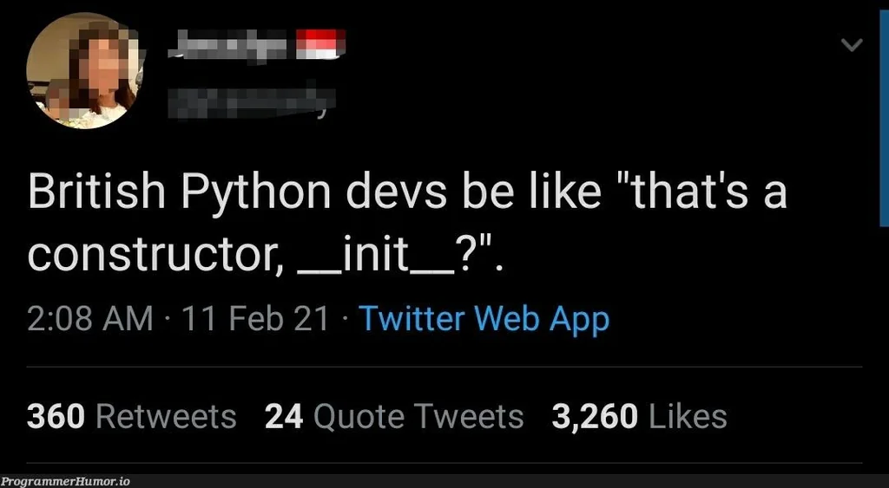
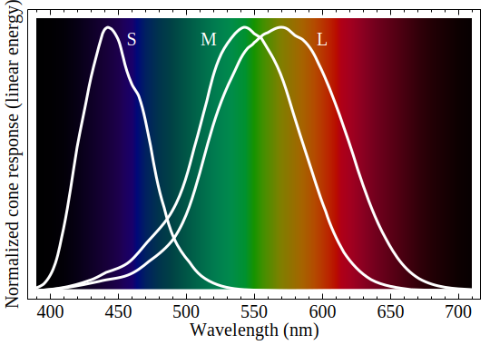
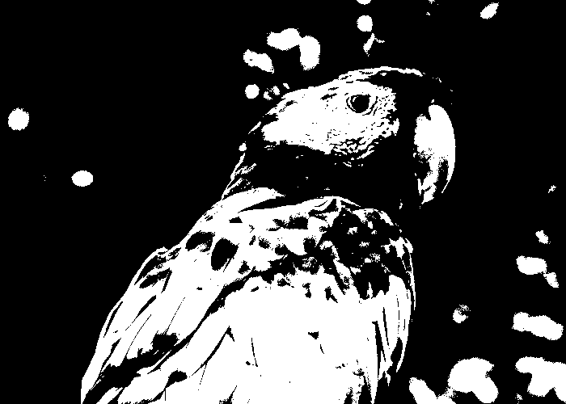

<!-- height duration isinstance -->

<!-- ## isinstance

```py
class Height:
    def __init__(self, feet, inches):
        self.feet = feet
        self.inches = inches

    def __repr__(self):
        return f"{self.feet}'{self.inches}\""

height = Height(5, 6)
n = 10

isinstance(height, Height) # True
isinstance(height, int)    # False

isinstance(n, Height)      # False
isinstance(n, int)         # True
```

---

## Classes Review

## Height

```py
class Height:
    def __init__(self, feet, inches):
        self.feet = feet
        self.inches = inches

    def __repr__(self):
        return f"{self.feet}'{self.inches}\""


h = Height(5, 6)

print(h)  # 5'6"
```

## \_\_add\_\_ and \_\_mul\_\_

```py
class Height:
    def __init__(self, feet, inches):
        self.feet = feet
        self.inches = inches

    def __repr__(self):
        return f"{self.feet}'{self.inches}\""

    def __add__(self, other):
        feet = self.feet + other.feet
        inches = self.inches + other.inches
        return Height(feet, inches)

    def __sub__(self, other):
        feet = self.feet - other.feet
        inches = self.inches - other.inches
        return Height(feet, inches)


h = Height(5, 6)

print(h)  # 5'6"
print(h + Height(1, 4))  # 6'10"
print(h - Height(1, 4))  # 4'2"
```

See the bug?

## Invalid State

```py
h = Height(5, 6)

print(h + Height(1, 4))  # 6'10"
print(h - Height(1, 4))  # 4'2"
print(h + Height(1, 10))  # 6'16"
print(h - Height(1, 10))  # 4'-4"
```

## Corrections in \_\_init\_\_

<div style="font-size: 16px;">

```py
class Height:
    def __init__(self, feet, inches):
        while inches >= 12:
            feet += 1
            inches -= 12

        while inches < 0:
            feet -= 1
            inches += 12

        self.feet = feet
        self.inches = inches

    def __repr__(self):
        return f"{self.feet}'{self.inches}\""

    def __add__(self, other):
        feet = self.feet + other.feet
        inches = self.inches + other.inches
        return Height(feet, inches)

    def __sub__(self, other):
        feet = self.feet - other.feet
        inches = self.inches - other.inches
        return Height(feet, inches)


h = Height(5, 6)

print(h)  # 5'6"
print(h + Height(1, 4))  # 6'10"
print(h - Height(1, 4))  # 4'2"
print(h + Height(1, 10))  # 7'4"
print(h - Height(1, 10))  # 3'8"
```

</div>

## Alternative Representation

```py
class Height:
    def __init__(self, feet, inches):
        self.inches = feet * 12 + inches

    def __repr__(self):
        feet = self.inches // 12
        inches = self.inches - feet * 12
        return f"{feet}'{inches}\""

    def __add__(self, other):
        return Height(0, self.inches + other.inches)

    def __sub__(self, other):
        return Height(0, self.inches - other.inches)


h = Height(5, 6)

print(h)  # 5'6"
print(h + Height(1, 4))  # 6'10"
print(h - Height(1, 4))  # 4'2"
print(h + Height(1, 10))  # 7'4"
print(h - Height(1, 10))  # 3'8"
```

See the bug?

## Invalid \_\_repr\_\_

```py
h = Height(5, 6)

print(h - Height(2, 8))  # -3'10"
```

We could fix this, but don't worry about it for now
 -->

## Fraction Class

```py
class Fraction:
    def __init__(self, num, den):
        self.num = num
        self.den = den

    def __repr__(self):
        return f"{self.num}/{self.den}"
```

```py
a = Fraction(7, 20)
print(a)
```

```txt
7/20
```

## `__mul__` by Int

```py
class Fraction:
    def __init__(self, num, den):
        self.num = num
        self.den = den

    def __repr__(self):
        return f"{self.num}/{self.den}"

    def __mul__(self, other):
        # Make `self * other` work
        return Fraction(self.num * other, self.den)
```

```py
a = Fraction(7, 20)
print(a * 3)  # Calls __mul__(a, 3)
```

```txt
21/20
```

## `__mul__` Arguments

The following two forms are equivalent

```py
a * 3
Fraction.__mul__(a, 3)
```

## `__mul__` by Fraction

```py
class Fraction:
    def __init__(self, num, den):
        self.num = num
        self.den = den

    def __repr__(self):
        return f"{self.num}/{self.den}"

    def __mul__(self, other):
        # Make `self * other` work
        num = self.num * other.num
        den = self.den * other.den
        return Fraction(num, den)
```

```py
a = Fraction(7, 20)
b = Fraction(3, 2)
print(a * b)
```

```txt
21/40
```

## `isinstance`

```py
isinstance(3, int)                     # True
isinstance(3, Fraction)                # False
isinstance(Fraction(7, 20), int)       # False
isinstance(Fraction(7, 20), Fraction)  # True
```

## Generic `__mul__`

```py
class Fraction:
    def __init__(self, num, den):
        self.num = num
        self.den = den

    def __repr__(self):
        return f"{self.num}/{self.den}"

    def __mul__(self, other):
        # Make `self * other` work
        if isinstance(other, int):
            return Fraction(self.num * other, self.den)

        num = self.num * other.num
        den = self.den * other.den
        return Fraction(num, den)
```

```py
a = Fraction(7, 20)
print(a * 3)

b = Fraction(3, 2)
print(a * b)
```

```txt
21/20
21/40
```

## Other Math Methods

```py
def __add__(self, other):
    # ...

def __sub__(self, other):
    # ...

def __mul__(self, other):
    # ...

def __truediv__(self, other):
    # ...
```

## Addition Formula


```txt
self.num   other.num   self.num * other.den + other.num * self.den
──────── + ───────── = ───────────────────────────────────────────
self.den   other.den               self.den * other.den
```

## Simplification

```py
a = Fraction(5, 20)
```

```txt
5/20
```

```txt
1/4
```

```py
a = Fraction(3, 7)
b = Fraction(7, 6)
print(a * b)
```

```txt
1/2
```

## Greatest Common Factor (Divisor)

https://en.wikipedia.org/wiki/Euclidean_algorithm

```py
def gcd(a, b):
    while b != 0:
        tmp = b
        b = a % b
        a = tmp
    return a
```

```py
gcd(5, 20)
gcd(12, 20)
gcd(12, 27)
```

```py
5
4
1
```

## `r` Methods

```py
a = Fraction(7, 20)
print(3 * a)
```

```txt
Traceback (most recent call last):
  File "/tmp/demo.py", line 19, in <module>
    print(3 * a)
          ~~^~~
TypeError: unsupported operand type(s) for *: 'int' and 'Fraction'
```

The following two forms are equivalent

```py
3 * a
Fraction.__rmul__(a, 3)
```

## `r` Method Implementation

"How can we rearrange the equation to put `self` on the left-hand side?"

```py
def __rmul__(self, other):
    # Make `other * self` work
    return self * other

def __radd__(self, other):
    # Make `other + self` work
    return self + other

def __rtruediv__(self, other):
    # Make `other / self` work
    return self.inverse() * other

def __rsub__(self, other):
    # Make `other - self` work
    return -1 * self + other
```

---

## Player Class

```py
class Player:
    def __init__(self, name):
        self.name = name

        # Baskets count starts at 0
        self.baskets = 0

        # Shots count starts at 0
        self.shots = 0

    def __repr__(self):
        # Example: "Avery 9/10"
        return f"{self.name} {self.baskets}/{self.shots}"
```

```py
avery = Player("Avery")
avery.baskets = 2
avery.shots = 3
print(avery)
```

```txt
Avery 2/3
```

## Team Class

```py
team = Team()

team.addPlayer("alex")
team.addPlayer("marcus")
team.addPlayer("chuck")

team.addBasket("marcus")
team.addBasket("marcus")

team.addMiss("marcus")
team.addMiss("alex")
team.addMiss("chuck")

team.removePlayer("chuck")

print(team)
```

```txt
alex 0/1
marcus 2/3
--------------------
2 players 2/4 total
```

## Team Class (continued)

```py
class Team:
    def __init__(self):
        # List of player objects, starts empty
        self.players = []

    def addPlayer(self, name):
        # Make a new player with the given name and add to team
        self.players.append(Player(name))

    def addBasket(self, name):
        # Find the player matching name and update basket and shot count
        for player in self.players:
            # Find the player with the matching name
            if player.name == name:
                # Update both shots and baskets for successful shot
                player.baskets += 1
                player.shots += 1

    def addMiss(self, name):
        # Find the player matching name and update shot count
        for player in self.players:
            # Find the player with the matching name
            if player.name == name:
                # Only update shots for unsuccessful shot
                player.shots += 1

    # ...
```

## Team Class (continued)

```py
class Team:
    # ...

    def removePlayer(self, name):
        # Make a list to store the filtered players
        newPlayers = []

        for player in self.players:
            # Add player to the new list if player's name isn't the one
            # we're trying to remove
            if player.name != name:
                newPlayers.append(player)

        # Swap in new players list
        self.players = newPlayers

    # ...
```

## Team Class (continued)

```py
class Team:
    # ...

    def __repr__(self):
        # Number of players
        numPlayers = len(self.players)

        # Use to count total baskets
        totalBaskets = 0

        # Use to count total shots
        totalShots = 0

        # Use to build string representation
        result = ""

        for player in self.players:
            # Calls player __repr__ method and add newline
            result += f"{player}\n"
            # Add players stats to totals
            totalBaskets += player.baskets
            totalShots += player.shots

        # Add divider line
        result += "-" * 20
        # Add row with summary information
        result += f"\n{numPlayers} players {totalBaskets}/{totalShots} total"
        return result
```

## To Do App

Interactve demo

```py
todo = TodoList()

todo.add("do homework")
todo.add("feed dog")
todo.add("water plants")
todo.finish("feed dog")
todo.remove("do homework")

print(todo)
```

```txt
Should print:

[x] feed dog
[ ] water plants
--------------------
2 tasks, 1 undone
```

## To Do Code

```py
class Task:
    def __init__(self, name):
        # ...

    def __repr__(self):
        # ...

class TodoList:
    def __init__(self):
        self.tasks = []

    def add(self, name):
        # ...

    def finish(self, name):
        # ...

    def remove(self, name):
        # ...

    def __repr__(self):
        # ...
```

## Filtering a List

- Make an empty list
- Iterate over the items in the original list
- Choose which items to add to the new list
- Swap out the new list for the old one

---

## Functions Review

https://www.w3schools.com/python/python_functions.asp

```py
def greeting(name, school):
  return f"Hello {name} from {school}!"

print(greeting("Avery", "gfs")) # "Hello Avery from gfs!"
```

Early returns

```py
def smallest(a, b):
  if a < b:
    return a

  return b

print(smallest(3, 4))
```

## Object Oriented Programming

Objects are **data** + **functionality**.

```py
nums = [1, 2, 3, 4]
print(nums)          # [1, 2, 3, 4]
print(nums[0])       # [1]

nums.append(5)
print(nums)          # [1, 2, 3, 4, 5]

print(nums.index(2)) # 1
```

We use classes to make objects.

## Init

https://www.w3schools.com/python/python_classes.asp

```py
class Rectangle:
  def __init__(self, width, height):
    self.width = width
    self.height = height
```

```py
r = Rectangle(3, 4)
print(r.width)  # 3
print(r.height) # 4
```



## Terms

- **Objects**: Structures that combine data and functionality (methods)
- **Methods**: Functions that are attached to a value
- **Classes**: The categories that objects belong to
- **Instance**: An object is an "instance" of a class if the object belongs to
  that class category
- **Fields**: Variables that are stored inside an object

## Repr

```py
class Rectangle:
  def __init__(self, width, height):
    self.width = width
    self.height = height

  def __repr__(self):
    return f"Rectangle({self.width}, {self.height})"
```

```py
r = Rectangle(3, 4)
print(r) # Rectangle(3, 4)
```

## Methods

```py
class Rectangle:
  def __init__(self, width, height):
    self.width = width
    self.height = height

  def __repr__(self):
    return f"Rectangle({self.width}, {self.height})"

  def area(self):
    return self.width * self.height

  def perimeter(self):
    return 2 * (self.width + self.height)
```

```py
r = Rectangle(3, 4)
print(r.area())      # 12
print(r.perimeter()) # 14
```

Why use methods vs extra fields?

## Mutation

```py
r = Rectangle(3, 4)
r.width = 5
print(r.area()) # ??
```

## Self

```py
class Rectangle:
  def __init__(self, width, height):
    self.width = width
    self.height = height

  def __repr__(self):
    return f"Rectangle({self.width}, {self.height})"

  def area(self):
    return self.width * self.height

  def perimeter(self):
    return 2 * (self.width + self.height)
```

The `self` variable helps us keep track of which data and functionality is
inside of the objects of our class (that is, which variables and functions are
fields and methods).

---

## More Dictionary Methods

- [`keys()`](https://www.w3schools.com/python/ref_dictionary_keys.asp)
- [`values()`](https://www.w3schools.com/python/ref_dictionary_values.asp)
- [`items()`](https://www.w3schools.com/python/ref_dictionary_items.asp)
- [`get(key, default)`](https://www.w3schools.com/python/ref_dictionary_get.asp)
- [`setDefault(key, default)`](https://www.w3schools.com/python/ref_dictionary_setdefault.asp)
- [`pop(value)`](https://www.w3schools.com/python/ref_dictionary_pop.asp)

https://docs.python.org/3/library/stdtypes.html#dict

https://www.w3schools.com/python/python_ref_dictionary.asp

## Get

```py
votes = { "strawberry": 7 }

votes.get("strawberry", 0) # 7
votes.get("banana", 0)     # 0
```

## Using Get

```py
votes = { "strawberry": 1 }

while True: # Loop forever
  flavor = input("Enter for your favorite flavor: ")

  if flavor in votes:
      votes[flavor] += 1 # Increase vote count by one
  else:
      votes[flavor] = 1 # Set initial vote count to one

  print(votes) # Print out vote data after each new vote
```

```py
votes = { "strawberry": 1 }

while True: # Loop forever
    flavor = input("Enter for your favorite flavor: ")

    # Increase the vote count for flavor by 1, using 0 as the default current
    # value if the flavor isn't in the votes dictionary yet
    votes[flavor] = votes.get(flavor, 0) + 1

    print(votes) # Print out vote data after each new vote
```

## Scrabble Best Alphabet

Use more dictionaries!

`bestWords`

```ptls
{
  'c': 'contemptuously',
  'i': 'inquisitively',
  'd': 'difficulty',
  't': 'thoughtfully',
  'r': 'refreshments',
  ...
}
```

`bestScores`

```ptls
{
  'c': 23,
  'i': 28,
  'd': 22,
  't': 25,
  'r': 20,
  ...
}
```

## Challenge: Scrabble Lookup

```txt
Enter letters: football
['football', 'tablespoonful']
tablespoonful
20
```

---

## Dictionaries

A dictionary is a collection of key/value pairs that allows us to look up the
value associated with each key.

https://runestone.academy/ns/books/published/fopp/Dictionaries/toctree.html?mode=browsing

```py
votes = { "strawberry": 1, "chocolate": 1, "vanilla": 1 }
```

## Look up a value

```py
votes["strawberry"] # 1
```

## Add a value

```py
votes["mint"] = 1

# votes = { "strawberry": 1, "chocolate": 1, "vanilla": 1, "mint": 1 }
```

## Update a value

```py
votes["strawberry"] = 2

# votes = { "strawberry": 2, "chocolate": 1, "vanilla": 1, "mint": 1 }
```

A dictionary can only contain a single entry for a given key.

## Increment a value

```py
votes["chocolate"] += 1

# votes = { "strawberry": 2, "chocolate": 2, "vanilla": 1, "mint": 1 }
```

## Iterate over keys

```py
for flavor in votes:
    print(flavor, votes[flavor])

# Prints:
#
# strawberry 2
# chocolate 2
# vanilla 1
# mint 1
```

## Check membership

```py
"mint" in votes # True
"pineapple" in votes # False
```

## Ice cream flavor voting

```py
votes = { "strawberry": 1 }

while True: # Loop forever
  flavor = input("Enter for your favorite flavor: ")

  if flavor in votes:
      votes[flavor] += 1 # Increase vote count by one
  else:
      votes[flavor] = 1 # Set initial vote count to one

  print(votes) # Print out vote data after each new vote
```

## Scrabble


## Scrabble Points

```txt
a:  1, b:  3, c:  3, d:  2, e:  1, f:  4, g:  2, h:  4,
i:  1, j:  8, k:  5, l:  1, m:  3, n:  1, o:  1, p:  3,
q: 10, r:  1, s:  1, t:  1, u:  1, v:  4, w:  4, x:  8,
y:  4, z: 10
```

## Alice in Wonderland

```txt
chapter i down the rabbit hole alice was beginning to get very tired
of sitting by her sister on the bank and of having nothing to do once
or twice she had peeped into the book her sister was reading but it
had no pictures or conversations in it and what is the use of a book
thought alice without pictures or conversations so she was
considering in her own mind as well as she could for the hot day made
her feel very sleepy and stupid whether the pleasure of making a
daisy chain would be worth the trouble of getting up and picking the
daisies when suddenly a white rabbit with pink eyes ran close by her
there was nothing so very remarkable in that nor did alice think it
so very much out of the way to hear the rabbit say to itself oh dear
oh dear i shall be late when she thought it over afterwards it...
```

## Scrabble Best Word

You can use a `for` loop to loop over the characters in a string.

```py
word = "chapter"

for c in word:
  print(c)

# Prints:
#
# c
# h
# a
# p
# t
# e
# r
```

---

## Inverted


## Greenish


## Challenge: Scaled


## Challenge: Ascii

<div style="font-size: 11px !important; font-weight: bold;">

````````````````````````````````````````txt
 ```````````````````````````````````````--~~---'''``'~~~:~-```   ```````````````
```````````````````````````````````'-+eOEEEEEEEEOOOOEEEEEEEOec+~`` `````````    ``````
``````````````````````````````'~<cOEEEEEEEEEEEEEEEEEEOEEEEEEEEEEOc~````````````````````
````````````````````````````-+eOEEEEEEEEOEEOOEOOOOOOOOOOOOEEEEEEEEEO<-````````````````     `
``````````````````````````:cOOOOEEEEEEEEEEOeOOOEOOOOOOOOEEOOOOEEEEEEEEe:``````````````````````
```````````````````````':ceeOEEEEEEOOOOOOOOOOOOOOOeeeeceOOOOOOOEEEEEEEEEO-````````````````````
``````````````````````~ceOOEEEEEEEEEEOeeOOec<+::::~~~~:::+ceeOOOOOOOOOEEEE:```````  ``    ``
````````````````````'+OEEEEEEEEEEEEEOOOOO<:~--''-'''''''''-::+ceOOOOOOOOOOO-``````
```````````````````-eEEEEEEEEEEEEEEOOOOe+~---''''''''''''''''''-~+ceOOOOOOO+``````
``````````````````~OEEEEEEEEEEEEEEEOOec+~-----'''''''``'''```''''''-~<eeOEE<'``````
`````````````````:OEEEEEEEEEEEEEEEOOe<+::~~-~~--''''''`````````''''''--~+cOc:``````` `
````````````````:EEEEEEEEEEEEEEEEOOec<+++::~~~--''`'''````````'''''''-----:OE~```````` ``
```````````````+EEEEEEEEEEEEEEEEEOOec<<<+::~~~~---''``````````'''''''-----~+O+````````````
`````````````-eEEEEEEEEEEEEEEEEEEEOec<++::~~~~~~---'''``''````''''--------~~<<'```````````
````````````:OEEEEEEEEEEEEEEEEEEEOc<+:::~~~~~~~~--'-'```'''''`''''------~~~~+<-````````````
```````````+EEEEEEEEEEEEEEEEEEEOe<++:::~~~~~~~~~--'---'``````''''-------~~~:+cc+'`````````
`````````'<EEEEEOec<<cOEEEOOOOec<<++:::~~~~:::++++<ccc<<:--''''''-------~~:++cee~````````
`````````<EEEEOcceeee+-~<eeeccc<<+++::~~~~:+cccc<<<<+<+<eOec+:~----------~:+<<:'```````
````````:EEEEc~:++<<eEO:-:cecccc<+::::~:::+<<<++++:::~~-~cOOOec+:~-~~~~-~~~:++-'````
`````'`'cEEEE+--:::~-<Ec:+<OOcc<<::~~~~~:+c++<<ceeecc<cc+~~<cccc<:~~~~~~~~~::-```
```````-eEEEEc'-::~-'-ce+<cOOec+++:~~----+c:+<ceceOe<'`:Oe<:+cc<+~:::++<cceeec'``
```````~OEEEEE~-+~~~:cEO+~+eOe<++<:~~--''~+----<<+cee~``:cee<<:-'-:<ceOOEEOOOE~
```````-cEEEEEc~+'~~~:c+`'~<ecc<+<<::~--'~:``''~+<<<+~~~~::::~~'`'+OOeeecc++c+`
``````'`-<EEEEE+<-``'~cc'':+cccc<cc<+:~---+````'''-~~~~~~-'-----'':cOe<:-<Oc-
'````````':eEEEe:<<+-~<<::+<<<<<cccc<+:~~-+-'```''-~~~~~-''''-~~''-:<eec`~e-
``'`'`````'+OeOEc~+<:~--~+<<+++<<ccc<<+::~:+-''''''``````''''-~-'`-::+<+:~`
```````-+cOEOc<cEO:~-----:<<<<++<<cc<<+:::~<:---'````````-------``-++:+e:
`''-:<eOEEOEEO<+cEEOeceOe+c<<<+++<<cc<++::::c~~-''`````'~~~~~~-'``-:c<++`
<ceOEEOOOOOOOEe+:+<eeeeEecc<<<<++++<<<+::~~~:c~--'''--~::~--:~-'``-~:++:`
OOOOOOOOOOOOOOEe+:~--':OOccc<<++++++<<++:~~~~~c+---~~-:<+:~~::-'`'-~::+-            ``
OOOOOOOOOOOOOOeOe+~--'~OOeecc<+++::++++++++:~~~<<~~-'`~eOEEOOOc+:::+++~           `'`
OOOOOOOOOOOOOOe-ee+~-'~OOOeecc<++:::::++::++++:-+e:-'''-:<eEEEEOecc<<~         `''`
OOOOOOOOOOOOOOO~`ec:---eOOOOeec<+:::::::~~~~~:<ccOOe<:~-~~:eEEEEe<<c-        `'`
OOOOOOOOOOOOOOOe``c<~--<OOEEOOec<+:::::~~-----~:<eOEEEOeec<cOEEOc<<'     ``''`
OOOOOOOOOOOOOOOO< 'e+~-:OOEEEEOec<++::::~~~~~::+++ceOOOOc++:eOOec<'``'--''`
OOOOOOOOOOOOOOOOO- -e+~~eeOEEEEOOe<++++:::::~~--~~~~:+<eOOeeOEEOe<++~'`
OOOOEOOOOOOOOOOOOe` -e+:<eeOEEEEEOec<<<++++:~~~~::++:::::+<cOEEe`
OOOOEOOOOOOOOOOOOE+  ~e++eeOEEEEEEEOeec<++::::~:::+<ceeOeecccee~
OOOOOEOOOOOOOOOOOOO-  ~e<eOOEEEEEEEEEOOec<+:~----'''-~:+<ceccc+
OOOOOEOOOOOOOOOOOOEc   ~eeOOOEEEEEEEEEEEEOec+:~---''--~~~:+ce:`
OOOOOEOOOOOOOOOOOOOO-   ~eOOOEEEEEEEEEEEEEEEOec<+:::::::++++'
OOOOOOOOOOOOOOOOOOOE<````~OOOEEEEEEEEEEEEEEEEEEEEOOOOeccc+'
OOOOOOEOOOOOOOOOOOOOO'````:OOEEEEEEEEEEEEEEEEOe<++:+<<+:'`
OOOOOOEOOOOOOOOOOOOOE:```'-cEEEEEEEEEEEEEOc:-``
OOOOOOEOOOOOOOOOOOOOE<``'-~+eEEEEEEEEEO<~````````````
OOOOOOEEOOOOOOOOOOOOOO-''-~+eOEEEEOe<~```````````````
OOOOOOEEOOOOOOOOOOOOOO+-~~:+cOOEOO-````````````````````
OOOOOOEEOOOOOOOOOOOOOEc''-~+<cOEOE:``-c~````````````````
OOOOOOOEOOOOOOOOOOOOOOO'``'-~<OEOE<`<EE-```````````````````
OOOOOOOEOOOOOOOOOOOOOOO~```':eEOEEeeEEc`````````````````````
OOOOOOOEOOOOOOOOOOOOOOE:``~cOEOEEEEEEE-`````````````````````````
OOOOOOEEOOOOOOOOOOOOOOE<:eeeOOEEEEEEEc``````````````````````````
OOOOOOOEOOOOOOOOOOOOOOOOEOeOOEEEEEEEE~````````````````````````````
OOOOOOEEOOOOOOOOOOOOOOOOOeeOEEEEEEEEe`````````````````````````````` `
'cOOOOEEEOOOOOOOOOOOOOOOOeeeEEEEEEEE:``````````````````````````````````
````````````````````````````````````````

</div>


---

## Image Coordinates


- Zero-indexed
- [Top-left origin](https://dsp.stackexchange.com/questions/35925/why-do-we-use-the-top-left-corner-as-the-origin-in-image-processing)

## Pixels


## Subpixels




## Color Channels


- `(r, g, b)` notation
- https://rgbcolorpicker.com/

## Color Intuition


## Impossible Colors


## Colors Worksheet


## PIL / Pillow

https://pillow.readthedocs.io/en/stable/reference/Image.html

```py
from PIL import Image

# Load input image
im = Image.open("bird.png")

# Make blank output image with same dimension as the original
output = Image.new(im.mode, (im.width, im.height))

for y in range(im.height):
  for x in range(im.width):
    (r, g, b) = im.getpixel((x, y))

    # Your code goes here

    output.putpixel((x, y), (r, g, b))

# Save output image
output.save("grayscale.png")
```

## Tuples

```py
(r, g, b) = im.getpixel((x, y))
```

```py
color = im.getpixel((x, y))

# ...

(r, g, b) = color
```

## Max Red Demo

```py
r = 255
```

## Simple Grayscale


- https://en.wikipedia.org/wiki/Grayscale
- `r`, `g`, and `b` are all equal
- $$l = \frac{r + g + b}{3}$$

## Better Grayscale


- Relative / perceptual luminance
- https://brandonrohrer.com/convert_rgb_to_grayscale.html

Linear approximation for gamma-compressed channel values:

$$l = 0.299 \cdot r + 0.587 \cdot g + 0.114 \cdot b$$

## Black and White




- Black `(0, 0, 0)`
- White `(255, 255, 255)`

---

## Images Preview

## Python Review

---

## Demo Projects

- Orbits
- Images
- Football

## What is CS2

- Practical, project based, applications
- Data focused

## Grading policy

[Link](../shared/grading.md)

## Python setup

Idle:

- [Idle](https://www.python.org/downloads/)

VSCode:

- [VSCode](https://code.visualstudio.com/)
- [Python extension](https://marketplace.visualstudio.com/items?itemName=ms-python.python)

## Review

- Define a variable
- Print out `Hello <name>` based on the value in the variable `name`
- Get a name string from the user as input and print out `Hello <name>`
- Get input from the user
- Convert a string to a number

## Dog Years
