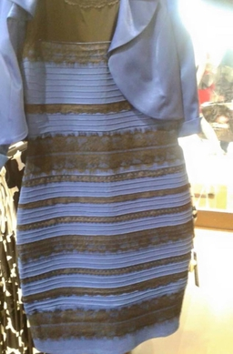

**Pixels**

- What are pixels?
- [Raster graphics](https://en.wikipedia.org/wiki/Raster_graphics)
- Image dimensions
- Image coordinate system
  - [Top-left origin](https://dsp.stackexchange.com/questions/35925/why-do-we-use-the-top-left-corner-as-the-origin-in-image-processing)
  - Zero-indexed

**Colors**

- [Subpixels](https://en.wikipedia.org/wiki/Subpixel_rendering)
- [RGB color model](https://en.wikipedia.org/wiki/RGB_color_model)
- `(r, g, b)` notation
- https://rgbcolorpicker.com/
- Grayscale https://en.wikipedia.org/wiki/Grayscale

**Color intuition**

**Colors worksheet**

**Python review**

https://www.w3schools.com/python/python_exercises.asp

---

**Class intro**

- Practical, project based, applications
- Data focused
- Orbits demo
- Images demo
- Football demo

**Grading policy**

- [Link](../shared/grading.md)

**Python setup**

- [Idle](https://www.python.org/downloads/)
- [VSCode](https://code.visualstudio.com/) +
  [Python extension](https://marketplace.visualstudio.com/items?itemName=ms-python.python)

**Install Python libraries**

- [Command](../shared/install-python-libraries)

**Review**

- Define a variable
- Make an empty list
- Make an infinite loop
- Print out `Hello <name>` based on the value in the variable `name`
- Get a name string from the user as input and print out `Hello <name>`
- Clear the console
- Check if a value is in a list
- Add a value to a list
- Remove a value from a list

**Dog years**

- `input`
- Converting strings to numbers with `int`
- Math operators
- [Format strings](https://realpython.com/python-string-formatting/)
- `print`
