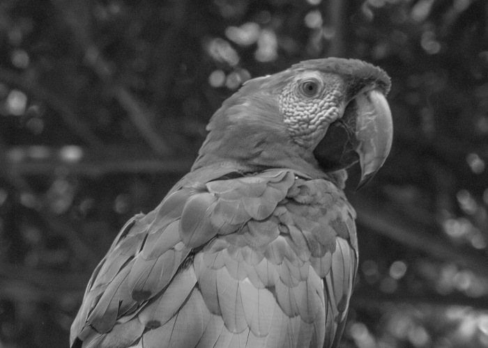

**Relative / perceptual luminance**

- https://en.wikipedia.org/wiki/Relative_luminance
- $$l = 0.2126 \cdot r + 0.7152 \cdot g + 0.0722 \cdot b$$

**Fancy grayscale**

- _Problem_

**Inverted**

- _Problem_

**Scaled**

- _Problem_

---

**PIL intro**

- https://pillow.readthedocs.io/en/stable/reference/Image.html

- Dimensions

  ```py
  im.height # image height in pixels
  im.width # image width in pixels
  ```

- Get pixel value:

  ```py
  (r, g, b) = im.getpixel((x, y)) # get rgb values at position x, y
  ```

- Set pixel value:

  ```py
  im.putpixel((x, y), (r, g, b)) # set rgb values at position x, y
  ```

**Starter code**

```py
from PIL import Image

# Load input image
im = Image.open("bird.png")

# Make blank output image with same dimension as the original
output = Image.new(im.mode, (im.width, im.height))

for y in range(im.height):
  for x in range(im.width):
    (r, g, b) = im.getpixel((x, y))

    # Your code goes here

    output.putpixel((x, y), (r, g, b))

# Save output image
output.save("grayscale.png")
```

**Demo manipulation**

Set `r = 255`.

**Grayscale**

- _Problem_

**Greenish**

- _Problem_

---

**Pixels**


- What are pixels?
- [Raster graphics](https://en.wikipedia.org/wiki/Raster_graphics)
- Image dimensions
- Image coordinate system
  - [Top-left origin](https://dsp.stackexchange.com/questions/35925/why-do-we-use-the-top-left-corner-as-the-origin-in-image-processing)
  - Zero-indexed


**Colors**


- [Subpixels](https://en.wikipedia.org/wiki/Subpixel_rendering)
- [RGB color model](https://en.wikipedia.org/wiki/RGB_color_model)
- `(r, g, b)` notation
- https://rgbcolorpicker.com/

**Grayscale**

- https://en.wikipedia.org/wiki/Grayscale
- `r`, `g`, and `b` are all equal
- $$y = \frac{r + g + b}{3}$$



**Color intuition**


**Colors worksheet**

- _Worksheet_

**Python review**

https://www.w3schools.com/python/python_exercises.asp

---

**Class intro**

- Practical, project based, applications
- Data focused
- Orbits demo
- Images demo
- Football demo

**Grading policy**

- [Link](../shared/grading.md)

**Python setup**

- [Idle](https://www.python.org/downloads/)
- [VSCode](https://code.visualstudio.com/) +
  [Python extension](https://marketplace.visualstudio.com/items?itemName=ms-python.python)

**Install Python libraries**

- [Command](../shared/install-python-libraries)

**Review**

- Define a variable
- Make an empty list
- Make an infinite loop
- Print out `Hello <name>` based on the value in the variable `name`
- Get a name string from the user as input and print out `Hello <name>`
- Clear the console
- Check if a value is in a list
- Add a value to a list
- Remove a value from a list

**Dog years**

- _Problem_
- `input`
- Converting strings to numbers with `int`
- Math operators
- [Format strings](https://realpython.com/python-string-formatting/)
- `print`
