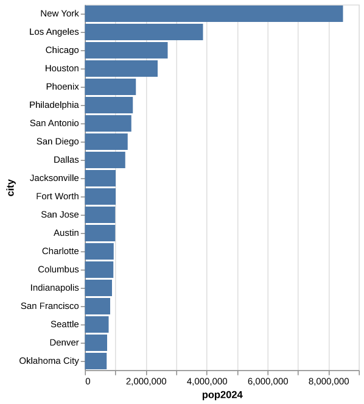
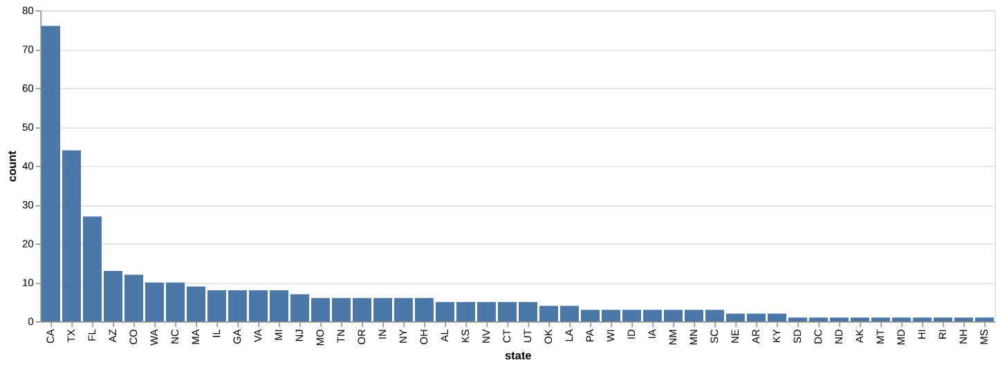
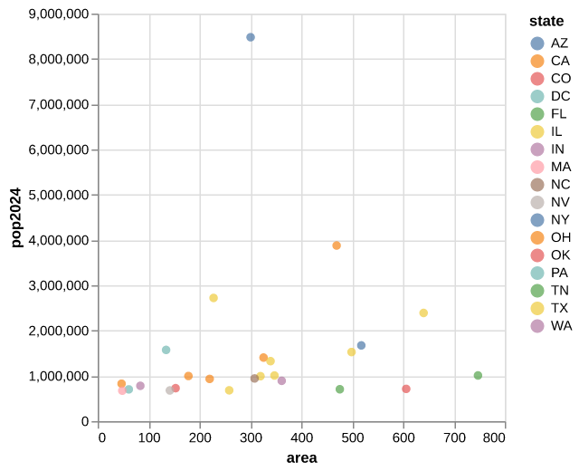

# Data Analysis and Visualization

## Setup

```txt
pip install polars
pip install altair
pip install vl-convert-python
```

## Links

- https://altair-viz.github.io/altair-tutorial/README.html
- https://docs.pola.rs/
- https://en.wikipedia.org/wiki/List_of_United_States_cities_by_population
- https://wikitable2csv.ggor.de/
- https://survey.stackoverflow.co/2018
- https://ww2.amstat.org/censusatschool/RandomSampleForm.cfm
- https://matplotlib.org/

## Load Data

```py
import polars as pl

cities = pl.read_csv("data/cities.csv") # Load dataframe from CSV
```

## View Data

```py
cities
```

```
shape: (346, 5)
┌─────────────┬───────┬─────────┬─────────┬───────┐
│ city        ┆ state ┆ pop2024 ┆ pop2020 ┆ area  │
│ ---         ┆ ---   ┆ ---     ┆ ---     ┆ ---   │
│ str         ┆ str   ┆ i64     ┆ i64     ┆ f64   │
╞═════════════╪═══════╪═════════╪═════════╪═══════╡
│ New York    ┆ NY    ┆ 8478072 ┆ 8804190 ┆ 300.5 │
│ Los Angeles ┆ CA    ┆ 3878704 ┆ 3898747 ┆ 469.5 │
│ Chicago     ┆ IL    ┆ 2721308 ┆ 2746388 ┆ 227.7 │
│ Houston     ┆ TX    ┆ 2390125 ┆ 2304580 ┆ 640.4 │
│ Phoenix     ┆ AZ    ┆ 1673164 ┆ 1608139 ┆ 518.0 │
│ …           ┆ …     ┆ …       ┆ …       ┆ …     │
│ Deltona     ┆ FL    ┆ 100513  ┆ 93692   ┆ 37.3  │
│ Federal Way ┆ WA    ┆ 100252  ┆ 101030  ┆ 22.3  │
│ San Angelo  ┆ TX    ┆ 100159  ┆ 99893   ┆ 59.7  │
│ Tracy       ┆ CA    ┆ 100136  ┆ 93000   ┆ 25.9  │
│ Sunrise     ┆ FL    ┆ 100128  ┆ 97335   ┆ 16.2  │
└─────────────┴───────┴─────────┴─────────┴───────┘
```

Use `pl.Config(tbl_rows=-1)` to show all rows

_How many rows are in this table? How many columns?_

<details>
  <summary>Click to show answer</summary>

`346` rows, `5` columns

</details>

## Length

```py
len(cities)
```

```
346
```

## Get Rows From the Start

```py
cities.head(5)
```

```
shape: (5, 5)
┌─────────────┬───────┬─────────┬─────────┬───────┐
│ city        ┆ state ┆ pop2024 ┆ pop2020 ┆ area  │
│ ---         ┆ ---   ┆ ---     ┆ ---     ┆ ---   │
│ str         ┆ str   ┆ i64     ┆ i64     ┆ f64   │
╞═════════════╪═══════╪═════════╪═════════╪═══════╡
│ New York    ┆ NY    ┆ 8478072 ┆ 8804190 ┆ 300.5 │
│ Los Angeles ┆ CA    ┆ 3878704 ┆ 3898747 ┆ 469.5 │
│ Chicago     ┆ IL    ┆ 2721308 ┆ 2746388 ┆ 227.7 │
│ Houston     ┆ TX    ┆ 2390125 ┆ 2304580 ┆ 640.4 │
│ Phoenix     ┆ AZ    ┆ 1673164 ┆ 1608139 ┆ 518.0 │
└─────────────┴───────┴─────────┴─────────┴───────┘
```

## Get Rows From the End

```py
cities.tail(5)
```

```
shape: (5, 5)
┌─────────────┬───────┬─────────┬─────────┬──────┐
│ city        ┆ state ┆ pop2024 ┆ pop2020 ┆ area │
│ ---         ┆ ---   ┆ ---     ┆ ---     ┆ ---  │
│ str         ┆ str   ┆ i64     ┆ i64     ┆ f64  │
╞═════════════╪═══════╪═════════╪═════════╪══════╡
│ Deltona     ┆ FL    ┆ 100513  ┆ 93692   ┆ 37.3 │
│ Federal Way ┆ WA    ┆ 100252  ┆ 101030  ┆ 22.3 │
│ San Angelo  ┆ TX    ┆ 100159  ┆ 99893   ┆ 59.7 │
│ Tracy       ┆ CA    ┆ 100136  ┆ 93000   ┆ 25.9 │
│ Sunrise     ┆ FL    ┆ 100128  ┆ 97335   ┆ 16.2 │
└─────────────┴───────┴─────────┴─────────┴──────┘
```

## Get Rows From the Middle

Get rows `6` through `10` using `head` and `tail`

<details>
  <summary>Click to show answer</summary>

```py
cities.head(10).tail(5)
```

</details>

```
shape: (5, 5)
┌──────────────┬───────┬─────────┬─────────┬───────┐
│ city         ┆ state ┆ pop2024 ┆ pop2020 ┆ area  │
│ ---          ┆ ---   ┆ ---     ┆ ---     ┆ ---   │
│ str          ┆ str   ┆ i64     ┆ i64     ┆ f64   │
╞══════════════╪═══════╪═════════╪═════════╪═══════╡
│ Philadelphia ┆ PA    ┆ 1573916 ┆ 1603797 ┆ 134.4 │
│ San Antonio  ┆ TX    ┆ 1526656 ┆ 1434625 ┆ 498.8 │
│ San Diego    ┆ CA    ┆ 1404452 ┆ 1386932 ┆ 325.9 │
│ Dallas       ┆ TX    ┆ 1326087 ┆ 1304379 ┆ 339.6 │
│ Jacksonville ┆ FL    ┆ 1009833 ┆ 949611  ┆ 747.3 │
└──────────────┴───────┴─────────┴─────────┴───────┘
```

## Slicing

```py
cities[5:10]
```

```
shape: (5, 5)
┌──────────────┬───────┬─────────┬─────────┬───────┐
│ city         ┆ state ┆ pop2024 ┆ pop2020 ┆ area  │
│ ---          ┆ ---   ┆ ---     ┆ ---     ┆ ---   │
│ str          ┆ str   ┆ i64     ┆ i64     ┆ f64   │
╞══════════════╪═══════╪═════════╪═════════╪═══════╡
│ Philadelphia ┆ PA    ┆ 1573916 ┆ 1603797 ┆ 134.4 │
│ San Antonio  ┆ TX    ┆ 1526656 ┆ 1434625 ┆ 498.8 │
│ San Diego    ┆ CA    ┆ 1404452 ┆ 1386932 ┆ 325.9 │
│ Dallas       ┆ TX    ┆ 1326087 ┆ 1304379 ┆ 339.6 │
│ Jacksonville ┆ FL    ┆ 1009833 ┆ 949611  ┆ 747.3 │
└──────────────┴───────┴─────────┴─────────┴───────┘
```

## Single Row as a Table

```py
cities[5]
```

```
shape: (1, 5)
┌──────────────┬───────┬─────────┬─────────┬───────┐
│ city         ┆ state ┆ pop2024 ┆ pop2020 ┆ area  │
│ ---          ┆ ---   ┆ ---     ┆ ---     ┆ ---   │
│ str          ┆ str   ┆ i64     ┆ i64     ┆ f64   │
╞══════════════╪═══════╪═════════╪═════════╪═══════╡
│ Philadelphia ┆ PA    ┆ 1573916 ┆ 1603797 ┆ 134.4 │
└──────────────┴───────┴─────────┴─────────┴───────┘
```

## Single Row as a Dictionary

```py
cities.row(5, named=True)
```

```
{'city': 'Philadelphia', 'state': 'PA', 'pop2024': 1573916, 'pop2020': 1603797, 'area': 134.4}
```

## Get Column Names

```py
cities.columns
```

```
['city', 'state', 'pop2024', 'pop2020', 'area']
```

## Select Columns

```py
cities.select(["city", "pop2024"])
```

```
shape: (346, 2)
┌─────────────┬─────────┐
│ city        ┆ pop2024 │
│ ---         ┆ ---     │
│ str         ┆ i64     │
╞═════════════╪═════════╡
│ New York    ┆ 8478072 │
│ Los Angeles ┆ 3878704 │
│ Chicago     ┆ 2721308 │
│ Houston     ┆ 2390125 │
│ Phoenix     ┆ 1673164 │
│ …           ┆ …       │
│ Deltona     ┆ 100513  │
│ Federal Way ┆ 100252  │
│ San Angelo  ┆ 100159  │
│ Tracy       ┆ 100136  │
│ Sunrise     ┆ 100128  │
└─────────────┴─────────┘
```

## Selection and Slicing

Get the name and 2024 population of the first 10 cities (two ways)

<details>
  <summary>Click to show answer</summary>

```py
cities.head(10).select("city", "pop2024")
```

Or, equivalently:

```py
cities.select(["city", "pop2024"]).head(10)
```

</details>

## Get Column as a Polars Series

```py
cities["state"]
```

or

```py
cities.get_column("state")
```

```
shape: (346,)
Series: 'state' [str]
[
    "NY"
    "CA"
    "IL"
    "TX"
    "AZ"
    …
    "FL"
    "WA"
    "TX"
    "CA"
    "FL"
]
```

## Get Column a List

```py
cities["state"].to_list()
```

```
['NY', 'CA', 'IL', 'TX', 'AZ', ...]
```

_How do we get the name of the 10th city in the dataframe?_

<details>
  <summary>Click to show answer</summary>

```py
cities["city"][9]
```

</details>

## Remove Columns

```py
cities.drop(["pop2020", "area"])
```

```
shape: (346, 3)
┌─────────────┬───────┬─────────┐
│ city        ┆ state ┆ pop2024 │
│ ---         ┆ ---   ┆ ---     │
│ str         ┆ str   ┆ i64     │
╞═════════════╪═══════╪═════════╡
│ New York    ┆ NY    ┆ 8478072 │
│ Los Angeles ┆ CA    ┆ 3878704 │
│ Chicago     ┆ IL    ┆ 2721308 │
│ Houston     ┆ TX    ┆ 2390125 │
│ Phoenix     ┆ AZ    ┆ 1673164 │
│ …           ┆ …     ┆ …       │
│ Deltona     ┆ FL    ┆ 100513  │
│ Federal Way ┆ WA    ┆ 100252  │
│ San Angelo  ┆ TX    ┆ 100159  │
│ Tracy       ┆ CA    ┆ 100136  │
│ Sunrise     ┆ FL    ┆ 100128  │
└─────────────┴───────┴─────────┘
```

## Rename Columns

```py
cities.rename({"area": "areaSqMiles"})
```

```
shape: (346, 5)
┌─────────────┬───────┬─────────┬─────────┬─────────────┐
│ city        ┆ state ┆ pop2024 ┆ pop2020 ┆ areaSqMiles │
│ ---         ┆ ---   ┆ ---     ┆ ---     ┆ ---         │
│ str         ┆ str   ┆ i64     ┆ i64     ┆ f64         │
╞═════════════╪═══════╪═════════╪═════════╪═════════════╡
│ New York    ┆ NY    ┆ 8478072 ┆ 8804190 ┆ 300.5       │
│ Los Angeles ┆ CA    ┆ 3878704 ┆ 3898747 ┆ 469.5       │
│ Chicago     ┆ IL    ┆ 2721308 ┆ 2746388 ┆ 227.7       │
│ Houston     ┆ TX    ┆ 2390125 ┆ 2304580 ┆ 640.4       │
│ Phoenix     ┆ AZ    ┆ 1673164 ┆ 1608139 ┆ 518.0       │
│ …           ┆ …     ┆ …       ┆ …       ┆ …           │
│ Deltona     ┆ FL    ┆ 100513  ┆ 93692   ┆ 37.3        │
│ Federal Way ┆ WA    ┆ 100252  ┆ 101030  ┆ 22.3        │
│ San Angelo  ┆ TX    ┆ 100159  ┆ 99893   ┆ 59.7        │
│ Tracy       ┆ CA    ┆ 100136  ┆ 93000   ┆ 25.9        │
│ Sunrise     ┆ FL    ┆ 100128  ┆ 97335   ┆ 16.2        │
└─────────────┴───────┴─────────┴─────────┴─────────────┘
```

## Immutability

Polars operations don't modify the original dataframe: they produce a new
dataframe with the changes applied. In the example below, calling `cities.drop`
doesn't change the data in the `cities` dataframe.

```py
cities.drop(["pop2020", "area"])
```

```
shape: (346, 3)
┌─────────────┬───────┬─────────┐
│ city        ┆ state ┆ pop2024 │
│ ---         ┆ ---   ┆ ---     │
│ str         ┆ str   ┆ i64     │
╞═════════════╪═══════╪═════════╡
│ New York    ┆ NY    ┆ 8478072 │
│ Los Angeles ┆ CA    ┆ 3878704 │
│ Chicago     ┆ IL    ┆ 2721308 │
│ Houston     ┆ TX    ┆ 2390125 │
│ Phoenix     ┆ AZ    ┆ 1673164 │
│ …           ┆ …     ┆ …       │
│ Deltona     ┆ FL    ┆ 100513  │
│ Federal Way ┆ WA    ┆ 100252  │
│ San Angelo  ┆ TX    ┆ 100159  │
│ Tracy       ┆ CA    ┆ 100136  │
│ Sunrise     ┆ FL    ┆ 100128  │
└─────────────┴───────┴─────────┘
```

```py
cities
```

```
shape: (346, 5)
┌─────────────┬───────┬─────────┬─────────┬───────┐
│ city        ┆ state ┆ pop2024 ┆ pop2020 ┆ area  │
│ ---         ┆ ---   ┆ ---     ┆ ---     ┆ ---   │
│ str         ┆ str   ┆ i64     ┆ i64     ┆ f64   │
╞═════════════╪═══════╪═════════╪═════════╪═══════╡
│ New York    ┆ NY    ┆ 8478072 ┆ 8804190 ┆ 300.5 │
│ Los Angeles ┆ CA    ┆ 3878704 ┆ 3898747 ┆ 469.5 │
│ Chicago     ┆ IL    ┆ 2721308 ┆ 2746388 ┆ 227.7 │
│ Houston     ┆ TX    ┆ 2390125 ┆ 2304580 ┆ 640.4 │
│ Phoenix     ┆ AZ    ┆ 1673164 ┆ 1608139 ┆ 518.0 │
│ …           ┆ …     ┆ …       ┆ …       ┆ …     │
│ Deltona     ┆ FL    ┆ 100513  ┆ 93692   ┆ 37.3  │
│ Federal Way ┆ WA    ┆ 100252  ┆ 101030  ┆ 22.3  │
│ San Angelo  ┆ TX    ┆ 100159  ┆ 99893   ┆ 59.7  │
│ Tracy       ┆ CA    ┆ 100136  ┆ 93000   ┆ 25.9  │
│ Sunrise     ┆ FL    ┆ 100128  ┆ 97335   ┆ 16.2  │
└─────────────┴───────┴─────────┴─────────┴───────┘
```

## Making New Columns: Population Density

```py
cities.with_columns(
    (pl.col("pop2024") / pl.col("area")).round(1).alias("popDensity")
)
```

```
shape: (346, 6)
┌─────────────┬───────┬─────────┬─────────┬───────┬────────────┐
│ city        ┆ state ┆ pop2024 ┆ pop2020 ┆ area  ┆ popDensity │
│ ---         ┆ ---   ┆ ---     ┆ ---     ┆ ---   ┆ ---        │
│ str         ┆ str   ┆ i64     ┆ i64     ┆ f64   ┆ f64        │
╞═════════════╪═══════╪═════════╪═════════╪═══════╪════════════╡
│ New York    ┆ NY    ┆ 8478072 ┆ 8804190 ┆ 300.5 ┆ 28213.2    │
│ Los Angeles ┆ CA    ┆ 3878704 ┆ 3898747 ┆ 469.5 ┆ 8261.4     │
│ Chicago     ┆ IL    ┆ 2721308 ┆ 2746388 ┆ 227.7 ┆ 11951.3    │
│ Houston     ┆ TX    ┆ 2390125 ┆ 2304580 ┆ 640.4 ┆ 3732.2     │
│ Phoenix     ┆ AZ    ┆ 1673164 ┆ 1608139 ┆ 518.0 ┆ 3230.0     │
│ …           ┆ …     ┆ …       ┆ …       ┆ …     ┆ …          │
│ Deltona     ┆ FL    ┆ 100513  ┆ 93692   ┆ 37.3  ┆ 2694.7     │
│ Federal Way ┆ WA    ┆ 100252  ┆ 101030  ┆ 22.3  ┆ 4495.6     │
│ San Angelo  ┆ TX    ┆ 100159  ┆ 99893   ┆ 59.7  ┆ 1677.7     │
│ Tracy       ┆ CA    ┆ 100136  ┆ 93000   ┆ 25.9  ┆ 3866.3     │
│ Sunrise     ┆ FL    ┆ 100128  ┆ 97335   ┆ 16.2  ┆ 6180.7     │
└─────────────┴───────┴─────────┴─────────┴───────┴────────────┘
```

You can think of
`(pl.col("pop2024") / pl.col("area")).round(1).alias("popDensity")` as a
_formula_ for making a new column.

## Making New Columns: Population Change Number

```py
cities.with_columns(
    (pl.col("pop2024") - pl.col("pop2020")).alias("change")
)
```

```
shape: (346, 6)
┌─────────────┬───────┬─────────┬─────────┬───────┬─────────┐
│ city        ┆ state ┆ pop2024 ┆ pop2020 ┆ area  ┆ change  │
│ ---         ┆ ---   ┆ ---     ┆ ---     ┆ ---   ┆ ---     │
│ str         ┆ str   ┆ i64     ┆ i64     ┆ f64   ┆ i64     │
╞═════════════╪═══════╪═════════╪═════════╪═══════╪═════════╡
│ New York    ┆ NY    ┆ 8478072 ┆ 8804190 ┆ 300.5 ┆ -326118 │
│ Los Angeles ┆ CA    ┆ 3878704 ┆ 3898747 ┆ 469.5 ┆ -20043  │
│ Chicago     ┆ IL    ┆ 2721308 ┆ 2746388 ┆ 227.7 ┆ -25080  │
│ Houston     ┆ TX    ┆ 2390125 ┆ 2304580 ┆ 640.4 ┆ 85545   │
│ Phoenix     ┆ AZ    ┆ 1673164 ┆ 1608139 ┆ 518.0 ┆ 65025   │
│ …           ┆ …     ┆ …       ┆ …       ┆ …     ┆ …       │
│ Deltona     ┆ FL    ┆ 100513  ┆ 93692   ┆ 37.3  ┆ 6821    │
│ Federal Way ┆ WA    ┆ 100252  ┆ 101030  ┆ 22.3  ┆ -778    │
│ San Angelo  ┆ TX    ┆ 100159  ┆ 99893   ┆ 59.7  ┆ 266     │
│ Tracy       ┆ CA    ┆ 100136  ┆ 93000   ┆ 25.9  ┆ 7136    │
│ Sunrise     ┆ FL    ┆ 100128  ┆ 97335   ┆ 16.2  ┆ 2793    │
└─────────────┴───────┴─────────┴─────────┴───────┴─────────┘
```

## Making New Columns: Population Change Percentage

Get a table with population change as percentage change from 2020 to 2024

<details>
  <summary>Click to show answer</summary>

```py
cities.with_columns(
    (pl.col("pop2024") / pl.col("pop2020") * 100 - 100).round(2).alias("pctChange")
)
```

</details>

```
shape: (346, 6)
┌─────────────┬───────┬─────────┬─────────┬───────┬───────────┐
│ city        ┆ state ┆ pop2024 ┆ pop2020 ┆ area  ┆ pctChange │
│ ---         ┆ ---   ┆ ---     ┆ ---     ┆ ---   ┆ ---       │
│ str         ┆ str   ┆ i64     ┆ i64     ┆ f64   ┆ f64       │
╞═════════════╪═══════╪═════════╪═════════╪═══════╪═══════════╡
│ New York    ┆ NY    ┆ 8478072 ┆ 8804190 ┆ 300.5 ┆ -3.7      │
│ Los Angeles ┆ CA    ┆ 3878704 ┆ 3898747 ┆ 469.5 ┆ -0.51     │
│ Chicago     ┆ IL    ┆ 2721308 ┆ 2746388 ┆ 227.7 ┆ -0.91     │
│ Houston     ┆ TX    ┆ 2390125 ┆ 2304580 ┆ 640.4 ┆ 3.71      │
│ Phoenix     ┆ AZ    ┆ 1673164 ┆ 1608139 ┆ 518.0 ┆ 4.04      │
│ …           ┆ …     ┆ …       ┆ …       ┆ …     ┆ …         │
│ Deltona     ┆ FL    ┆ 100513  ┆ 93692   ┆ 37.3  ┆ 7.28      │
│ Federal Way ┆ WA    ┆ 100252  ┆ 101030  ┆ 22.3  ┆ -0.77     │
│ San Angelo  ┆ TX    ┆ 100159  ┆ 99893   ┆ 59.7  ┆ 0.27      │
│ Tracy       ┆ CA    ┆ 100136  ┆ 93000   ┆ 25.9  ┆ 7.67      │
│ Sunrise     ┆ FL    ┆ 100128  ┆ 97335   ┆ 16.2  ┆ 2.87      │
└─────────────┴───────┴─────────┴─────────┴───────┴───────────┘
```

## Filter Rows: Texas Cities

```py
cities.filter(pl.col("state") == "TX")
```

```
shape: (44, 5)
┌───────────────┬───────┬─────────┬─────────┬───────┐
│ city          ┆ state ┆ pop2024 ┆ pop2020 ┆ area  │
│ ---           ┆ ---   ┆ ---     ┆ ---     ┆ ---   │
│ str           ┆ str   ┆ i64     ┆ i64     ┆ f64   │
╞═══════════════╪═══════╪═════════╪═════════╪═══════╡
│ Houston       ┆ TX    ┆ 2390125 ┆ 2304580 ┆ 640.4 │
│ San Antonio   ┆ TX    ┆ 1526656 ┆ 1434625 ┆ 498.8 │
│ Dallas        ┆ TX    ┆ 1326087 ┆ 1304379 ┆ 339.6 │
│ Fort Worth    ┆ TX    ┆ 1008106 ┆ 918915  ┆ 347.3 │
│ Austin        ┆ TX    ┆ 993588  ┆ 961855  ┆ 319.9 │
│ …             ┆ …     ┆ …       ┆ …       ┆ …     │
│ Sugar Land    ┆ TX    ┆ 109851  ┆ 111026  ┆ 40.5  │
│ Edinburg      ┆ TX    ┆ 108733  ┆ 100243  ┆ 44.7  │
│ Wichita Falls ┆ TX    ┆ 102372  ┆ 102316  ┆ 72.0  │
│ Georgetown    ┆ TX    ┆ 101344  ┆ 67176   ┆ 57.3  │
│ San Angelo    ┆ TX    ┆ 100159  ┆ 99893   ┆ 59.7  │
└───────────────┴───────┴─────────┴─────────┴───────┘
```

## Filter Rows: Largest Cities

Get a table of cities with a 2024 population of at least one million

<details>
  <summary>Click to show answer</summary>

```py
cities.filter(pl.col("pop2024") >= 1000000)
```

</details>

```
shape: (11, 5)
┌──────────────┬───────┬─────────┬─────────┬───────┐
│ city         ┆ state ┆ pop2024 ┆ pop2020 ┆ area  │
│ ---          ┆ ---   ┆ ---     ┆ ---     ┆ ---   │
│ str          ┆ str   ┆ i64     ┆ i64     ┆ f64   │
╞══════════════╪═══════╪═════════╪═════════╪═══════╡
│ New York     ┆ NY    ┆ 8478072 ┆ 8804190 ┆ 300.5 │
│ Los Angeles  ┆ CA    ┆ 3878704 ┆ 3898747 ┆ 469.5 │
│ Chicago      ┆ IL    ┆ 2721308 ┆ 2746388 ┆ 227.7 │
│ Houston      ┆ TX    ┆ 2390125 ┆ 2304580 ┆ 640.4 │
│ Phoenix      ┆ AZ    ┆ 1673164 ┆ 1608139 ┆ 518.0 │
│ …            ┆ …     ┆ …       ┆ …       ┆ …     │
│ San Antonio  ┆ TX    ┆ 1526656 ┆ 1434625 ┆ 498.8 │
│ San Diego    ┆ CA    ┆ 1404452 ┆ 1386932 ┆ 325.9 │
│ Dallas       ┆ TX    ┆ 1326087 ┆ 1304379 ┆ 339.6 │
│ Jacksonville ┆ FL    ┆ 1009833 ┆ 949611  ┆ 747.3 │
│ Fort Worth   ┆ TX    ┆ 1008106 ┆ 918915  ┆ 347.3 │
└──────────────┴───────┴─────────┴─────────┴───────┘
```

## Boolean Operators

- Use `&` for `and`
- Use `|` for `or`
- Use `~` for `not`

```py
cities.filter((pl.col("state") == "CA") & (pl.col("pop2024") > 1000000))
```

```
shape: (2, 5)
┌─────────────┬───────┬─────────┬─────────┬───────┐
│ city        ┆ state ┆ pop2024 ┆ pop2020 ┆ area  │
│ ---         ┆ ---   ┆ ---     ┆ ---     ┆ ---   │
│ str         ┆ str   ┆ i64     ┆ i64     ┆ f64   │
╞═════════════╪═══════╪═════════╪═════════╪═══════╡
│ Los Angeles ┆ CA    ┆ 3878704 ┆ 3898747 ┆ 469.5 │
│ San Diego   ┆ CA    ┆ 1404452 ┆ 1386932 ┆ 325.9 │
└─────────────┴───────┴─────────┴─────────┴───────┘
```

## `is_in`

```py
cities.filter(pl.col("state").is_in(["MA", "PA"]))
```

```
shape: (12, 5)
┌──────────────┬───────┬─────────┬─────────┬───────┐
│ city         ┆ state ┆ pop2024 ┆ pop2020 ┆ area  │
│ ---          ┆ ---   ┆ ---     ┆ ---     ┆ ---   │
│ str          ┆ str   ┆ i64     ┆ i64     ┆ f64   │
╞══════════════╪═══════╪═════════╪═════════╪═══════╡
│ Philadelphia ┆ PA    ┆ 1573916 ┆ 1603797 ┆ 134.4 │
│ Boston       ┆ MA    ┆ 673458  ┆ 675647  ┆ 48.3  │
│ Pittsburgh   ┆ PA    ┆ 307668  ┆ 302971  ┆ 55.4  │
│ Worcester    ┆ MA    ┆ 211286  ┆ 206518  ┆ 37.4  │
│ Springfield  ┆ MA    ┆ 154888  ┆ 155929  ┆ 31.9  │
│ …            ┆ …     ┆ …       ┆ …       ┆ …     │
│ Lowell       ┆ MA    ┆ 120418  ┆ 115554  ┆ 13.6  │
│ Brockton     ┆ MA    ┆ 105788  ┆ 105643  ┆ 21.3  │
│ Lynn         ┆ MA    ┆ 103489  ┆ 101253  ┆ 10.7  │
│ Quincy       ┆ MA    ┆ 103434  ┆ 101636  ┆ 16.6  │
│ New Bedford  ┆ MA    ┆ 101318  ┆ 101079  ┆ 20.0  │
└──────────────┴───────┴─────────┴─────────┴───────┘
```

## Concatenate Rows

```py
pl.concat([
    cities.filter(pl.col("state") == "MA"),
    cities.filter(pl.col("state") == "PA"),
])
```

```
shape: (12, 5)
┌──────────────┬───────┬─────────┬─────────┬───────┐
│ city         ┆ state ┆ pop2024 ┆ pop2020 ┆ area  │
│ ---          ┆ ---   ┆ ---     ┆ ---     ┆ ---   │
│ str          ┆ str   ┆ i64     ┆ i64     ┆ f64   │
╞══════════════╪═══════╪═════════╪═════════╪═══════╡
│ Boston       ┆ MA    ┆ 673458  ┆ 675647  ┆ 48.3  │
│ Worcester    ┆ MA    ┆ 211286  ┆ 206518  ┆ 37.4  │
│ Springfield  ┆ MA    ┆ 154888  ┆ 155929  ┆ 31.9  │
│ Cambridge    ┆ MA    ┆ 121186  ┆ 118403  ┆ 6.4   │
│ Lowell       ┆ MA    ┆ 120418  ┆ 115554  ┆ 13.6  │
│ …            ┆ …     ┆ …       ┆ …       ┆ …     │
│ Quincy       ┆ MA    ┆ 103434  ┆ 101636  ┆ 16.6  │
│ New Bedford  ┆ MA    ┆ 101318  ┆ 101079  ┆ 20.0  │
│ Philadelphia ┆ PA    ┆ 1573916 ┆ 1603797 ┆ 134.4 │
│ Pittsburgh   ┆ PA    ┆ 307668  ┆ 302971  ┆ 55.4  │
│ Allentown    ┆ PA    ┆ 127138  ┆ 125845  ┆ 17.6  │
└──────────────┴───────┴─────────┴─────────┴───────┘
```

## Sort Rows: Ascending 2020 Population

```py
cities.sort("pop2020")
```

```
shape: (346, 5)
┌───────────────┬───────┬─────────┬─────────┬───────┐
│ city          ┆ state ┆ pop2024 ┆ pop2020 ┆ area  │
│ ---           ┆ ---   ┆ ---     ┆ ---     ┆ ---   │
│ str           ┆ str   ┆ i64     ┆ i64     ┆ f64   │
╞═══════════════╪═══════╪═════════╪═════════╪═══════╡
│ Georgetown    ┆ TX    ┆ 101344  ┆ 67176   ┆ 57.3  │
│ Palm Coast    ┆ FL    ┆ 106729  ┆ 89258   ┆ 95.4  │
│ Conroe        ┆ TX    ┆ 114581  ┆ 89956   ┆ 72.0  │
│ New Braunfels ┆ TX    ┆ 116477  ┆ 90403   ┆ 45.2  │
│ Buckeye       ┆ AZ    ┆ 114334  ┆ 91502   ┆ 393.0 │
│ …             ┆ …     ┆ …       ┆ …       ┆ …     │
│ Phoenix       ┆ AZ    ┆ 1673164 ┆ 1608139 ┆ 518.0 │
│ Houston       ┆ TX    ┆ 2390125 ┆ 2304580 ┆ 640.4 │
│ Chicago       ┆ IL    ┆ 2721308 ┆ 2746388 ┆ 227.7 │
│ Los Angeles   ┆ CA    ┆ 3878704 ┆ 3898747 ┆ 469.5 │
│ New York      ┆ NY    ┆ 8478072 ┆ 8804190 ┆ 300.5 │
└───────────────┴───────┴─────────┴─────────┴───────┘
```

## Add Rank Column

Make sure to add the ranking column _after_ sorting.

```py
cities.sort("pop2020").with_row_index(name="rank", offset=1)
```

```
shape: (346, 6)
┌──────┬───────────────┬───────┬─────────┬─────────┬───────┐
│ rank ┆ city          ┆ state ┆ pop2024 ┆ pop2020 ┆ area  │
│ ---  ┆ ---           ┆ ---   ┆ ---     ┆ ---     ┆ ---   │
│ u32  ┆ str           ┆ str   ┆ i64     ┆ i64     ┆ f64   │
╞══════╪═══════════════╪═══════╪═════════╪═════════╪═══════╡
│ 1    ┆ Georgetown    ┆ TX    ┆ 101344  ┆ 67176   ┆ 57.3  │
│ 2    ┆ Palm Coast    ┆ FL    ┆ 106729  ┆ 89258   ┆ 95.4  │
│ 3    ┆ Conroe        ┆ TX    ┆ 114581  ┆ 89956   ┆ 72.0  │
│ 4    ┆ New Braunfels ┆ TX    ┆ 116477  ┆ 90403   ┆ 45.2  │
│ 5    ┆ Buckeye       ┆ AZ    ┆ 114334  ┆ 91502   ┆ 393.0 │
│ …    ┆ …             ┆ …     ┆ …       ┆ …       ┆ …     │
│ 342  ┆ Phoenix       ┆ AZ    ┆ 1673164 ┆ 1608139 ┆ 518.0 │
│ 343  ┆ Houston       ┆ TX    ┆ 2390125 ┆ 2304580 ┆ 640.4 │
│ 344  ┆ Chicago       ┆ IL    ┆ 2721308 ┆ 2746388 ┆ 227.7 │
│ 345  ┆ Los Angeles   ┆ CA    ┆ 3878704 ┆ 3898747 ┆ 469.5 │
│ 346  ┆ New York      ┆ NY    ┆ 8478072 ┆ 8804190 ┆ 300.5 │
└──────┴───────────────┴───────┴─────────┴─────────┴───────┘
```

## Sort Rows: Descending Names

```py
cities.sort("city", descending=True)
```

```
shape: (346, 5)
┌───────────────┬───────┬─────────┬─────────┬───────┐
│ city          ┆ state ┆ pop2024 ┆ pop2020 ┆ area  │
│ ---           ┆ ---   ┆ ---     ┆ ---     ┆ ---   │
│ str           ┆ str   ┆ i64     ┆ i64     ┆ f64   │
╞═══════════════╪═══════╪═════════╪═════════╪═══════╡
│ Yuma          ┆ AZ    ┆ 103559  ┆ 95548   ┆ 120.7 │
│ Yonkers       ┆ NY    ┆ 211040  ┆ 211569  ┆ 18.0  │
│ Worcester     ┆ MA    ┆ 211286  ┆ 206518  ┆ 37.4  │
│ Woodbridge    ┆ NJ    ┆ 106101  ┆ 103639  ┆ 23.3  │
│ Winston-Salem ┆ NC    ┆ 255769  ┆ 249545  ┆ 132.7 │
│ …             ┆ …     ┆ …       ┆ …       ┆ …     │
│ Alexandria    ┆ VA    ┆ 159102  ┆ 159467  ┆ 14.9  │
│ Albuquerque   ┆ NM    ┆ 560326  ┆ 564559  ┆ 187.3 │
│ Albany        ┆ NY    ┆ 101317  ┆ 99224   ┆ 21.4  │
│ Akron         ┆ OH    ┆ 189664  ┆ 190469  ┆ 61.9  │
│ Abilene       ┆ TX    ┆ 130501  ┆ 125182  ┆ 106.7 │
└───────────────┴───────┴─────────┴─────────┴───────┘
```

## Sort Rows: Descending Area

Get a table with the largest `5` cities, by area.

<details>
  <summary>Click to show answer</summary>

```py
cities.sort("area", descending=True).head(5)
```

</details>

```
shape: (5, 5)
┌───────────────┬───────┬─────────┬─────────┬────────┐
│ city          ┆ state ┆ pop2024 ┆ pop2020 ┆ area   │
│ ---           ┆ ---   ┆ ---     ┆ ---     ┆ ---    │
│ str           ┆ str   ┆ i64     ┆ i64     ┆ f64    │
╞═══════════════╪═══════╪═════════╪═════════╪════════╡
│ Anchorage     ┆ AK    ┆ 289600  ┆ 291247  ┆ 1706.8 │
│ Jacksonville  ┆ FL    ┆ 1009833 ┆ 949611  ┆ 747.3  │
│ Houston       ┆ TX    ┆ 2390125 ┆ 2304580 ┆ 640.4  │
│ Oklahoma City ┆ OK    ┆ 712919  ┆ 681054  ┆ 606.2  │
│ Phoenix       ┆ AZ    ┆ 1673164 ┆ 1608139 ┆ 518.0  │
└───────────────┴───────┴─────────┴─────────┴────────┘
```

## Sorting: Density Change

Challenge: recreate the table below.

<details>
  <summary>Click to show answer</summary>

```py
(cities
    .select(
        pl.col("city"),
        pl.col("state"),
        (pl.col("pop2024") - pl.col("pop2020")).alias("popChange"),
        ((pl.col("pop2024") - pl.col("pop2020")) / pl.col("area")).alias("densityChange"),
    )
    .sort("densityChange", descending=True)
    .head(10)
    .with_row_index(name="rank", offset=1))
```

</details>

```
shape: (10, 5)
┌──────┬───────────────┬───────┬───────────┬───────────────┐
│ rank ┆ city          ┆ state ┆ popChange ┆ densityChange │
│ ---  ┆ ---           ┆ ---   ┆ ---       ┆ ---           │
│ u32  ┆ str           ┆ str   ┆ i64       ┆ f64           │
╞══════╪═══════════════╪═══════╪═══════════╪═══════════════╡
│ 1    ┆ Miami         ┆ FL    ┆ 44773     ┆ 1243.694444   │
│ 2    ┆ Jersey City   ┆ NJ    ┆ 10375     ┆ 705.782313    │
│ 3    ┆ Lewisville    ┆ TX    ┆ 24161     ┆ 653.0         │
│ 4    ┆ Meridian      ┆ ID    ┆ 22105     ┆ 629.77208     │
│ 5    ┆ Georgetown    ┆ TX    ┆ 34168     ┆ 596.300175    │
│ 6    ┆ New Braunfels ┆ TX    ┆ 26074     ┆ 576.858407    │
│ 7    ┆ Hialeah       ┆ FL    ┆ 12279     ┆ 568.472222    │
│ 8    ┆ Seattle       ┆ WA    ┆ 43980     ┆ 524.821002    │
│ 9    ┆ Nampa         ┆ ID    ┆ 17150     ┆ 511.940299    │
│ 10   ┆ Frisco        ┆ TX    ┆ 34699     ┆ 505.816327    │
└──────┴───────────────┴───────┴───────────┴───────────────┘
```

## Aggregation: First

Aggregations list:
https://docs.pola.rs/api/python/stable/reference/dataframe/group_by.html

```py
cities.sort("pop2024", descending=True).group_by("state").first()
```

```
shape: (46, 5)
┌───────┬─────────────┬─────────┬─────────┬───────┐
│ state ┆ city        ┆ pop2024 ┆ pop2020 ┆ area  │
│ ---   ┆ ---         ┆ ---     ┆ ---     ┆ ---   │
│ str   ┆ str         ┆ i64     ┆ i64     ┆ f64   │
╞═══════╪═════════════╪═════════╪═════════╪═══════╡
│ NY    ┆ New York    ┆ 8478072 ┆ 8804190 ┆ 300.5 │
│ CA    ┆ Los Angeles ┆ 3878704 ┆ 3898747 ┆ 469.5 │
│ IL    ┆ Chicago     ┆ 2721308 ┆ 2746388 ┆ 227.7 │
│ TX    ┆ Houston     ┆ 2390125 ┆ 2304580 ┆ 640.4 │
│ AZ    ┆ Phoenix     ┆ 1673164 ┆ 1608139 ┆ 518.0 │
│ …     ┆ …           ┆ …       ┆ …       ┆ …     │
│ CT    ┆ Bridgeport  ┆ 151599  ┆ 148654  ┆ 16.1  │
│ MS    ┆ Jackson     ┆ 141449  ┆ 153701  ┆ 111.7 │
│ ND    ┆ Fargo       ┆ 136285  ┆ 125990  ┆ 49.8  │
│ MT    ┆ Billings    ┆ 121483  ┆ 117116  ┆ 44.8  │
│ NH    ┆ Manchester  ┆ 116386  ┆ 115644  ┆ 33.1  │
└───────┴─────────────┴─────────┴─────────┴───────┘
```

## Aggregation: Count

```py
(cities
    .group_by("state")
    .count()
    .sort("count", descending=True))
```

```
shape: (46, 2)
┌───────┬───────┐
│ state ┆ count │
│ ---   ┆ ---   │
│ str   ┆ u32   │
╞═══════╪═══════╡
│ CA    ┆ 76    │
│ TX    ┆ 44    │
│ FL    ┆ 27    │
│ AZ    ┆ 13    │
│ CO    ┆ 12    │
│ …     ┆ …     │
│ HI    ┆ 1     │
│ MS    ┆ 1     │
│ ND    ┆ 1     │
│ MT    ┆ 1     │
│ DC    ┆ 1     │
└───────┴───────┘
```

## Aggregation: Sum

```py
(cities
    .group_by("state")
    .agg(
        pl.sum("pop2024"),
        pl.sum("area"),
    )
    .sort("pop2024", descending=True))
```

```
shape: (46, 3)
┌───────┬──────────┬────────┐
│ state ┆ pop2024  ┆ area   │
│ ---   ┆ ---      ┆ ---    │
│ str   ┆ i64      ┆ f64    │
╞═══════╪══════════╪════════╡
│ CA    ┆ 20143855 ┆ 3989.5 │
│ TX    ┆ 14357348 ┆ 5018.0 │
│ NY    ┆ 9420425  ┆ 441.2  │
│ FL    ┆ 5775436  ┆ 2136.5 │
│ AZ    ┆ 4712343  ┆ 2308.5 │
│ …     ┆ …        ┆ …      │
│ RI    ┆ 194706   ┆ 18.4   │
│ MS    ┆ 141449   ┆ 111.7  │
│ ND    ┆ 136285   ┆ 49.8   │
│ MT    ┆ 121483   ┆ 44.8   │
│ NH    ┆ 116386   ┆ 33.1   │
└───────┴──────────┴────────┘
```

Note that `pl.sum("pop2024")` is shorthand for `pl.col("pop2024").sum()`.

## Aggregation: State Change

Calculate the population total population change across all the large cities in
each state. Sort the resulting table in descending order by this value. Include
a `rank` column.

<details>
  <summary>Click to show answer</summary>

```py
(cities
    .group_by("state")
    .agg(
        (pl.sum("pop2024") - pl.sum("pop2020")).alias("popChange"),
    )
    .sort("popChange", descending=True)
    .with_row_index(name="rank", offset=1))
```

</details>

```
shape: (46, 3)
┌──────┬───────┬───────────┐
│ rank ┆ state ┆ popChange │
│ ---  ┆ ---   ┆ ---       │
│ u32  ┆ str   ┆ i64       │
╞══════╪═══════╪═══════════╡
│ 1    ┆ TX    ┆ 682767    │
│ 2    ┆ FL    ┆ 431452    │
│ 3    ┆ AZ    ┆ 226662    │
│ 4    ┆ NC    ┆ 164454    │
│ 5    ┆ NV    ┆ 121579    │
│ …    ┆ …     ┆ …         │
│ 42   ┆ MD    ┆ -17437    │
│ 43   ┆ PA    ┆ -23891    │
│ 44   ┆ IL    ┆ -24017    │
│ 45   ┆ LA    ┆ -37968    │
│ 46   ┆ NY    ┆ -332855   │
└──────┴───────┴───────────┘
```

## Graphing Setup

```py
import polars as pl
import altair as alt

cities = pl.read_csv("data/cities.csv") # Load dataframe from CSV
```

## Bar Charts

```py
topCities = cities.head(20)
chart = alt.Chart(topCities).mark_bar().encode(alt.X("pop2024"), alt.Y("city", sort="-x"))
chart.save("pop-bars.png", scale_factor = 1.5)
```



```py
cityCounts = (
    cities
        .group_by("state")
        .count()
)

chart = alt.Chart(cityCounts).mark_bar().encode(alt.X("state", sort = "-y"), alt.Y("count"))
chart.save("city-counts.png", scale_factor = 1.5)
```



## Scatter Plot

```py
top25 = cities.head(25)

chart = alt.Chart(top25).mark_circle(size = 40).encode(
    alt.X("area"),
    alt.Y("pop2024"),
    alt.Color("state"),
)

chart.save("pop-area-scatter.png", scale_factor = 1.5)
```


