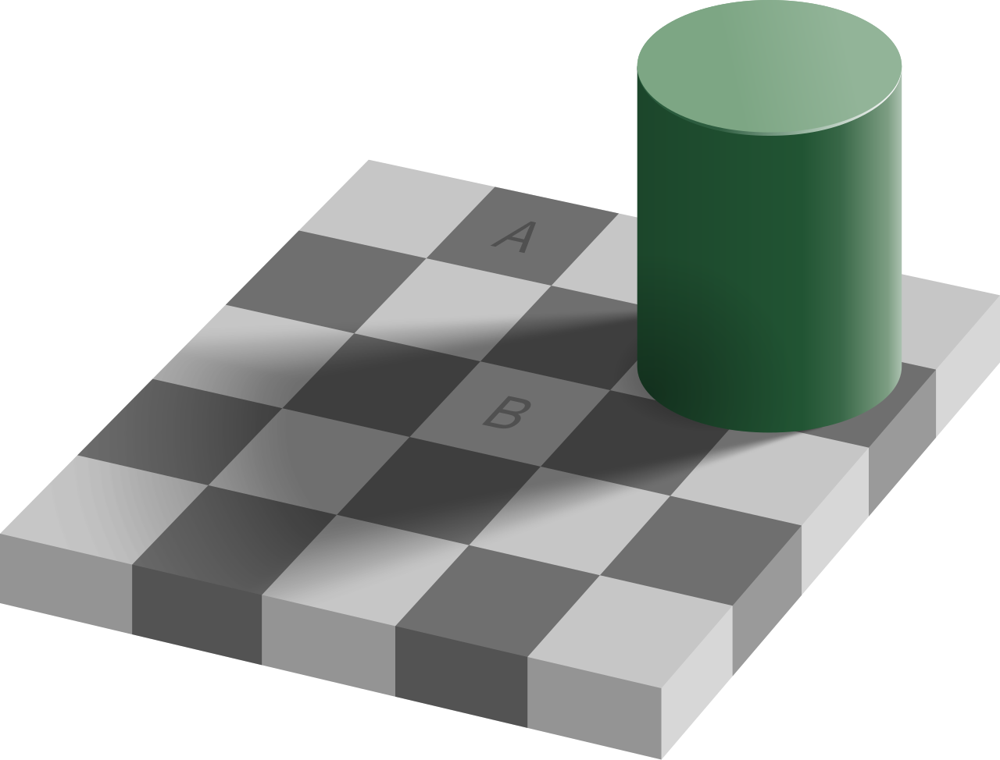

**Approximately how many colors are there, in millions?**

**What names would you use to describe the following colors?**

- (0, 0, 0)
- (255, 0, 0)
- (0, 255, 0)
- (255, 255, 0)
- (0, 0, 255)
- (255, 0, 255)
- (0, 255, 255)
- (255, 255, 255)
- (127, 127, 127)
- (0, 78, 90)
- (203, 78, 32)

**What are the grayscale versions of the following colors?**

- (21, 126, 235)
- (28, 66, 10)
- (240, 155, 170)
- (150, 146, 147)

**What color is the light-blue on the GFS website?**

**What are the background colors of the squares labelled A and B on the
checkerboard image?**

