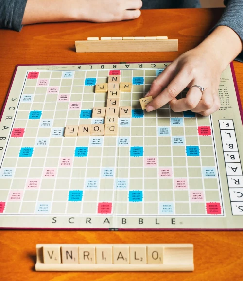

## Dictionaries

A dictionary is a collection of key/value pairs that allows us to look up the
value associated with each key.

https://runestone.academy/ns/books/published/fopp/Dictionaries/toctree.html?mode=browsing

```py
votes = { "strawberry": 1, "chocolate": 1, "vanilla": 1 }
```

## Look up a value

```py
votes["strawberry"] # 1
```

## Add a value

```py
votes["mint"] = 1

# votes = { "strawberry": 1, "chocolate": 1, "vanilla": 1, "mint": 1 }
```

## Update a value

```py
votes["strawberry"] = 2

# votes = { "strawberry": 2, "chocolate": 1, "vanilla": 1, "mint": 1 }
```

## Increment a value

```py
votes["chocolate"] += 1

# votes = { "strawberry": 2, "chocolate": 2, "vanilla": 1, "mint": 1 }
```

## Iterate over keys

```py
for flavor in votes:
    print(flavor, votes[flavor])

# Prints:
#
# strawberry 2
# chocolate 2
# vanilla 1
# mint 1
```

## Check membership

```py
"mint" in votes # True
"pineapple" in votes # False
```

## Ice cream flavor voting

```py
votes = { "strawberry": 1 }

while True: # Loop forever
  flavor = input("Enter for your favorite flavor: ")

  if flavor in votes:
      votes[flavor] += 1 # Increase vote count by one
  else:
      votes[flavor] = 1 # Set initial vote count to one

  print(votes) # Print out vote data after each new vote
```

## Scrabble



## Scrabble Points

```txt
a:  1, b:  3, c:  3, d:  2, e:  1, f:  4, g:  2, h:  4,
i:  1, j:  8, k:  5, l:  1, m:  3, n:  1, o:  1, p:  3,
q: 10, r:  1, s:  1, t:  1, u:  1, v:  4, w:  4, x:  8,
y:  4, z: 10
```

## Alice in Wonderland

```txt
chapter i down the rabbit hole alice was beginning to get very tired
of sitting by her sister on the bank and of having nothing to do once
or twice she had peeped into the book her sister was reading but it
had no pictures or conversations in it and what is the use of a book
thought alice without pictures or conversations so she was
considering in her own mind as well as she could for the hot day made
her feel very sleepy and stupid whether the pleasure of making a
daisy chain would be worth the trouble of getting up and picking the
daisies when suddenly a white rabbit with pink eyes ran close by her
there was nothing so very remarkable in that nor did alice think it
so very much out of the way to hear the rabbit say to itself oh dear
oh dear i shall be late when she thought it over afterwards it...
```
