<!-- https://en.wikipedia.org/wiki/Egyptian_Ratscrew -->

## Merging Sorted Lists

```py
[0, 6, 15, 22, 39, 43, 46, 46]

[2, 2, 12, 15, 23, 37, 43, 45]
```

http://localhost:3000/cs3/sorting/click-drag.html?q=0%2C+6%2C+15%2C+22%2C+39%2C+43%2C+46%2C+46%2C+2%2C+2%2C+12%2C+15%2C+23%2C+37%2C+43%2C+45

Get and remove the first element from a list:

```py
l.pop(0)
```

## Merge Sort


## Merge Sort

Split a list into two halves:

```py
half = len(l) // 2
left = l[:half]
right = l[half:]
```

## Emoji Comparison

Sort the emojis using merge sort. Try to use as few comparisons as possible.

http://localhost:3000/cs3/sorting/emoji-comparison.html

<!-- ⚽ 🍄 🏀 🐼 🐼 💩 🥑 🥦 🥦 🦀 🦘 🧲 🪭 🫖 🫖 🫖 -->

## Algorithmic Complexity

How many comparisons do we need to use to do merge sort for a list of `n`
numbers?

```py
[3, 5, 11, 7, 4, 14, 6, 9, 13, 1, 2, 10, 12, 8, 16, 15]
```

```py
[3] [5] [11] [7] [4] [14] [6] [9] [13] [1] [2] [10] [12] [8] [16] [15]  1 * 8 =  8
[3,  5] [11,  7] [4,  14] [6,  9] [13,  1] [2,  10] [12,  8] [16,  15]  3 * 4 = 12
[3,  5,  11,  7] [4,  14,  6,  9] [13,  1,  2,  10] [12,  8,  16,  15]  7 * 2 = 14
[3,  5,  11,  7,  4,  14,  6,  9] [13,  1,  2,  10,  12,  8,  16,  15] 15 * 1 = 15
```

http://localhost:3000/cs3/sorting/click-drag.html?q=3%2C+5%2C+11%2C+7%2C+4%2C+14%2C+6%2C+9%2C+13%2C+1%2C+2%2C+10%2C+12%2C+8%2C+16%2C+15


## Algorithmic Complexity (continued)

```txt
8 + 12 + 14 + 15 = 49
```

```txt
n + n + n + n = n * log(n)
└───────────┘
log(n) times
```

$$
n \cdot log(n) = O(nlog(n))
$$

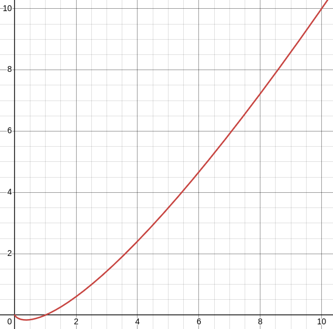

---

## Quicksort

https://en.wikipedia.org/wiki/Quicksort

Recursive sorting algorithm

Given a list of numbers:

- If the list is empty, return an empty list
- Otherwise, select the first number in the list as the pivot

- Make three new lists:

  - `low`: all numbers less than the pivot
  - `mid`: all numbers equal to the pivot
  - `high`: all numbers greater than the pivot

- Recursively sort the `low` and `high` lists using the same process
- Return the concatenation of `quicksort(low) + mid + quicksort(high)`, which
  gives the fully sorted list

http://localhost:3000/cs3/sorting/click-drag.html?q=22%2C+15%2C+39%2C+6%2C+46%2C+46%2C+0%2C+43%2C+37%2C+45%2C+23%2C+15

## Emoji Comparison

Sort the emojis using quicksort. Try to use as few comparisons as possible.

http://localhost:3000/cs3/sorting/emoji-comparison.html

<!-- ⚽ 🍄 🏀 🐼 🐼 💩 🥑 🥦 🥦 🦀 🦘 🧲 🪭 🫖 🫖 🫖 -->

## In-Place Sorting

Quicksort is typically done _in-place_, meaning that it modifies the existing
list, rather than making a new list to store the sorted values. We aren't doing
that in this class; we're working with variant where we put the sorted values in
a new list, which makes things a little easier, but the core idea is the same.

## Algorithmic Complexity

How many comparisons do we need to use to do quicksort for a list of `n`
numbers?

Best case:

```py
[8, 4, 2, 1, 3, 6, 5, 7, 12, 10, 9, 11, 14, 13, 15, 16]
```

http://localhost:3000/cs3/sorting/click-drag.html?q=8%2C+4%2C+2%2C+1%2C+3%2C+6%2C+5%2C+7%2C+12%2C+10%2C+9%2C+11%2C+14%2C+13%2C+15%2C+16

Worst case:

```py
[1, 2, 3, 4, 5, 6, 7, 8, 9, 10, 11, 12, 13, 14, 15, 16]
```

http://localhost:3000/cs3/sorting/click-drag.html?q=1%2C+2%2C+3%2C+4%2C+5%2C+6%2C+7%2C+8%2C+9%2C+10%2C+11%2C+12%2C+13%2C+14%2C+15%2C+16

## Algorithmic Complexity (continued)

```txt
15 + 14 + 13 + 12 + 11 + 10 + 9 + 8 + 7 + 6 + 5 + 4 + 3 + 2 + 1 = 120
```

$$
n + (n - 1) + (n - 2) + ... + 2 + 1 = \frac{n \cdot(n + 1)}{2} = \frac{n^2}{2} +\frac{n}{2} = O(n^2)
$$

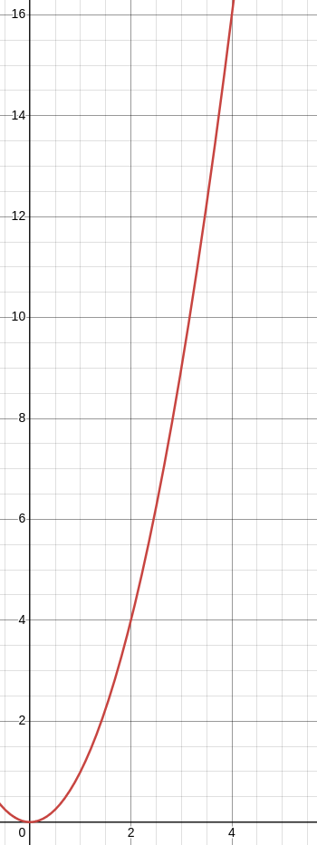

---

## Comparison Sorting

Computer doesn't have an intuition about what values are "big" or "small", only
knows the result of individual comparisons.

http://localhost:3000/cs3/sorting/click-drag.html?q=%F0%9F%90%BC%2C+%F0%9F%A6%98%2C+%F0%9F%A6%80%2C+%F0%9F%8F%80%2C+%F0%9F%92%A9%2C+%F0%9F%90%BC%2C+%F0%9F%A7%B2%2C+%F0%9F%AA%AD%2C+%F0%9F%8D%84%2C+%F0%9F%AB%96%2C+%F0%9F%A5%A6%2C+%F0%9F%AB%96

## Emoji Comparison

Sort the emojis using bubble sort. Try to use as few comparisons as possible.

http://localhost:3000/cs3/sorting/emoji-comparison.html

<!-- ⚽ 🍄 🏀 🐼 🐼 💩 🥑 🥦 🥦 🦀 🦘 🧲 🪭 🫖 🫖 🫖 -->

## Lexicographic Comparison, Unicode

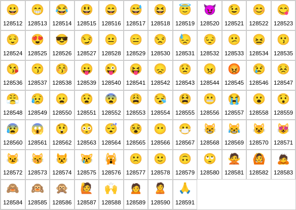

## Algorithmic Complexity

How many comparisons do we need to use to do bubble sort for a list of `n`
numbers?

```py
[3, 5, 11, 7, 4, 14, 6, 9, 13, 1, 2, 10, 12, 8, 16, 15]
```

```txt
15 + 14 + 13 + 12 + 11 + 10 + 9 + 8 + 7 + 6 + 5 + 4 + 3 + 2 + 1 = 120
```

## Algorithmic Complexity (continued)

$$
n + (n - 1) + (n - 2) + ... + 2 + 1 = \frac{n \cdot(n + 1)}{2} = \frac{n^2}{2} +\frac{n}{2} = O(n^2)
$$


---

## Algorithms

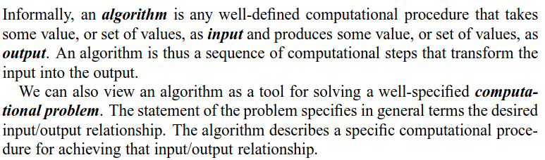

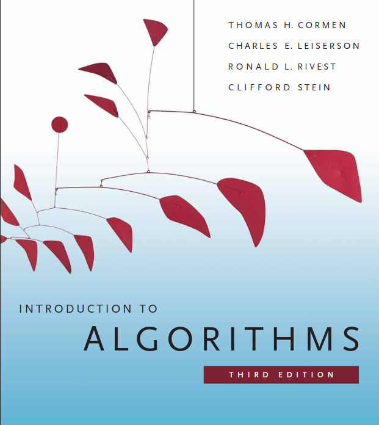

## What is "Sorted"

What does it mean for a list of numbers to be sorted?

_(When programmers talk about sorting, they typically mean sorting in ascending
order)_

## Why Sorting

Why sorting?

Good starting point for understanding algorithms and algorithmic analysis

## Bubble Sort

Arguably the simplest sorting algorithm


> An example of bubble sort. Starting from the beginning of the list, compare
> every adjacent pair, swap their position if they are not in the right order
> (the latter one is smaller than the former one). After each iteration, one
> less element (the last one) is needed to be compared until there are no more
> elements left to be compared. -- Wikipedia

## Correctness

How do we know that this algorithm will terminate?

How do we know that this algorithm will give us a sorted list?

## Invariants

The list suffix (the last elements in the list) are always in sorted order

Each loop increases the length of the sorted suffix

---

## Tiling Representation

`1` and `2` representation

```txt
┌─┐  ┌───┐
│ │  ├───┤
└─┘  └───┘
 1     2
```

Worksheet

## Tiling Representation

`1` and `2` representation

```txt
┌─┬─┬─┬─┐   ┌─┐   ┌─┬─┬─┐
│ │ │ │ │ = │ │ + │ │ │ │
└─┴─┴─┴─┘   └─┘   └─┴─┴─┘
 1 1 1 1     1     1 1 1

┌─┬─┬───┐   ┌─┐   ┌─┬───┐
│ │ ├───┤ = │ │ + │ ├───┤
└─┴─┴───┘   └─┘   └─┴───┘
 1 1  2      1     1  2

┌─┬───┬─┐   ┌─┐   ┌───┬─┐
│ ├───┤ │ = │ │ + ├───┤ │
└─┴───┴─┘   └─┘   └───┴─┘
 1  2  1     1      2  1

┌───┬─┬─┐   ┌───┐   ┌─┬─┐
├───┤ │ │ = ├───┤ + │ │ │
└───┴─┴─┘   └───┘   └─┴─┘
  2  1 1      2      1 1

┌───┬───┐   ┌───┐   ┌───┐
├───┼───┤ = ├───┤ + ├───┤
└───┴───┘   └───┘   └───┘
  2   2       2       2
```

## Tiling String Generation

```py
getTilings(0) # [""]
getTilings(1) # ["1"]
getTilings(2) # ["11", "2"]
getTilings(3) # ["111", "12", "21"]
getTilings(4) # ["1111", "112", "121", "211", "22"]
getTilings(5) # ["11111", "1112", "1121", "1211", "122", "2111", "212", "221"]
# ...
```

---

## Tiles Puzzle

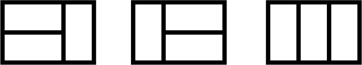

There are `3` distinct ways to tile a `2x3` board with `2x1` tiles.

How many distinct ways are there to tile `2x10` board with `2x1` tiles? Find a
proof for the correctness of your answer.

## Solution

```txt
0, 1, 1, 2, 3, 5, 8, 13, 21, 34, 55, 89, 144, 233, 377, 610, 987, ...
```

$$
F_0 = 0
$$

$$
F_1 = 1
$$

$$
F_n = F_{n - 1} + F_{n - 2}
$$

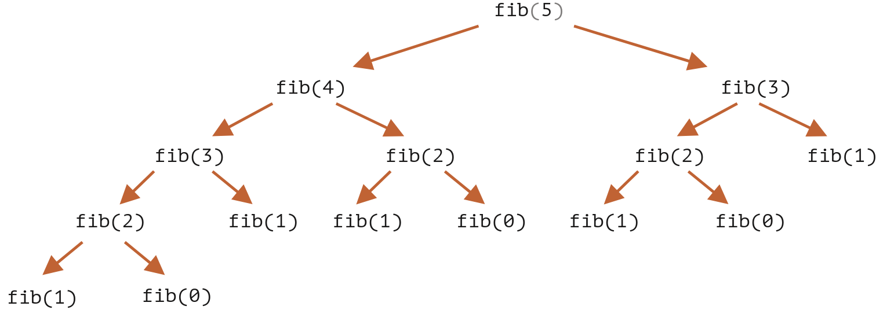

## Tiles Proof

```txt
┌─┬─┬─┬─┐   ┌─┐   ┌─┬─┬─┐
│ │ │ │ │ = │ │ + │ │ │ │
└─┴─┴─┴─┘   └─┘   └─┴─┴─┘
   2x4              2x3

┌─┬─┬───┐   ┌─┐   ┌─┬───┐
│ │ ├───┤ = │ │ + │ ├───┤
└─┴─┴───┘   └─┘   └─┴───┘
   2x4              2x3

┌─┬───┬─┐   ┌─┐   ┌───┬─┐
│ ├───┤ │ = │ │ + ├───┤ │
└─┴───┴─┘   └─┘   └───┴─┘
   2x4              2x3

┌───┬─┬─┐   ┌───┐   ┌─┬─┐
├───┤ │ │ = ├───┤ + │ │ │
└───┴─┴─┘   └───┘   └─┴─┘
   2x4               2x2

┌───┬───┐   ┌───┐   ┌───┐
├───┼───┤ = ├───┤ + ├───┤
└───┴───┘   └───┘   └───┘
   2x4               2x2
```

---

## Cartesian Product

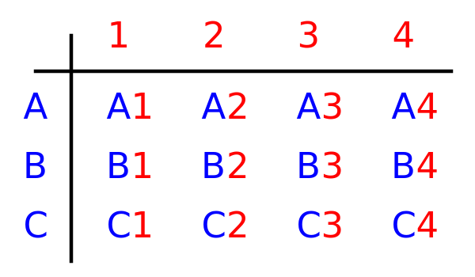

What is the size of a cartesian product?

## Card Deck

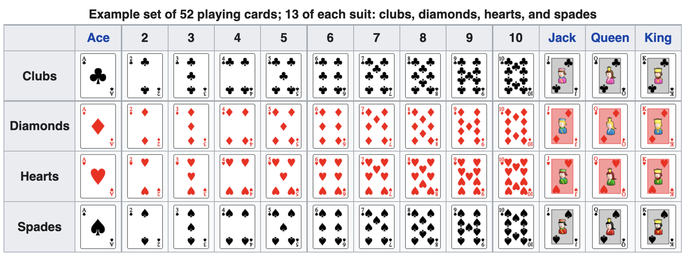

## Set Deck

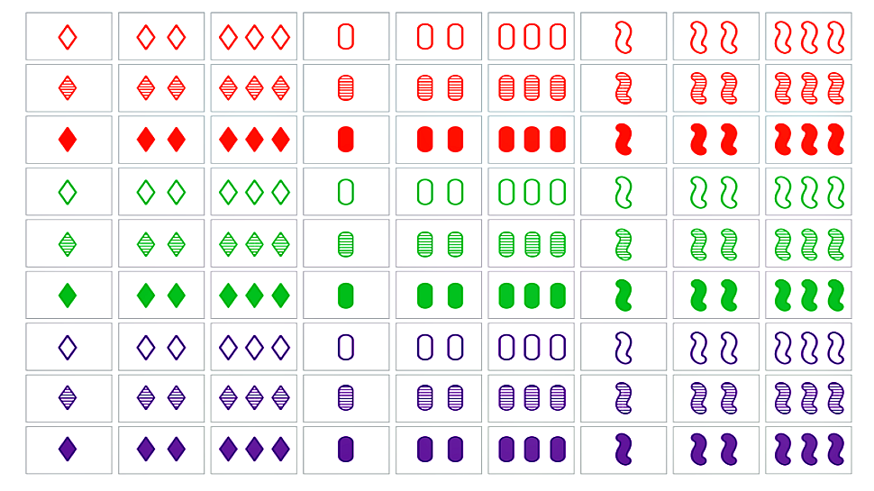

## Generating

```py
def product(listA, listB):
  # ...

suits = ["C", "D", "H", "S"]
ranks = ["A", "2", "3", "4", "5", "6", "7", "8", "9", "10", "J", "Q", "K"]

deck = product(ranks, suits)

for card in deck:
  print(card)
```

```txt
A C
A D
A H
A S
2 C
2 D
2 H
2 S
3 C
3 D
3 H
3 S
4 C
4 D
...
```

---

## Default Params

```py
def greet(name, greeting="Hello"):
  print(f"{greeting} {name}!")

greet("Avery")       # Prints "Hello Avery!"
greet("Avery", "Hi") # Prints "Hi Avery!"
```

## Recursive Factorial

```py
def factorial(n):
  if n == 0:
    return 1

  return n * factorial(n - 1)

print(factorial(10)) # Prints 3628800
```

## Tail Recursion

```py
def factorial(n, result):
  if n == 0:
    return result

  return factorial(n - 1, n * result)

print(factorial(10, 1)) # Prints 3628800
```

- Still has base case and recursive case
- Uses an _accumulator_ (result) parameter, which get's returned at the end
- https://en.wikipedia.org/wiki/Recursion_(computer_science)#Tail-recursive_functions

```txt
factorial(10, 1)
factorial(9, 10 * 1)
factorial(8, 10 * 9 * 1)
factorial(7, 10 * 9 * 8 * 1)
factorial(6, 10 * 9 * 8 * 7 * 1)
factorial(5, 10 * 9 * 8 * 7 * 6 * 1)
factorial(4, 10 * 9 * 8 * 7 * 6 * 5 * 1)
factorial(3, 10 * 9 * 8 * 7 * 6 * 5 * 4 * 1)
factorial(2, 10 * 9 * 8 * 7 * 6 * 5 * 4 * 3 * 1)
factorial(1, 10 * 9 * 8 * 7 * 6 * 5 * 4 * 3 * 2 * 1)
factorial(0, 10 * 9 * 8 * 7 * 6 * 5 * 4 * 3 * 2 * 1 * 1)
10 * 9 * 8 * 7 * 6 * 5 * 4 * 3 * 2 * 1 * 1
```

## Tail Recursion Default Params

```py
def factorial(n, result=1):
  if n == 0:
    return result

  return factorial(n - 1, n * result)

print(factorial(10)) # Prints 3628800
```

## Tail Recursion with Lists

```py
def total(numbers, index=0, result=0):
    # Calculate the sum of the numbers in a list recursively
    # ...
```

```txt
total([5, 6, 7, 8, 9], 0, 0)
total([5, 6, 7, 8, 9], 1, 5 + 0)
total([5, 6, 7, 8, 9], 2, 5 + 6 + 0)
total([5, 6, 7, 8, 9], 3, 5 + 6 + 7 + 0)
total([5, 6, 7, 8, 9], 4, 5 + 6 + 7 + 8 + 0)
total([5, 6, 7, 8, 9], 5, 5 + 6 + 7 + 8 + 9 + 0)
5 + 6 + 7 + 8 + 9 + 0
```

## Why No Tail Recursive Fibonacci?

```py
def fibonacci(n):
    if n == 0:
        return 0

    if n == 1:
        return 1

    return fibonacci(n - 1) + fibonacci(n - 2)
```

---

## Recursion

What does this code do?

```py
def hello():
  print("Hello world!")

hello()
```

## Recursion (continued)

What does this code do?

```py
def hello():
  print("Hello world!")
  hello()

hello()
```

## Recursion (continued)

What does this code do?

```py
def hello():
  hello()
  print("Hello world!")

hello()
```

## Recursion (continued)

What does this code do?

```py
def hello(n):
  if n < 10:
    print("Hello world!")
    hello(n + 1)

hello(0)
```

## Recursion (continued)

What does this code do?

```py
def hello(n):
  if n < 10:
    print("Hello world!")
    hello(n + 1)
  else:
    print("Done")

hello(0)
```

## Recursion (continued)

What does this code do?

```py
def hello(n):
  if n < 10:
    print("Hello world!")
    hello(n + 1)
    print("Goodbye")

hello(0)
```

## Koan

> To understand recursion, you must first understand recursion.

## Factorial Definition

```txt
factorial(0) = 1
factorial(n) = n * (n - 1) * ... * 1
```

```txt
factorial(5) = 5 * 4 * 3 * 2 * 1 = 120
```

$n!$ = `factorial(n)`

## Recursive Factorial

```txt
factorial(0) = 1
factorial(n) = n * factorial(n - 1)
```

```txt
factorial(5) = 5 * 4 * 3 * 2 * 1 = 120
```

## Iterative Functions

```py
def factorial(n):
  result = 1

  for i in range(1, n + 1):
    result *= i

  return result

print(factorial(10)) # Prints 3628800
```

## Recursive Functions

```py
def factorial(n):
  if n == 0:
    return 1

  return n * factorial(n - 1)

print(factorial(10)) # Prints 3628800
```

Recursive functions: functions which call themselves

```txt
factorial(10)
10 * factorial(9)
10 * 9 * factorial(8)
10 * 9 * 8 * factorial(7)
10 * 9 * 8 * 7 * factorial(6)
10 * 9 * 8 * 7 * 6 * factorial(5)
10 * 9 * 8 * 7 * 6 * 5 * factorial(4)
10 * 9 * 8 * 7 * 6 * 5 * 4 * factorial(3)
10 * 9 * 8 * 7 * 6 * 5 * 4 * 3 * factorial(2)
10 * 9 * 8 * 7 * 6 * 5 * 4 * 3 * 2 * factorial(1)
10 * 9 * 8 * 7 * 6 * 5 * 4 * 3 * 2 * 1 * factorial(0)
10 * 9 * 8 * 7 * 6 * 5 * 4 * 3 * 2 * 1 * 1
```

## Base Case

```py
def factorial(n):
  if n == 0:
    return 1

  return n * factorial(n - 1)

print(factorial(10)) # Prints 3628800
```

Case in which the function doesn't call itself recursively

```txt
0! = 1
```

```py
if n == 0:
  return 1
```

## Recursive Case

```py
def factorial(n):
  if n == 0:
    return 1

  return n * factorial(n - 1)

print(factorial(10)) # Prints 3628800
```

Case in which the function calls itself recursively

```txt
n! = n * (n - 1)!
```

```py
return n * factorial(n - 1)
```

## Visualizing Recursion

https://pythontutor.com/render.html#mode=display

## Recursive Summation

```py
def summation(n):
  if n == 0:
    return 0

  return n + summation(n - 1)

print(summation(10)) # Prints 55
```

```txt
summation(10)
10 + summation(9)
10 + 9 + summation(8)
10 + 9 + 8 + summation(7)
10 + 9 + 8 + 7 + summation(6)
10 + 9 + 8 + 7 + 6 + summation(5)
10 + 9 + 8 + 7 + 6 + 5 + summation(4)
10 + 9 + 8 + 7 + 6 + 5 + 4 + summation(3)
10 + 9 + 8 + 7 + 6 + 5 + 4 + 3 + summation(2)
10 + 9 + 8 + 7 + 6 + 5 + 4 + 3 + 2 + summation(1)
10 + 9 + 8 + 7 + 6 + 5 + 4 + 3 + 2 + 1 + summation(0)
10 + 9 + 8 + 7 + 6 + 5 + 4 + 3 + 2 + 1 + 0
```

## Fibonacci is Recursive

```txt
0, 1, 1, 2, 3, 5, 8, 13, 21, 34, 55, 89, 144, 233, 377, 610, 987, ...
```

$$
F_0 = 0
$$

$$
F_1 = 1
$$

$$
F_n = F_{n - 1} + F_{n - 2}
$$


## Recursion With Lists

```py
def total(numbers, index):
    # Calculate the sum of the numbers in a list recursively
    # ...
```

```txt
total([5, 6, 7, 8, 9], 0)
5 + total([5, 6, 7, 8, 9], 1)
5 + 6 + total([5, 6, 7, 8, 9], 2)
5 + 6 + 7 + total([5, 6, 7, 8, 9], 3)
5 + 6 + 7 + 8 + total([5, 6, 7, 8, 9], 4)
5 + 6 + 7 + 8 + 9 + total([5, 6, 7, 8, 9], 5)
5 + 6 + 7 + 8 + 9 + 0
```

## Recursive Functions

Challenge: recursive minimum

---

## Fibonacci Sequence

https://en.wikipedia.org/wiki/Fibonacci_sequence

$$
F_0 = 0
$$

$$
F_1 = 1
$$

$$
F_n = F_{n - 1} + F_{n - 2}
$$

```txt
0, 1, 1, 2, 3, 5, 8, 13, 21, 34, 55, 89, 144, 233, 377, 610, 987, ...
```

## Fibonacci Worksheet

## Fibonacci Generator

---

## `12(3)4` Puzzle

Starting with a number `n`, you have two choices:

1. You can subtract `3` from `n`:

```txt
n = n - 3
```

2. You can multiply `n` by `2`:

```txt
n = n * 2
```

You may repeat this process as many times as you like.

Starting from `n = 1`, can you reach `n = 24`? Either find a sequence of
transitions using the rules above that gets you from `1` to `24`, or prove that
none exists.

_Hint: Look for a pattern in what numbers can and can't be reached starting from
`1` using these rules. Prove that this pattern always holds no matter how many
times the rules are applied._

## Chessboard Tiling Puzzle

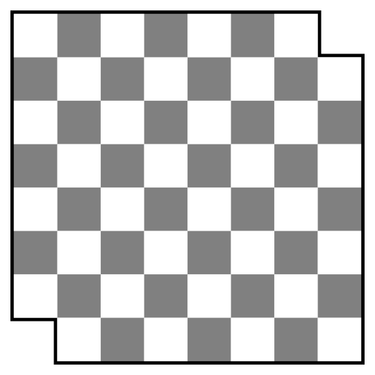

You have a chessboard (an `8x8` grid of checkered light and dark squares) which
is missing its two dark corner squares, leaving `62` squares remaining. Can you
tile this board with `2x1` tiles? Provide a tiling, or a proof that none exists.

_In this problem, "tiling" means covering the board with tiles so that each tile
covers two squares, each square is covered by a tile, and no tiles overlap or
hang off the edge of the board._

_Hint: use the fact that checkered pattern to your advantage._

---

## Maze Worksheet

## Demo Projects

- Maze
- Tower
- VM

## What is CS3

- Practice vs theory
- Programming vs CS
- Hard problems w/ easy solutions vs easy problems w/ hard solutions

## Grading policy

[Link](../shared/grading.md)

## Python setup

Idle:

- [Idle](https://www.python.org/downloads/)

VSCode:

- [VSCode](https://code.visualstudio.com/)
- [Python extension](https://marketplace.visualstudio.com/items?itemName=ms-python.python)

## Review

- Define a variable
- Make an empty list
- Make an infinite loop
- Print out `Hello <name>` based on the value in the variable `name`
- Get a name string from the user as input and print out `Hello <name>`
- Check if a value is in a list
- Add a value to a list
- Remove a value from a list

## To-do List
