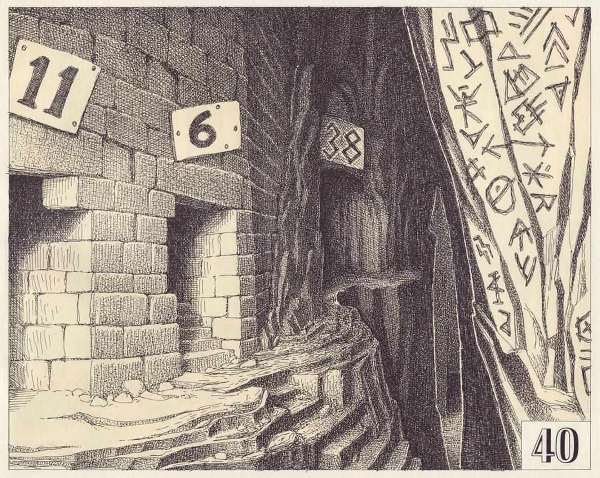
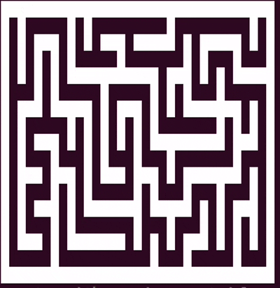
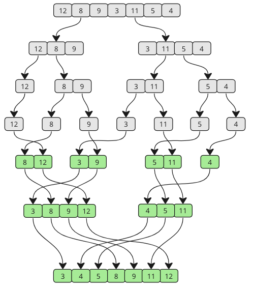

<!--

## Ghost

---

## Min Max

---

## Language

---

## Concurrency

---

## Scope

---

## Closures

---

## Regex Impl

---

## Regex

---

## Sudoku

## set

---

## VM

---

## Paper VM

---

## Metro

---

## Tree

---

## Queue

---

## Stack

---

## Linked List

---

## Picture Frame

---

 -->

## Recursive Tower Solver

```txt
Tower Labels:

    ░             ░             ░
    ░             ░             ░
    ░             ░             ░
    ░             ░             ░
    ░             ░             ░
    ░             ░             ░
    ░             ░             ░
   
    0             1             2
```

## Stacks

"Last in, first out"

- Push (add value) `append`

```py
values.append(something)
```

- Pop (remove last) `pop`

```py
values.pop()
```

- Check last (without removing)

```py
values[-1]
```

What are some real-life examples of stacks?

<!-- browser history, loading truck (shelf before books) -->

## Tower Representation

```py
towers = [[6, 5, 4, 3, 2, 1], [], []]
```

## Functions

```py
# Move a single disc from the top of tower `src` to tower `dest`.
#
# For example, if `towers` is
#
#     [[6, 5, 4], [3, 2, 1], []]
#
# and we run
#
#     moveSingle(0, 2)
#
# then `towers` will become
#
#     [[6, 5], [3, 2, 1], [4]]

moveSingle(src, dest)
```

## Functions

```py
# Using recursion, move the top `depth` discs from tower `src` to tower `dest`.
#
# For example, if `towers` is
#
#     [[6, 5, 4, 3, 2, 1], [], []]
#
# and we run
#
#     solve(0, 2, 3)
#
# then `towers` will become
#
#     [[6, 5, 4], [], [3, 2, 1]]

solve(src, dest, depth)
```

## Algorithm

To move `n` discs from the `src` tower to the `dest` tower:

- Move `n - 1` discs from the `src` tower to the `tmp` tower
- Move the next `n`th disc from the `src` tower to the `dest` tower
- Move `n - 1` discs from the `tmp` tower to the `dest` tower

Draw tree diagram

Where does `* 2 + 1` pattern in step counts come from?

---

## Towers

```txt
steps(n + 1) = 2 * steps(n) + 1
```

## World Record

https://www.youtube.com/watch?v=TTKwx1xIx6g

---

## Project Planning Slides

https://docs.google.com/presentation/d/1hh2TvDd2wa9LfzCvLSy28JokWcScPnhxPGbqGM2R9Ws/edit?usp=sharing

---

## Pseudo-random Numbers

```py
import random

print(random.random())
print(random.random())
print(random.random())
print(random.random())
```

```txt
0.17231323191590397
0.2546137274261232
0.530283680130046
0.6811537529720958
```

## Pseudo-random Numbers

Linear congruential generators


```py
def next(n):
    m = 2**32  # 4294967296
    a = 1664525
    c = 1013904223
    return (a * n + c) % m
```

## Pseudo-random Numbers

```py
def next(n):
    m = 2**32  # 4294967296
    a = 1664525
    c = 1013904223
    return (a * n + c) % m
```

```py
n = 17  # Seed value

n = next(n)
print(n)

n = next(n)
print(n)

n = next(n)
print(n)

n = next(n)
print(n)
```

```txt
1042201148
3524153451
1973856974
1276228565
```

## Pseudo-random Numbers

Scale to between `0.0` and `1.0`

```txt
1042201148 -> 0.24265636410564184
3524153451 -> 0.8205309163313359
1973856974 -> 0.4595743897370994
1276228565 -> 0.2971451182384044
```

## Pseudo-random Number Properties

- Should have even distribution across output range
- Should have unpredictable spacing between values

Requires good parameter values


---

## Refactoring != Code Golf

```py
def sign(num):
    if num > 0:
        return "positive"

    if num == 0:
        return "zero"

    return "negative"


print(sign(8))   # 1
print(sign(0))   # 0
print(sign(-7))  # -1
```

```py
def sign(num):
    return ["zero", "positive", "negative"][num // (abs(num) or 1)]
```

## The Sad State of Python Docs

Challenge: try to find a piece of official documentation (from
[python.org](python.org)) that describes the behavior of the `%` operator in
Python.

## Modulus `%`

```python
a % b
```

Add or subtract `b` from `a` until the absolute value of the resulting number
has:

1. The same sign as `b`
2. An absolute value less than `b`

```txt
 20 %  7 =  20 - 7 - 7     =  6
-20 %  7 = -20 + 7 + 7 + 7 =  1
 20 % -7 =  20 - 7 - 7 - 7 = -1
-20 % -7 = -20 + 7 + 7     = -6
```

Note that `%` works differently for negative numbers in Python than it does in
other languages.

Note that `b` must not be `0`.

https://docs.python.org/3/reference/expressions.html#binary-arithmetic-operations

---

## Zen

```txt
>>> import this
The Zen of Python, by Tim Peters

Beautiful is better than ugly.
Explicit is better than implicit.
Simple is better than complex.
Complex is better than complicated.
Flat is better than nested.
Sparse is better than dense.
Readability counts.
Special cases aren't special enough to break the rules.
Although practicality beats purity.
Errors should never pass silently.
Unless explicitly silenced.
In the face of ambiguity, refuse the temptation to guess.
There should be one-- and preferably only one --obvious way to do it.
Although that way may not be obvious at first unless you're Dutch.
Now is better than never.
Although never is often better than *right* now.
If the implementation is hard to explain, it's a bad idea.
If the implementation is easy to explain, it may be a good idea.
Namespaces are one honking great idea -- let's do more of those!
```

## Ruff

Code formatter and linter

https://github.com/astral-sh/ruff?tab=readme-ov-file

```txt
python3 -m pip install ruff
```

https://marketplace.visualstudio.com/items?itemName=charliermarsh.ruff

## Formatting

```py
def factorial(
  n):
   result  = 1

   for i in range(1,n+1):

        result*= i

   return result

print(
 factorial(10))
```

```txt
ruff format example.py
```

```py
def factorial(n):
    result = 1

    for i in range(1, n + 1):
        result *= i

    return result

print(factorial(10))
```

## Linting

```py
def factorial(n):
    result = 1

    for i in range(1, n + 1):
        resutl *= i

    return result

print(factorial(0))
```

```txt
ruff check example.py
```

```py
F821 Undefined name `resutl`
 --> /home/anortonsmith/Documents/classes/solutions/test.py:5:9
  |
4 |     for i in range(1, n + 1):
5 |         resutl *= i
  |         ^^^^^^
6 |
7 |     return result
  |
```

---

## Refactoring


## Refactoring

```py
def clamp(num, low, high):
    if num < low:
        return low

    elif num > high:
        return high

    elif num >= low and num <= high:
        return num
```

```py
clamp(-7, 0, 10)
clamp(7, 0, 10)
clamp(17, 0, 10)
```

```py
0
7
10
```

## Refactoring

```py
def clamp(num, low, high):
    if num < low:
        return low

    elif num > high:
        return high

    elif num >= low and num <= high:
        return num
```

```py
def clamp(num, low, high):
    if num < low:
        return low

    elif num > high:
        return high

    else:
        return num
```

## Refactoring

```py
def clamp(num, low, high):
    if num < low:
        return low

    elif num > high:
        return high

    else:
        return num
```

```py
def clamp(num, low, high):
    if num < low:
        return low

    if num > high:
        return high

    return num
```

## Refactoring

```py
def clamp(num, low, high):
    if num < low:
        return low

    if num > high:
        return high

    return num
```

```py
def clamp(num, low, high):
    return max(low, min(high, num))
```

## Refactoring

```py
def clamp(num, low, high):
    if num < low:
        return low

    elif num > high:
        return high

    elif num >= low and num <= high:
        return num
```

```py
def clamp(num, low, high):
    return max(low, min(high, num))
```

## Comments

Please for the love of all that is good in the world, never do this

```py
"""
def clamp(num, low, high):
    return max(low, min(high, num))
"""
```

Comments in Python use hash `#` symbols

```py
# def clamp(num, low, high):
#     return max(low, min(high, num))
```

Most editors will let you toggle comments on/off using `ctrl + /` or `cmd + /`

## Comments

```py
def search(r, c):
    cell = board[r][c]

    if cell == "█" or cell == "▒":
        return False

    update(r, c, "▒")

    """
    if cell == "B":
        return True
    """

    if search(r - 1, c) or search(r + 1, c) or search(r, c - 1) or search(r, c + 1):
        return True

    update(r, c, " ")
    return False
```

## Comments

```py
"""
def search(r, c):
    cell = board[r][c]

    if cell == "█" or cell == "▒":
        return False

    update(r, c, "▒")

    """
    if cell == "B":
        return True
    """

    if search(r - 1, c) or search(r + 1, c) or search(r, c - 1) or search(r, c + 1):
        return True

    update(r, c, " ")
    return False
"""
```

**NOT COMPOSIBLE**

## Comments

```py
def search(r, c):
    cell = board[r][c]

    if cell == "█" or cell == "▒":
        return False

    update(r, c, "▒")

    # if cell == "B":
    #     return True

    if search(r - 1, c) or search(r + 1, c) or search(r, c - 1) or search(r, c + 1):
        return True

    update(r, c, " ")
    return False
```

## Comments

```py
# def search(r, c):
#     cell = board[r][c]

#     if cell == "█" or cell == "▒":
#         return False

#     update(r, c, "▒")

#     # if cell == "B":
#     #     return True

#     if search(r - 1, c) or search(r + 1, c) or search(r, c - 1) or search(r, c + 1):
#         return True

#     update(r, c, " ")
#     return False
```

**COMPOSIBLE**

## Comments

You can have nested lists

```py
["a", "b", ["c", "d"]]
```

because lists use different starting and ending delimeters (`[` vs `]`)

You can't have nested strings (without using escape characters or different
quote characters)

```py
"germantown "friends" school"
```

because strings use `"` for as both the starting and ending delimeter

---

## Maze Search

```py
maze = """
█████████████████████████████████
█▒█     █B█         █         █ █
█▒█ ███ █ █ ███ █████ █ █████ █ █
█▒█ █ █ █     █       █ █   █   █
█▒█ █ █ ███████████ ███ █ █ █████
█▒▒ █ █     █     █ █ █   █     █
█ ███ █████ █ ███ █ █ ███████ █ █
█ █     █ █ █ █ █ █       █ █ █ █
█ █ ███ █ █ █ █ █ █████████ ███ █
█ █   █   █ █   █   █       █   █
█ ███ ███ █ ███ ███ █ ███████ █ █
█ █   █ █ █     █ █   █   █   █ █
█ █ ███ █ ███████ █████ █ █ ███ █
█ █   █ █       █   █   █ █ █ █ █
█ ███ █ ███████ █ █ █ ███ █ █ █ █
█     █           █   █     █   █
█████████████████████████████████
"""

search(5, 2)  # False
```

## Maze Search (continued)

```py
maze = """
█████████████████████████████████
█▒█     █B█         █         █ █
█▒█ ███ █ █ ███ █████ █ █████ █ █
█▒█ █ █ █     █       █ █   █   █
█▒█ █ █ ███████████ ███ █ █ █████
█▒  █ █     █     █ █ █   █     █
█▒███ █████ █ ███ █ █ ███████ █ █
█ █     █ █ █ █ █ █       █ █ █ █
█ █ ███ █ █ █ █ █ █████████ ███ █
█ █   █   █ █   █   █       █   █
█ ███ ███ █ ███ ███ █ ███████ █ █
█ █   █ █ █     █ █   █   █   █ █
█ █ ███ █ ███████ █████ █ █ ███ █
█ █   █ █       █   █   █ █ █ █ █
█ ███ █ ███████ █ █ █ ███ █ █ █ █
█     █           █   █     █   █
█████████████████████████████████
"""

search(6, 1)  # True
```

## Search Procedure

1. If we hit a wall or backtrack on the current path, return `False`
2. Mark the current cell with the path characters
3. If the goal is reached, return `True`
4. Run a child search in all four neighbor directions

   - If any branch returns `True`, return `True` and skip subsequent search
     branches

   - Otherwise, erase the current path character and return `False`

## Short Circuit Operators

```py
def getTrue():
    print("Called getTrue")
    return True

True or getTrue()   # Doesn't call getTrue
False or getTrue()  # Calls getTrue
```

---

## Algorithmic Problem Solving

1. Establish constraints
2. Apply intuition

<br />

## Hidden Maze

1. Solve the maze
2. Write an algorithm for solving the maze (a procedure that) someone could
   follow to solve the problem, subject to the constraints of the problem

Note that this maze has **no loops**

https://avery-gfs.github.io/maze/maze?maze=%E2%96%88%E2%96%88%E2%96%88%E2%96%88%E2%96%88%E2%96%88%E2%96%88%E2%96%88%E2%96%88%E2%96%88%E2%96%88%E2%96%88%E2%96%88%E2%96%88%E2%96%88%0D%0A%E2%96%88A%E2%96%88+++++%E2%96%88B%E2%96%88+++%E2%96%88%0D%0A%E2%96%88+%E2%96%88+%E2%96%88%E2%96%88%E2%96%88+%E2%96%88+%E2%96%88%E2%96%88%E2%96%88+%E2%96%88%0D%0A%E2%96%88+%E2%96%88+%E2%96%88+%E2%96%88+%E2%96%88+++++%E2%96%88%0D%0A%E2%96%88+%E2%96%88+%E2%96%88+%E2%96%88+%E2%96%88%E2%96%88%E2%96%88%E2%96%88%E2%96%88+%E2%96%88%0D%0A%E2%96%88+++%E2%96%88+%E2%96%88+++++%E2%96%88+%E2%96%88%0D%0A%E2%96%88+%E2%96%88%E2%96%88%E2%96%88+%E2%96%88%E2%96%88%E2%96%88%E2%96%88%E2%96%88+%E2%96%88+%E2%96%88%0D%0A%E2%96%88+++++%E2%96%88+++++++%E2%96%88%0D%0A%E2%96%88%E2%96%88%E2%96%88%E2%96%88%E2%96%88%E2%96%88%E2%96%88%E2%96%88%E2%96%88%E2%96%88%E2%96%88%E2%96%88%E2%96%88%E2%96%88%E2%96%88

## Maze Algorithm

1. Choose an unexplored (white) path if there is one
2. Backtrack (green) otherwise

```txt
███████████████
█A█     █B█   █
█ █ ███ █ ███ █
█ █ █ █ █     █
█ █ █ █ █████ █
█   █ █     █ █
█ ███ █████ █ █
█     █       █
███████████████
```

## Getting Maze Data

```py
maze = """
███████████████
█A█     █B█   █
█ █ ███ █ ███ █
█ █ █ █ █     █
█ █ █ █ █████ █
█   █ █     █ █
█ ███ █████ █ █
█     █       █
███████████████
"""
```

```py
print(board[0][0])  # "█"
print(board[1][1])  # "A"
print(board[1][9])  # "B"
```

## Updating the Maze

```py
maze = """
███████████████
█A█     █B█   █
█ █ ███ █ ███ █
█ █ █ █ █     █
█ █ █ █ █████ █
█   █ █     █ █
█ ███ █████ █ █
█     █       █
███████████████
"""
```

```py
update(1, 1, "▒")
update(2, 1, "▒")
```

```txt
███████████████
█▒█     █B█   █
█▒█ ███ █ ███ █
█ █ █ █ █     █
█ █ █ █ █████ █
█   █ █     █ █
█ ███ █████ █ █
█     █       █
███████████████
```

## Maze Probe



- Recursively "probe" every path in the maze
- Don't worry about stopping when you find the goal ("B")
- Make sure your probe accesses each cell of the maze
- Make your probe erase previous path characters as it backtracks from exploring
  a branch

## Probe Starter Code

```py
def probe(r, c):
    # Edit the code below to make a function that fully probes the board

    cell = board[r][c]

    if cell == "█":
        return

    update(r, c, "▒")
    probe(r + 1, c)
```

---

## Shuffle

---

## Merging Sorted Lists

```py
[0, 6, 15, 22, 39, 43, 46, 46]

[2, 2, 12, 15, 23, 37, 43, 45]
```

http://localhost:3000/cs3/sorting/click-drag.html?q=0%2C+6%2C+15%2C+22%2C+39%2C+43%2C+46%2C+46%2C+2%2C+2%2C+12%2C+15%2C+23%2C+37%2C+43%2C+45

Get and remove the first element from a list:

```py
l.pop(0)
```

## Merge Sort



http://localhost:3000/cs3/sorting/click-drag.html?q=23%2C+46%2C+15%2C+43%2C+37%2C+2%2C+12%2C+15%2C+45%2C+39%2C+6%2C+22%2C+2%2C+46%2C+0%2C+43

## Hints

Split a list into two halves:

```py
half = len(l) // 2
left = l[:half]
right = l[half:]
```

Get and remove the first value from a list:

```py
l = [10, 11, 12]
print(l.pop(0))  # 10
print(l)         # [11, 12]
```

Add items to the end of a list:

```py
l = [10, 11, 12]
l.extend([13, 14, 15])

print(l)  # [10, 11, 12, 13, 14, 15]
```

(Note that `extend` is different from `append`)

## Correctness

How do we know that this algorithm will terminate?

How do we know that this algorithm will give us a sorted list?

## Emoji Comparison

Sort the emojis using merge sort. Try to use as few comparisons as possible.

http://localhost:3000/cs3/sorting/emoji-comparison.html

<!-- ⚽ 🍄 🏀 🐼 🐼 💩 🥑 🥦 🥦 🦀 🦘 🧲 🪭 🫖 🫖 🫖 -->

---

## Quicksort

https://en.wikipedia.org/wiki/Quicksort

Recursive sorting algorithm

Given a list of numbers:

- If the list is empty, return an empty list
- Otherwise, select the first number in the list as the pivot

- Make three new lists:

  - `low`: all numbers less than the pivot
  - `mid`: all numbers equal to the pivot
  - `high`: all numbers greater than the pivot

- Recursively sort the `low` and `high` lists using the same process
- Return the concatenation of `quicksort(low) + mid + quicksort(high)`, which
  gives the fully sorted list

http://localhost:3000/cs3/sorting/click-drag.html?q=23%2C+46%2C+15%2C+43%2C+37%2C+2%2C+12%2C+15%2C+45%2C+39%2C+6%2C+22%2C+2%2C+46%2C+0%2C+43

## Correctness

How do we know that this algorithm will terminate?

How do we know that this algorithm will give us a sorted list?

## Emoji Comparison

Sort the emojis using quicksort. Try to use as few comparisons as possible.

http://localhost:3000/cs3/sorting/emoji-comparison.html

<!-- ⚽ 🍄 🏀 🐼 🐼 💩 🥑 🥦 🥦 🦀 🦘 🧲 🪭 🫖 🫖 🫖 -->

## In-Place Sorting

Quicksort is typically done _in-place_, meaning that it modifies the existing
list, rather than making a new list to store the sorted values. We aren't doing
that in this class; we're working with variant where we put the sorted values in
a new list, which makes things a little easier, but the core idea is the same.

---

## Algorithms


## What is "Sorted"

What does it mean for a list of numbers to be sorted?

_(When programmers talk about sorting, they typically mean sorting in ascending
order)_

## Bubble Sort

Arguably the simplest sorting algorithm


> An example of bubble sort. Starting from the beginning of the list, compare
> every adjacent pair, swap their position if they are not in the right order
> (the latter one is smaller than the former one). After each iteration, one
> less element (the last one) is needed to be compared until there are no more
> elements left to be compared. -- Wikipedia

http://localhost:3000/cs3/sorting/click-drag.html?q=23%2C+46%2C+15%2C+43%2C+37%2C+2%2C+12%2C+15%2C+45%2C+39%2C+6%2C+22%2C+2%2C+46%2C+0%2C+43

## Correctness

How do we know that this algorithm will terminate?

How do we know that this algorithm will give us a sorted list?

## Comparison Sorting

Computer doesn't have an intuition about what values are "big" or "small", only
knows the result of individual comparisons.

http://localhost:3000/cs3/sorting/click-drag.html?q=%F0%9F%90%BC%2C+%F0%9F%A6%98%2C+%F0%9F%A6%80%2C+%F0%9F%8F%80%2C+%F0%9F%92%A9%2C+%F0%9F%90%BC%2C+%F0%9F%A7%B2%2C+%F0%9F%AA%AD%2C+%F0%9F%8D%84%2C+%F0%9F%AB%96%2C+%F0%9F%A5%A6%2C+%F0%9F%AB%96

## Emoji Comparison

Sort the emojis using bubble sort. Try to use as few comparisons as possible.

http://localhost:3000/cs3/sorting/emoji-comparison.html

<!-- ⚽ 🍄 🏀 🐼 🐼 💩 🥑 🥦 🥦 🦀 🦘 🧲 🪭 🫖 🫖 🫖 -->

## Lexicographic Comparison, Unicode


---

## Tiling Representation

`1` and `2` representation

```txt
┌─┐  ┌───┐
│ │  ├───┤
└─┘  └───┘
 1     2
```

Worksheet

## Tiling Representation

`1` and `2` representation

```txt
┌─┬─┬─┬─┐   ┌─┐   ┌─┬─┬─┐
│ │ │ │ │ = │ │ + │ │ │ │
└─┴─┴─┴─┘   └─┘   └─┴─┴─┘
 1 1 1 1     1     1 1 1

┌─┬─┬───┐   ┌─┐   ┌─┬───┐
│ │ ├───┤ = │ │ + │ ├───┤
└─┴─┴───┘   └─┘   └─┴───┘
 1 1  2      1     1  2

┌─┬───┬─┐   ┌─┐   ┌───┬─┐
│ ├───┤ │ = │ │ + ├───┤ │
└─┴───┴─┘   └─┘   └───┴─┘
 1  2  1     1      2  1

┌───┬─┬─┐   ┌───┐   ┌─┬─┐
├───┤ │ │ = ├───┤ + │ │ │
└───┴─┴─┘   └───┘   └─┴─┘
  2  1 1      2      1 1

┌───┬───┐   ┌───┐   ┌───┐
├───┼───┤ = ├───┤ + ├───┤
└───┴───┘   └───┘   └───┘
  2   2       2       2
```

## Tiling String Generation

```py
getTilings(0) # [""]
getTilings(1) # ["1"]
getTilings(2) # ["11", "2"]
getTilings(3) # ["111", "12", "21"]
getTilings(4) # ["1111", "112", "121", "211", "22"]
getTilings(5) # ["11111", "1112", "1121", "1211", "122", "2111", "212", "221"]
# ...
```

---

## Tiles Puzzle


There are `3` distinct ways to tile a `2x3` board with `2x1` tiles.

How many distinct ways are there to tile `2x10` board with `2x1` tiles? Find a
proof for the correctness of your answer.

## Solution

```txt
0, 1, 1, 2, 3, 5, 8, 13, 21, 34, 55, 89, 144, 233, 377, 610, 987, ...
```

$$
F_0 = 0
$$

$$
F_1 = 1
$$

$$
F_n = F_{n - 1} + F_{n - 2}
$$


## Tiles Proof

```txt
┌─┬─┬─┬─┐   ┌─┐   ┌─┬─┬─┐
│ │ │ │ │ = │ │ + │ │ │ │
└─┴─┴─┴─┘   └─┘   └─┴─┴─┘
   2x4              2x3

┌─┬─┬───┐   ┌─┐   ┌─┬───┐
│ │ ├───┤ = │ │ + │ ├───┤
└─┴─┴───┘   └─┘   └─┴───┘
   2x4              2x3

┌─┬───┬─┐   ┌─┐   ┌───┬─┐
│ ├───┤ │ = │ │ + ├───┤ │
└─┴───┴─┘   └─┘   └───┴─┘
   2x4              2x3

┌───┬─┬─┐   ┌───┐   ┌─┬─┐
├───┤ │ │ = ├───┤ + │ │ │
└───┴─┴─┘   └───┘   └─┴─┘
   2x4               2x2

┌───┬───┐   ┌───┐   ┌───┐
├───┼───┤ = ├───┤ + ├───┤
└───┴───┘   └───┘   └───┘
   2x4               2x2
```

---

## Cartesian Product


What is the size of a cartesian product?

## Card Deck


## Set Deck


## Generating

```py
def product(listA, listB):
  # ...

suits = ["C", "D", "H", "S"]
ranks = ["A", "2", "3", "4", "5", "6", "7", "8", "9", "10", "J", "Q", "K"]

deck = product(ranks, suits)

for card in deck:
  print(card)
```

```txt
A C
A D
A H
A S
2 C
2 D
2 H
2 S
3 C
3 D
3 H
3 S
4 C
4 D
...
```

---

## Default Params

```py
def greet(name, greeting="Hello"):
  print(f"{greeting} {name}!")

greet("Avery")       # Prints "Hello Avery!"
greet("Avery", "Hi") # Prints "Hi Avery!"
```

## Recursive Factorial

```py
def factorial(n):
  if n == 0:
    return 1

  return n * factorial(n - 1)

print(factorial(10)) # Prints 3628800
```

## Tail Recursion

```py
def factorial(n, result):
  if n == 0:
    return result

  return factorial(n - 1, n * result)

print(factorial(10, 1)) # Prints 3628800
```

- Still has base case and recursive case
- Uses an _accumulator_ (result) parameter, which get's returned at the end
- https://en.wikipedia.org/wiki/Recursion_(computer_science)#Tail-recursive_functions

```txt
factorial(10, 1)
factorial(9, 10 * 1)
factorial(8, 10 * 9 * 1)
factorial(7, 10 * 9 * 8 * 1)
factorial(6, 10 * 9 * 8 * 7 * 1)
factorial(5, 10 * 9 * 8 * 7 * 6 * 1)
factorial(4, 10 * 9 * 8 * 7 * 6 * 5 * 1)
factorial(3, 10 * 9 * 8 * 7 * 6 * 5 * 4 * 1)
factorial(2, 10 * 9 * 8 * 7 * 6 * 5 * 4 * 3 * 1)
factorial(1, 10 * 9 * 8 * 7 * 6 * 5 * 4 * 3 * 2 * 1)
factorial(0, 10 * 9 * 8 * 7 * 6 * 5 * 4 * 3 * 2 * 1 * 1)
10 * 9 * 8 * 7 * 6 * 5 * 4 * 3 * 2 * 1 * 1
```

## Tail Recursion Default Params

```py
def factorial(n, result=1):
  if n == 0:
    return result

  return factorial(n - 1, n * result)

print(factorial(10)) # Prints 3628800
```

## Tail Recursion with Lists

```py
def total(numbers, index=0, result=0):
    # Calculate the sum of the numbers in a list recursively
    # ...
```

```txt
total([5, 6, 7, 8, 9], 0, 0)
total([5, 6, 7, 8, 9], 1, 5 + 0)
total([5, 6, 7, 8, 9], 2, 5 + 6 + 0)
total([5, 6, 7, 8, 9], 3, 5 + 6 + 7 + 0)
total([5, 6, 7, 8, 9], 4, 5 + 6 + 7 + 8 + 0)
total([5, 6, 7, 8, 9], 5, 5 + 6 + 7 + 8 + 9 + 0)
5 + 6 + 7 + 8 + 9 + 0
```

## Why No Tail Recursive Fibonacci?

```py
def fibonacci(n):
    if n == 0:
        return 0

    if n == 1:
        return 1

    return fibonacci(n - 1) + fibonacci(n - 2)
```

---

## Recursion

What does this code do?

```py
def hello():
  print("Hello world!")

hello()
```

## Recursion (continued)

What does this code do?

```py
def hello():
  print("Hello world!")
  hello()

hello()
```

## Recursion (continued)

What does this code do?

```py
def hello():
  hello()
  print("Hello world!")

hello()
```

## Recursion (continued)

What does this code do?

```py
def hello(n):
  if n < 10:
    print("Hello world!")
    hello(n + 1)

hello(0)
```

## Recursion (continued)

What does this code do?

```py
def hello(n):
  if n < 10:
    print("Hello world!")
    hello(n + 1)
  else:
    print("Done")

hello(0)
```

## Recursion (continued)

What does this code do?

```py
def hello(n):
  if n < 10:
    print("Hello world!")
    hello(n + 1)
    print("Goodbye")

hello(0)
```

## Koan

> To understand recursion, you must first understand recursion.

## Factorial Definition

```txt
factorial(0) = 1
factorial(n) = n * (n - 1) * ... * 1
```

```txt
factorial(5) = 5 * 4 * 3 * 2 * 1 = 120
```

$n!$ = `factorial(n)`

## Recursive Factorial

```txt
factorial(0) = 1
factorial(n) = n * factorial(n - 1)
```

```txt
factorial(5) = 5 * 4 * 3 * 2 * 1 = 120
```

## Iterative Functions

```py
def factorial(n):
  result = 1

  for i in range(1, n + 1):
    result *= i

  return result

print(factorial(10)) # Prints 3628800
```

## Recursive Functions

```py
def factorial(n):
  if n == 0:
    return 1

  return n * factorial(n - 1)

print(factorial(10)) # Prints 3628800
```

Recursive functions: functions which call themselves

```txt
factorial(10)
10 * factorial(9)
10 * 9 * factorial(8)
10 * 9 * 8 * factorial(7)
10 * 9 * 8 * 7 * factorial(6)
10 * 9 * 8 * 7 * 6 * factorial(5)
10 * 9 * 8 * 7 * 6 * 5 * factorial(4)
10 * 9 * 8 * 7 * 6 * 5 * 4 * factorial(3)
10 * 9 * 8 * 7 * 6 * 5 * 4 * 3 * factorial(2)
10 * 9 * 8 * 7 * 6 * 5 * 4 * 3 * 2 * factorial(1)
10 * 9 * 8 * 7 * 6 * 5 * 4 * 3 * 2 * 1 * factorial(0)
10 * 9 * 8 * 7 * 6 * 5 * 4 * 3 * 2 * 1 * 1
```

## Base Case

```py
def factorial(n):
  if n == 0:
    return 1

  return n * factorial(n - 1)

print(factorial(10)) # Prints 3628800
```

Case in which the function doesn't call itself recursively

```txt
0! = 1
```

```py
if n == 0:
  return 1
```

## Recursive Case

```py
def factorial(n):
  if n == 0:
    return 1

  return n * factorial(n - 1)

print(factorial(10)) # Prints 3628800
```

Case in which the function calls itself recursively

```txt
n! = n * (n - 1)!
```

```py
return n * factorial(n - 1)
```

## Visualizing Recursion

https://pythontutor.com/render.html#mode=display

## Recursive Summation

```py
def summation(n):
  if n == 0:
    return 0

  return n + summation(n - 1)

print(summation(10)) # Prints 55
```

```txt
summation(10)
10 + summation(9)
10 + 9 + summation(8)
10 + 9 + 8 + summation(7)
10 + 9 + 8 + 7 + summation(6)
10 + 9 + 8 + 7 + 6 + summation(5)
10 + 9 + 8 + 7 + 6 + 5 + summation(4)
10 + 9 + 8 + 7 + 6 + 5 + 4 + summation(3)
10 + 9 + 8 + 7 + 6 + 5 + 4 + 3 + summation(2)
10 + 9 + 8 + 7 + 6 + 5 + 4 + 3 + 2 + summation(1)
10 + 9 + 8 + 7 + 6 + 5 + 4 + 3 + 2 + 1 + summation(0)
10 + 9 + 8 + 7 + 6 + 5 + 4 + 3 + 2 + 1 + 0
```

## Fibonacci is Recursive

```txt
0, 1, 1, 2, 3, 5, 8, 13, 21, 34, 55, 89, 144, 233, 377, 610, 987, ...
```

$$
F_0 = 0
$$

$$
F_1 = 1
$$

$$
F_n = F_{n - 1} + F_{n - 2}
$$


## Recursion With Lists

```py
def total(numbers, index):
    # Calculate the sum of the numbers in a list recursively
    # ...
```

```txt
total([5, 6, 7, 8, 9], 0)
5 + total([5, 6, 7, 8, 9], 1)
5 + 6 + total([5, 6, 7, 8, 9], 2)
5 + 6 + 7 + total([5, 6, 7, 8, 9], 3)
5 + 6 + 7 + 8 + total([5, 6, 7, 8, 9], 4)
5 + 6 + 7 + 8 + 9 + total([5, 6, 7, 8, 9], 5)
5 + 6 + 7 + 8 + 9 + 0
```

## Recursive Functions

Challenge: recursive minimum

---

## Fibonacci Sequence

https://en.wikipedia.org/wiki/Fibonacci_sequence

$$
F_0 = 0
$$

$$
F_1 = 1
$$

$$
F_n = F_{n - 1} + F_{n - 2}
$$

```txt
0, 1, 1, 2, 3, 5, 8, 13, 21, 34, 55, 89, 144, 233, 377, 610, 987, ...
```

## Fibonacci Worksheet

## Fibonacci Generator

---

## `12(3)4` Puzzle

Starting with a number `n`, you have two choices:

1. You can subtract `3` from `n`:

```txt
n = n - 3
```

2. You can multiply `n` by `2`:

```txt
n = n * 2
```

You may repeat this process as many times as you like.

Starting from `n = 1`, can you reach `n = 24`? Either find a sequence of
transitions using the rules above that gets you from `1` to `24`, or prove that
none exists.

_Hint: Look for a pattern in what numbers can and can't be reached starting from
`1` using these rules. Prove that this pattern always holds no matter how many
times the rules are applied._

## Chessboard Tiling Puzzle


You have a chessboard (an `8x8` grid of checkered light and dark squares) which
is missing its two dark corner squares, leaving `62` squares remaining. Can you
tile this board with `2x1` tiles? Provide a tiling, or a proof that none exists.

_In this problem, "tiling" means covering the board with tiles so that each tile
covers two squares, each square is covered by a tile, and no tiles overlap or
hang off the edge of the board._

_Hint: use the fact that checkered pattern to your advantage._

---

## Maze Worksheet

## Demo Projects

- Maze
- Tower
- VM

## What is CS3

- Practice vs theory
- Programming vs CS
- Hard problems w/ easy solutions vs easy problems w/ hard solutions

## Grading policy

[Link](../shared/grading.md)

## Python setup

Idle:

- [Idle](https://www.python.org/downloads/)

VSCode:

- [VSCode](https://code.visualstudio.com/)
- [Python extension](https://marketplace.visualstudio.com/items?itemName=ms-python.python)

## Review

- Define a variable
- Make an empty list
- Make an infinite loop
- Print out `Hello <name>` based on the value in the variable `name`
- Get a name string from the user as input and print out `Hello <name>`
- Check if a value is in a list
- Add a value to a list
- Remove a value from a list

## To-do List
