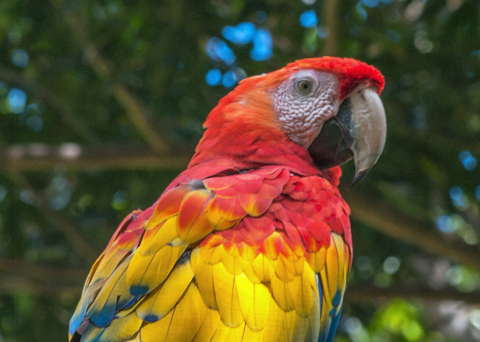
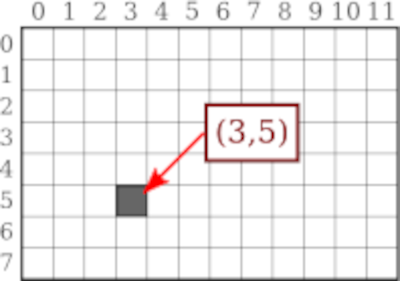
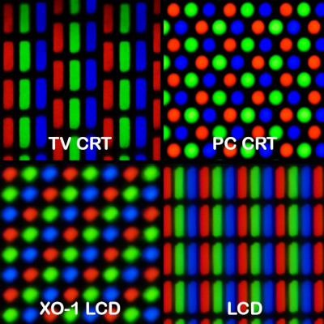
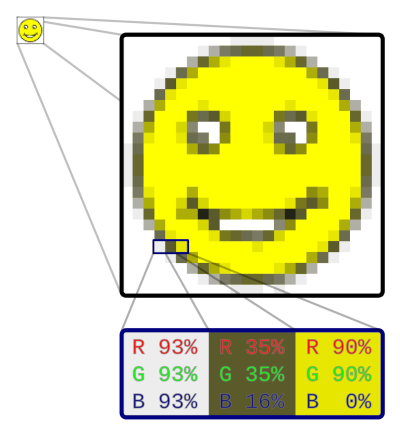
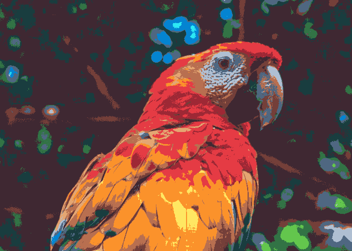

## Advanced Image Processing



## Image Coordinates



- Zero-indexed
- [Top-left origin](https://dsp.stackexchange.com/questions/35925/why-do-we-use-the-top-left-corner-as-the-origin-in-image-processing)

## Pixels


## Subpixels



## Color Channels



- `(r, g, b)` notation
- https://rgbcolorpicker.com/

## Black and White

- Black `(0, 0, 0)`
- White `(255, 255, 255)`

## Simple Grayscale

- https://en.wikipedia.org/wiki/Grayscale
- `r`, `g`, and `b` are all equal
- $$y = \frac{r + g + b}{3}$$

## Better Grayscale

- Relative / perceptual luminance
- https://en.wikipedia.org/wiki/Relative_luminance

$$l = 0.2126 \cdot r + 0.7152 \cdot g + 0.0722 \cdot b$$

## Color Distance

$$distance =\sqrt{(R_2 - R_1)^{2} + (G_2 - G_1)^{2} + (B_2 - B_1)^{2}}$$

## PIL / Pillow

https://pillow.readthedocs.io/en/stable/reference/Image.html

```py
from PIL import Image

# Load input image
im = Image.open("bird.png")

# Make blank output image with same dimension as the original
output = Image.new(im.mode, (im.width, im.height))

for y in range(im.height):
  for x in range(im.width):
    (r, g, b) = im.getpixel((x, y))

    # Your code goes here

    output.putpixel((x, y), (r, g, b))

# Save output image
output.save("grayscale.png")
```

## Tuples

```py
(r, g, b) = im.getpixel((x, y))
```

```py
color = im.getpixel((x, y))

# ...

(r, g, b) = color
```

## Color Palettes

- https://rgbcolorpicker.com/
- https://lospec.com/palette-list/endesga-16



## Scrabble Code

```py
bestWord = None # Keep track of the highest scoring word
bestScore = 0   # Keep track of the score of bestWord

# Find the word with the highest Scrabble score

for word in words:
    score = 0

    for letter in word:
        score += letterPoints[letter]

    if score > bestScore:
        bestScore = score
        bestWord = word
```
