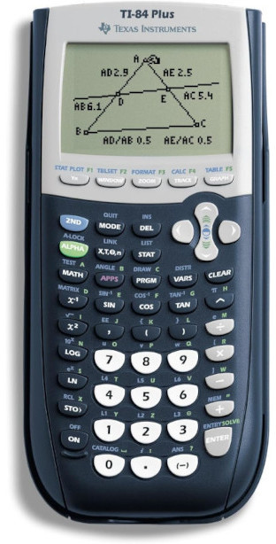

- player stop no button press
- gravity
- config variables
- functions

---

**Review**

- What is the purpose of the `draw` function in gamelab?
- How do we decide what code to put before the `draw` function and what to put
  inside it?

**Concepts**

[Demo](game-lab/controls)

- 1D character controls
- Randomized spawning
- Text display
- Declaring variables
- Scoring with counter pattern
- Boundaries

---

**Review**

- What are the dimensions of the game screen in GameLab?
- Where on the game screen is the coordinate (0, 0)?
- What code could we use to adjust the size of a sprite?

**Movement**

[Demo](game-lab/movement)

- Sprite velocity
- `background` and why we need it
- `function draw`
- Multiple sprites
- Sprite position
- Conditionals

---

**Graphing calculator story**

**Class intro**

- Flappy bird demo
- Jacky

**Flappy bird concepts brainstorm**

**Grading policy**

[Link](../shared/grading.md)

**Game lab**

[Demo](game-lab/intro)

- https://studio.code.org/projects/gamelab/new
- World coordinates
- Position
- `createSprite`
- `setAnimation`
- `sprite.scale`
