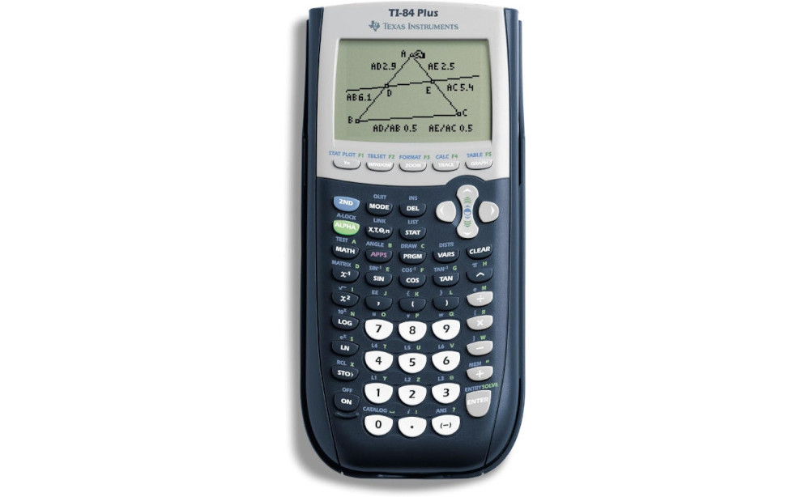

**Connecting the microbit**

- Sending code
- Errors
- Restarting code

**Share nametags**

**Program structure**

- What is a command?
- What is a program? Sequence of commands
- `on start` block
- What happens if we leave out on start block?
- `Forever`
- Command arguments
- Data types
- What is a string?
- Help menu
- Copy commands
- Deleting commands

**Commands overview**

- Basics
- Variables
- Random
- Conditionals
- Comparisons

**Rock paper scissors demo**

**Dice problem**

---

**Graphing calculator story**
  

**Class intro**

- Orbits demo
- Sports data demo
- Images demo
- Microbit demo

**Grading policy**

[Link](../shared/grading.md

**MakeCode editor**

https://makecode.microbit.org/

**Nametag assignment**

- `basic.show_leds`
