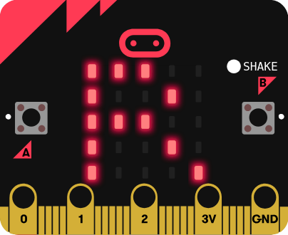
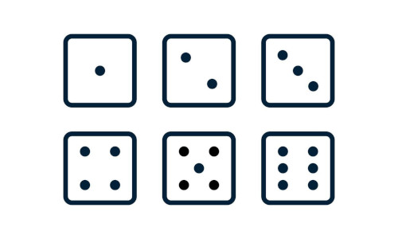
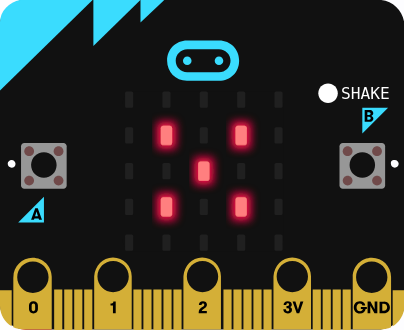

**Review**

**Variables**

- What is a variable?
- Counter demo

**Rock paper scissors demo**

- Random
- Conditionals
- Comparisons
- Add your own images

**Dice problem**

Make a digital die that display a random roll when you shake your microbit.

---

**Connecting the microbit**

- Sending code
- Errors
- Restarting code

**Share nametags**

**Program structure**

- What is a command?
- What is a program? Sequence of commands
- `on start` and `forever`
- What happens if we leave out on start block?
- Command arguments
- Data types
- What is a string?
- Help menu
- Copy commands
- Deleting commands

**Commands overview**

- Basics

---

**Graphing calculator story**
  

**Class intro**

- Orbits demo
- Sports data demo
- Images demo
- Microbit demo

**Grading policy**

[Link](../shared/grading.md)

**MakeCode editor**

https://makecode.microbit.org/

**Nametag**

- `basic.show_leds`
