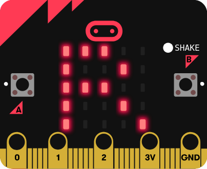
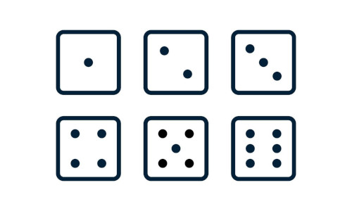
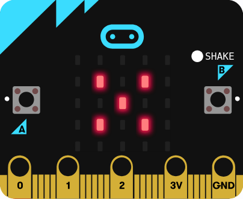
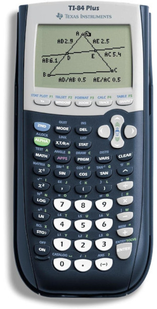

## Review Twine

## Demo Presentation

## Final Project and Presentations

---

## Twine 4

- More conditionals
- Randomness

---

## Twine 3

- Variables
- Displaying variables
- Variable math
- Text input
- Conditionals

---

## Twine 2

- Formats (chapbook)
  https://klembot.github.io/chapbook/guide/text-and-links/text-formatting.html
- Text styles
- Images

---

## Twine 1

https://twinery.org/

https://twinery.org/reference/en/

- Rooms (passages)
- Links
- Loops
- Watch out for whitespace

---

## Rock Paper Scissors Review

## Morse Code

https://www.youtube.com/watch?v=QmNNjH8e4G8

## Morse Worksheet

## Morse Brainstorm

What commands do we need to make microbit display morse code?

## Morse Demo

## Telegraph Exercise

I'll transmit a word, see who can decode it first

---

## Variables

What is a variable?

## Counter

## Rock Paper Scissors Demo

- Conditionals
- Comparisons
- Hard coded choice
- Random

## Add Images

## Dice problem

Make a digital die that display a random roll when you shake your microbit.

---

## Program Structure

- What is a command?
- What is a program? Sequence of commands
- `on start` and `forever`
- What happens if we leave out on start block?
- Command arguments
- Data types
- What is a string?
- Help menu
- Copy commands
- Deleting commands

## Commands Overview

## Connecting the microbit

- Sending code
- Errors
- Restarting code

## Share Nametags

---

## Graphing calculator story

## Python Projects

- Orbits
- Sports data
- Images
- Microbit

## Grading policy

[Link](../shared/grading.md)

## MakeCode Editor

https://makecode.microbit.org/

## Jumping Jacks Demo

## Nametag

- `on start`
- `show leds`
